

  

<h1 align="center">UNIVERSIDAD PERUANA DE CIENCIAS APLICADAS</h1>
<h2 align="center">Ingeniería de Software - Ciclo 08</h2>

---

<h2 align="center">Anti Hacking y Nuevas Tendencias de Seguridad</h2>

<strong>Código del curso:</strong> 1ASI0665-2520-14423

<h3 align="center">Profesor</h3>

<strong>David Carlos Vera Olivera</strong>

---

<h2 align="center">INFORME DEL TRABAJO FINAL</h2>

<strong>Consultora:</strong> SecuraLabs

<strong>Empresa:</strong> Tutormatch

---

<h3 align="center">Integrantes</h3>

<table>
  <tr>
    <th>Nombre y Apellido</th>
    <th>Código</th>
  </tr>
  <tr>
    <td>Leonardo José Aquino Cruz</td>
    <td>u20201b949</td>
  </tr>
  <tr>
    <td>Fabio Maurizio Nicolich Alvis</td>
    <td>u202218791</td>
  </tr>
  <tr>
    <td>Harold Miguel Elías Sánchez</td>
    <td>u202212684</td>
  </tr>
  <tr>
    <td>Piero Alberto Velarde Luyo</td>
    <td>u20211a620</td>
  </tr>
</table>

<strong>Octubre 2025</strong>

---

# Registro de Versiones del Informe

| **Versión** | **Fecha** | **Cambios Realizados** | **Responsable** |
|:--:|:--:|:--|:--|
| **1.0** | **2025-10-24** | **Entrega TP1 (Semana 9):** Documento de Alcance y primer paquete de entregables. Se completaron:  **Student Outcome:** Borrador sobre contribución al Outcome 2.  **Capítulo I:** (1.1) *Startup Profile* — descripción de la PyME y expectativas del cliente. (1.2) *Consultora* — descripción y perfiles/roles SCRUM. (1.3) *Solution Profile* — antecedentes, problemática y objetivos del pentesting. (1.4) *ROE* — alcance y condiciones iniciales.  **Capítulo II:** (2.1) Marco de referencia (Scrum, PTES, OWASP). (2.2) Backlog inicial (User Stories priorizadas). (2.3) Planificación de sprints (detalle Sprint 1).  **Capítulo III (Sprint 1):** Objetivo, actividades técnicas (configuración Kali, OSINT, nmap, gobuster, TLS checks) y entregables técnicos (*prep_evidence.txt*, *discovery.txt*, carpeta OSINT, lista de endpoints, screenshots) con PoC inicial.  **Capítulo IV:** Matriz de vulnerabilidades (entradas preliminares) y evidencias adjuntas. Incluye checklist DoD parcial y evidencia subida al repositorio. | **SecuraLabs** — Harold Miguel Elías Sánchez *(Product Owner)*; Fabio Maurizio Nicolich Alvis *(Scrum Master)*; Leonardo José Aquino Cruz *(Pentester & Analyst)*; Piero Alberto Velarde Luyo *(Technical Writer)* |
| **2.0** | **2025-12-03** | **Entrega Sprint 2 y avance de Sprint 3: Se completaron:**  **Capítulo II:** Actualización de la planificación ágil — ampliación de la correspondencia PTES/OWASP/Scrum y ajustes en actividades de Sprint 2.  **Capítulo III (Sprint 2):** Desarrollo completo del sprint: enumeración avanzada, descubrimiento de endpoints API, análisis de exposición de datos sensibles, verificación de credenciales débiles y recolección de evidencias técnicas (salidas de nmap, gobuster, whatweb, capturas de Burp). Se registraron PoC iniciales asociadas a vulnerabilidades preliminares.  **Capítulo III (Sprint 3 — inicio):** Incorporación de actividades de explotación controlada (SQLi, XSS, CSRF, subida de archivos inseguros, revisión TLS/headers). Se añadieron pruebas con Burp Suite, sqlmap y herramientas de explotación para validar hallazgos críticos.  **Capítulo IV:** Actualización de la matriz de vulnerabilidades — nuevos hallazgos documentados con CVSS provisional, impacto técnico y evidencia formal (screenshots, logs y outputs).  **Capítulo V:** Inclusión del borrador inicial del plan de mitigación basado en hallazgos de los sprints 2 y 3 (hardening, saneamiento de entradas, políticas de autenticación, mejoras TLS). | **SecuraLabs** — Harold Miguel Elías Sánchez (Product Owner); Fabio Maurizio Nicolich Alvis (Scrum Master); Leonardo José Aquino Cruz (Pentester & Exploit Developer); Piero Alberto Velarde Luyo (Technical Writer & Evidence Manager) |
---

# Project Report Collaboration Insights

## Roles Scrum
- **Product Owner (líder de consultora):**  
  **Harold Miguel Elías Sánchez**  
  Responsable de definir el alcance del servicio de pentesting, gestionar la comunicación con el cliente (TutorMatch), priorizar el Product Backlog y validar los entregables de cada sprint. Supervisa la aplicación de las reglas del **ROE (Rules of Engagement)** y asegura que las pruebas se desarrollen bajo lineamientos éticos y legales.

- **Scrum Master (coordinador de procesos):**  
  **Fabio Maurizio Nicolich Alvis**  
  Encargado de coordinar las reuniones de planificación y retrospectiva, facilitar la comunicación entre los miembros del equipo, garantizar la correcta aplicación del marco **Scrum** y el cumplimiento del **Definition of Done (DoD)**. También vela por la trazabilidad y organización del repositorio (GitHub, Trello).

- **Development Team (pentesters, documentadores, analistas):**  
  **Leonardo José Aquino Cruz** – Pentester y analista técnico, responsable de la ejecución de pruebas de reconocimiento, escaneo, explotación controlada y recolección de evidencias.  
  **Piero Alberto Velarde Luyo** – Documentador y analista, encargado de registrar hallazgos, elaborar el informe técnico y consolidar las recomendaciones de seguridad.  
  El equipo colabora en la planificación de sprints, priorización de User Stories y documentación de vulnerabilidades conforme al estándar **PTES/OWASP**.

## Herramientas de colaboración usadas
- Jira  
- GitHub  
- Microsoft Teams / WhatsApp  
- Otras herramientas técnicas (Burp Suite, Metasploit, etc.)

## Repositorio del informe

El informe final se desarrollará en un repositorio público bajo la organización 1ASI0665-antihacking-G1, donde se documentará todo el ciclo de vida del proyecto, incluyendo commits, versiones y entregables.
Repositorio oficial: [https://github.com/1ASI0665-antihacking-G1/report-hacking-G1](https://github.com/1ASI0665-antihacking-G1/report-hacking-G1) 

## Evidencia de colaboración

La evidencia de colaboración refleja la participación activa de todos los integrantes del equipo **SecuraLabs** en el repositorio oficial del proyecto.  
A través de commits, revisiones y coordinación mediante GitHub, se garantizó la trazabilidad y transparencia del desarrollo.

### Actividad general del repositorio (*Pulse*)

### Gráfico de contribuciones por integrante

### Historial de commits y mensajes 

---

# Tabla de Contenidos

- [Student Outcome](#student-outcome)  
- [Capítulo I: Introducción](#capítulo-i-introducción)  
  - [1.1 Startup Profile (Cliente)](#11-startup-profile-cliente)  
  - [1.2 Consultora de Ciberseguridad (Equipo)](#12-consultora-de-ciberseguridad-equipo)  
  - [1.3 Solution Profile](#13-solution-profile)  
  - [1.4 Aceptación del Servicio de Pentesting (Rules of Engagement)](#14-aceptación-del-servicio-de-pentesting-rules-of-engagement)  
- [Capítulo II: Metodología Ágil y de Pentesting](#capítulo-ii-metodología-ágil-y-de-pentesting)  
  - [2.1 Marco de referencia](#21-marco-de-referencia)  
  - [2.2 Backlog inicial: User Stories de seguridad](#22-backlog-inicial-user-stories-de-seguridad)  
  - [2.3 Planificación de sprints (Sprint Planning)](#23-planificación-de-sprints-sprint-planning)  
  - [2.4 Definición de Done (DoD)](#24-definición-de-done-dod)  
  - [2.5 Herramientas](#25-herramientas)  
- [Capítulo III: Desarrollo del Proyecto por Sprints](#capítulo-iii-desarrollo-del-proyecto-por-sprints)  
  - [Sprint 1 – Reconocimiento y Escaneo](#sprint-1--reconocimiento--escaneo-inicial-1-semana)  
  - [Sprint 2 – Enumeración y Vulnerabilidades](#sprint-2--enumeración-y-vulnerabilidades-preliminares)  
  - [Sprint 3 – Explotación](#sprint-3--explotación-controlada-web-apis)  
  - [Sprint 4 – Post-explotación y Persistencia](#sprint-4--post-explotación-y-persistencia)  
  - [Sprint 5 – Informe Final y Recomendaciones](#sprint-5--informe-final-y-recomendaciones)  
- [Capítulo IV: Resultados Consolidados](#capítulo-iv-resultados-consolidados)  
- [Capítulo V: Recomendaciones y Plan de Mitigación](#capítulo-v-recomendaciones-y-plan-de-mitigación)  
- [Capítulo VI: Conclusiones y Recomendaciones](#capítulo-vi-conclusiones-y-recomendaciones)  
- [Bibliografía](#bibliografía)  
- [Anexos](#anexos) 

---

# Student Outcome

## Student Outcome

| Criterio Específico | Acciones realizadas | Conclusiones |
|----------------------|--------------------|---------------|
| **Diseña soluciones en ingeniería de software que satisfacen necesidades específicas considerando salud pública, seguridad, bienestar, factores globales, culturales, sociales, ambientales y económicos.** | **Harold Elías:** Diseñé el alcance del servicio de pentesting considerando la seguridad y privacidad de los usuarios de la plataforma TutorMatch, priorizando la protección de datos personales y la reducción de riesgos de exposición. Al igual que propuse la implementación de buenas prácticas de ciberseguridad y mecanismos de validación ética para garantizar un entorno digital seguro para estudiantes y tutores.  **Fabio Nicolich:** Estructuré el marco de trabajo ágil que permitió diseñar el servicio de pentesting de manera organizada y con enfoque en la seguridad y bienestar digital. También promoví el diseño de un flujo de trabajo que respetara normas éticas y buenas prácticas internacionales en seguridad de la información, considerando factores culturales y sociales de los usuarios finales.  **Leonardo Aquino:** Diseñé los casos de prueba y las estrategias de evaluación de vulnerabilidades aplicando metodologías reconocidas (OWASP, NIST), con el fin de fortalecer la seguridad del producto. A su vez, consideré el impacto que una falla de seguridad podría tener en la reputación de la empresa y en la experiencia de los usuarios, priorizando soluciones seguras y sostenibles.  **Piero Velarde:** Diseñé la estructura de los informes técnicos y reportes de resultados asegurando claridad, transparencia y ética profesional. También incorporé en la documentación recomendaciones específicas que contribuyen al bienestar digital y a la prevención de malas prácticas en el manejo de información. | El equipo de **SecuraLabs** diseñó un servicio de pentesting integral enfocado en la protección de la información, la privacidad y el bienestar de los usuarios. Cada integrante aportó desde su rol a la creación de una solución segura y responsable, considerando factores sociales, culturales y éticos, demostrando una comprensión integral del impacto de la ingeniería de software en la sociedad digital. |
| **Valida que el diseño de la solución considere salud pública, seguridad, bienestar, y factores globales, culturales, sociales, ambientales y económicos.** | **Harold Elías:** Validé que los requerimientos del servicio de pentesting cumplieran con estándares éticos y no afectaran la disponibilidad ni la estabilidad del sistema. También supervisé la revisión de los hallazgos para asegurar que las recomendaciones propuestas reforzaran la seguridad y bienestar de los usuarios finales.  **Fabio Nicolich:** Validé la correcta ejecución del plan de trabajo y el cumplimiento de buenas prácticas en seguridad de la información durante cada sprint del proyecto. Al igual que verifiqué que el diseño del servicio mantuviera un enfoque responsable frente a factores globales y sociales, garantizando la integridad del proceso.  **Leonardo Aquino:** Validé los resultados de las pruebas de penetración mediante herramientas y análisis técnico para asegurar la fiabilidad de los hallazgos. También confirmé que las vulnerabilidades detectadas fueron tratadas de manera que promuevan un entorno seguro y éticamente responsable.  **Piero Velarde:** Validé la coherencia y exactitud de los informes técnicos, asegurando que la información presentada fuera clara y comprensible para el cliente. A su vez, garanticé que los reportes reflejaran una comunicación responsable, protegiendo la confidencialidad de los datos y fomentando la conciencia sobre seguridad digital. | El equipo **SecuraLabs** validó de manera exhaustiva que el diseño y ejecución del servicio de pentesting cumplieran con los principios de seguridad, ética y bienestar digital. Su trabajo evidenció la importancia de verificar que cada decisión técnica tenga un impacto positivo en la confianza, estabilidad y sostenibilidad de las soluciones de software, alineándose con valores globales y sociales del entorno tecnológico actual. |

---

# Capítulo I: Introducción

## 1.1 Startup Profile (Cliente)
### Descripción de la PyME 

SkillSwap Inc. es una startup tecnológica conformada por un equipo estudiantes de la carrera de Ingeniería de Software de la Universidad Peruana de Ciencias Aplicadas (UPC). Su principal iniciativa es TutorMatch, una plataforma digital orientada a mejorar el acceso y la gestión de tutorías académicas dentro del entorno universitario. El objetivo de la solución es facilitar la conexión entre estudiantes que buscan apoyo académico y tutores calificados, promoviendo una experiencia de aprendizaje colaborativa y flexible.  
La empresa se enmarca en el sector EdTech, un rubro que integra tecnologías digitales con metodologías educativas innovadoras, contribuyendo a la transformación digital del ámbito académico. TutorMatch representa el principal activo digital de la organización y constituye el eje central de su modelo de negocio.

**Servicios digitales ofrecidos**

La solución TutorMatch está compuesta por un ecosistema tecnológico distribuido en tres capas principales:
- **Frontend Web:** Portal de acceso principal desarrollado para navegadores, desde el cual los estudiantes pueden registrarse, buscar tutores, agendar sesiones, chatear en tiempo real y acceder a recursos académicos compartidos.
- **Backend:** API central que gestiona la autenticación de usuarios, el manejo de perfiles, el registro de tutorías, la comunicación en tiempo real y la administración de la base de datos.
- **Aplicación Móvil:** Complemento multiplataforma que ofrece las mismas funcionalidades del portal web, con un enfoque en la usabilidad y la accesibilidad desde dispositivos móviles.

Estas plataformas integran funcionalidades como videollamadas, chat en tiempo real, transferencia de archivos y gestión de disponibilidad y horarios, lo que permite una experiencia académica fluida y personalizada.

**Misión y visión**
- **Misión:** Facilitar la conexión entre estudiantes y tutores universitarios, optimizando la experiencia de aprendizaje mediante el uso de tecnologías colaborativas que permitan acceder a apoyo académico en tiempo real, de manera flexible y efectiva.
- **Visión:** Convertirse en la principal plataforma universitaria de tutorías académicas en un plazo de cinco años, promoviendo una educación más accesible, personalizada y eficiente mediante el uso de herramientas digitales innovadoras que fortalezcan el rendimiento académico y la autonomía del estudiante.

**Mercado objetivo**

El mercado objetivo de TutorMatch está compuesto principalmente por estudiantes universitarios de la carrera de Ingeniería de Software de la UPC, con proyección de expandirse a otras carreras y universidades del país. La plataforma busca posicionarse como un punto de encuentro confiable y ágil entre tutores y alumnos dentro del entorno académico digital.

### Expectativas del cliente  

Las expectativas del cliente se centran en obtener una evaluación de seguridad práctica y accionable que permita identificar y priorizar riesgos reales para TutorMatch. Específicamente, el cliente espera que el ejercicio de pentesting detecte vulnerabilidades críticas y de alto impacto (riesgo de takeover de cuentas, exposición de datos sensibles, ejecución remota o acceso no autorizado a la base de datos), que se entregue un informe técnico detallado con hallazgos reproducibles y evidencia (pruebas, logs, capturas) y que se proponga un plan de remediación con mitigaciones concretas, estimación de esfuerzo y prioridades para corregir los problemas detectados. Además, el cliente valora recibir un resumen ejecutivo comprensible para áreas no técnicas y recomendaciones para mejorar prácticas de desarrollo seguro (DevSecOps) y políticas operativas.

## 1.2 Consultora de Ciberseguridad (Equipo)
### Descripción de la consultora  

SecuraLabs es una consultora académica de ciberseguridad conformada por estudiantes de la carrera de Ingeniería de Software de la Universidad Peruana de Ciencias Aplicadas (UPC). El equipo se especializa en la aplicación de metodologías de seguridad ofensiva, evaluación de vulnerabilidades y pruebas de penetración (pentesting) orientadas a entornos web, móviles y de infraestructura en red.
El enfoque de SecuraLabs se centra en la identificación proactiva de amenazas y evaluación del riesgo tecnológico dentro de organizaciones que buscan fortalecer su postura de seguridad digital. El equipo combina conocimientos técnicos adquiridos en el ámbito académico con buenas prácticas reconocidas, como el uso de estándares OWASP, NIST SP 800-115 y MITRE ATT&CK, aplicados a contextos reales de desarrollo y despliegue de software.

**Misión**

Nuestra misión es ayudar a las organizaciones a descubrir y mitigar vulnerabilidades antes de que puedan ser explotadas, mediante la ejecución de pruebas controladas y éticas que simulan ataques reales. Buscamos fomentar una cultura de seguridad preventiva y aprendizaje continuo, aportando soluciones prácticas y estrategias de mejora que fortalezcan los sistemas y procesos de nuestros clientes frente a las nuevas tendencias de ciberamenazas.

### Perfiles de los integrantes y roles Scrum  

| Perfil | Descripción |
|--------|-------------|
|  | **Harold Elías – Product Owner** Estudiante de Ingeniería de Software en octavo ciclo, con interés en las áreas de ciberseguridad y pentesting. Posee experiencia en los lenguajes C++ y Python a nivel intermedio, además de haber participado en proyectos de desarrollo web y en la implementación de pruebas unitarias utilizando C# con NUnit.  Como Product Owner en SecuraLabs, Harold se encarga de definir y priorizar el backlog de seguridad, alineando las necesidades del cliente con los objetivos técnicos del equipo. Su capacidad de análisis y trabajo colaborativo facilita la toma de decisiones orientadas a maximizar el valor de las pruebas de ciberseguridad, asegurando que los entregables respondan a las expectativas del cliente.|
||**Fabio Nicolich – Scrum Master** Estudiante de Ingeniería de Software en séptimo ciclo, destacado por su liderazgo, responsabilidad y proactividad en la gestión de equipos. Cuenta con conocimientos en C++, HTML, CSS, JavaScript y Python, además de interés en el uso de frameworks modernos para el desarrollo de aplicaciones web.  Como Scrum Master, Fabio promueve la comunicación efectiva, la coordinación del equipo y la aplicación de los valores ágiles, garantizando el cumplimiento de los objetivos en cada sprint. Su compromiso con la calidad y la mejora continua contribuye a mantener un entorno colaborativo, motivando al equipo hacia resultados consistentes y orientados al aprendizaje conjunto.|
||**Leonardo Aquino – Pentester & Security Analyst** Estudiante de Ingeniería de Software en décimo ciclo, con experiencia en desarrollo web, ciberseguridad y diseño de videojuegos utilizando Godot y Unity. Domina lenguajes como C++, Python y JavaScript, y posee una fuerte orientación hacia la creación de soluciones seguras y la prevención de vulnerabilidades.  Como Pentester & Security Analyst en SecuraLabs, Leonardo lidera la ejecución de las pruebas ofensivas y el análisis técnico de vulnerabilidades, participando en la identificación, validación y documentación de hallazgos. Su capacidad analítica y su enfoque en resultados fortalecen la calidad técnica del proceso de evaluación de seguridad.|
||**Piero Velarde – Technical Writer & Documentador** Estudiante de Ingeniería de Software en séptimo ciclo, con interés en tecnologías emergentes, programación y ciberseguridad. Maneja los lenguajes C++, Python, JavaScript y Dart, y mantiene una actitud proactiva hacia el aprendizaje continuo y la investigación tecnológica.  Dentro de SecuraLabs, Piero desempeña el rol de Technical Writer & Documentador, siendo responsable de la redacción técnica, estructuración del informe y sistematización de evidencias. Además, asegura la coherencia comunicativa entre las fases técnicas y los entregables finales, contribuyendo a la claridad, precisión y formalidad de los documentos presentados al cliente.|

## 1.3 Solution Profile
### Antecedentes y problemática  

Las startups de tecnología educativa, como TutorMatch, están altamente expuestas a riesgos de seguridad informática debido al manejo de grandes volúmenes de datos sensibles (credenciales, historiales académicos, etc.) a través de plataformas, webs y aplicaciones móviles. TutorMatch, en su fase de desarrollo, es un objetivo atractivo para ciberatacantes que buscan explotar vulnerabilidades en sistemas emergentes. El análisis preliminar de su entorno ha revelado múltiples deficiencias de seguridad que amplían su superficie de ataque, incluyendo la carencia de controles robustos de autenticación y gestión de sesiones, la potencial exposición de APIs, validación insuficiente de entradas de usuario (formularios, chat) y archivos subidos. Adicionalmente, se detectaron fallos en la configuración de seguridad (TLS, encabezados HTTP) y en la gestión de credenciales, lo que justifica de manera urgente la realización de una auditoría de seguridad ofensiva.

Ante el contexto de ataques recientes en plataformas educativas similares, que han resultado en filtraciones masivas por la explotación de vulnerabilidades como inyecciones SQL o XSS, SkillSwap Inc. reconoce la necesidad crítica de actuar proactivamente. El objetivo principal es llevar a cabo una evaluación integral de ciberseguridad para TutorMatch. Esto permitirá identificar las brechas de seguridad más críticas, fortalecer la protección de los activos digitales de la plataforma y establecer un plan de mejora continua que siga las mejores prácticas de seguridad ofensiva.

### Objetivos del pentesting (General y específicos)  

**Objetivo general**

Realizar una evaluación integral de seguridad ofensiva (pentesting) sobre las plataformas web, backend y aplicación móvil de TutorMatch, con el fin de identificar vulnerabilidades técnicas, riesgos de exposición de datos y configuraciones inseguras, proporcionando un informe técnico y un plan de remediación que permitan fortalecer la postura de seguridad y la resiliencia del sistema ante potenciales ataques.

**Objetivos específicos**
1.	Identificar vulnerabilidades críticas en los componentes principales de TutorMatch (frontend, APIs, backend y app móvil) mediante la ejecución de pruebas de inyección, validación de entradas y análisis de permisos.

2.	Evaluar la robustez de los mecanismos de autenticación, gestión de sesiones y recuperación de cuentas, comprobando la resistencia del sistema frente a ataques de fuerza bruta y suplantación de identidad.

3.	Detectar exposición de información sensible (tokens, correos, datos personales o claves embebidas) en las respuestas del sistema, repositorios de código y pipelines de integración continua.

4.	Analizar la configuración de seguridad de la infraestructura y servicios asociados, incluyendo protocolos de cifrado (TLS/HTTPS), encabezados de seguridad HTTP y políticas de acceso a servidores y bases de datos.

5.	Ejecutar pruebas de explotación controlada (Proof of Concept) sobre las vulnerabilidades encontradas, validando su impacto y nivel de riesgo de acuerdo con metodologías OWASP y CVSS.

6.	Elaborar un informe técnico detallado y un plan de remediación, priorizando las acciones correctivas y recomendaciones para mitigar riesgos y fortalecer la seguridad del ciclo de desarrollo (DevSecOps).

## 1.4 Aceptación del Servicio de Pentesting (Rules of Engagement)

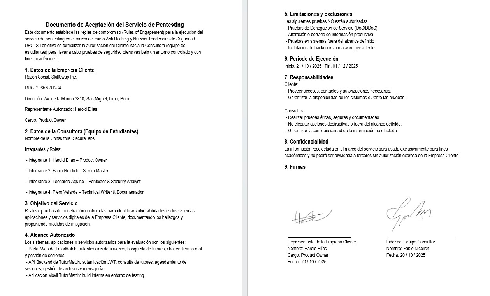

# Capítulo II: Metodología Ágil y de Pentesting

## 2.1 Marco de referencia

El presente proyecto adopta un enfoque ágil basado en **Scrum**, adaptado al contexto del **pentesting corporativo**. Esta integración permite gestionar de forma iterativa y controlada las actividades técnicas, priorizando la entrega continua de valor en cada sprint y la mejora constante del producto.  
El marco Scrum, tradicionalmente orientado al desarrollo de software, se ajusta aquí para guiar los ciclos de **planificación, ejecución, validación y documentación** de las pruebas de penetración. El equipo se organiza en roles específicos:  
- **Product Owner (PO)**: responsable de definir el alcance, objetivos y criterios de aceptación del pentest.  
- **Scrum Master**: vela por el cumplimiento del marco Scrum, la gestión de impedimentos y la comunicación efectiva del equipo.  
- **Equipo de Pentesters**: encargados de ejecutar las tareas técnicas, documentar hallazgos y proponer medidas de mitigación.  

Cada sprint de pentesting está alineado con las fases de los estándares reconocidos en la industria, especialmente **PTES (Penetration Testing Execution Standard)** y **OWASP Testing Guide (v5)**. Estas metodologías proporcionan la estructura técnica sobre la cual Scrum define su dinámica de trabajo. La correspondencia se resume así:

| Fase PTES | Fase OWASP | Sprint Scrum asociado | Objetivo principal |
|------------|-------------|-----------------------|--------------------|
| Pre-engagement Interactions | Information Gathering | Sprint 1: Reconocimiento y Escaneo inicial | Identificar el alcance, activos y vectores de ataque |
| Intelligence Gathering | Threat Modeling | Sprint 2: Enumeración y vulnerabilidades preliminares | Descubrir servicios, endpoints y posibles vulnerabilidades |
| Vulnerability Analysis | Testing for OWASP Top 10 | Sprint 3: Explotación controlada | Validar vulnerabilidades críticas mediante PoC seguras |
| Exploitation | Post-Exploitation | Sprint 4: Persistencia y escalamiento controlado | Verificar impacto y acceso a información sensible |
| Reporting | Remediation Verification | Sprint 5: Informe final y recomendaciones | Documentar hallazgos, riesgos e impactos al negocio |

Además, se complementa con las guías de:
- **OSSTMM (Open Source Security Testing Methodology Manual)**: como referencia para la evaluación objetiva de seguridad y métricas.  
- **NIST SP 800-115**: para estructurar la documentación y trazabilidad de pruebas.  
- **MITRE ATT&CK Framework**: como apoyo en la identificación de técnicas y tácticas de adversarios reales.

Este marco integrado garantiza que el proceso sea **repetible, medible y verificable**, manteniendo la ética profesional y la conformidad con buenas prácticas internacionales.  

La ejecución de cada sprint incluye reuniones de **Sprint Planning**, **Daily Scrums**, **Sprint Review** y **Retrospective**, donde se evalúan los avances técnicos, los obstáculos y las oportunidades de mejora.  
De esta manera, se asegura que cada iteración aporte resultados concretos (evidencias, PoC, registros) y que las decisiones técnicas se documenten oportunamente en función de la evolución del pentest.

## 2.2 Backlog inicial: User Stories de seguridad

Una vez redactadas todas las User Stories (US), es fundamental priorizarlas. El Product Backlog organiza las historias de usuario de acuerdo con el valor que aportan al proyecto. Para ello, los Story Points se asignaron usando la escala de Fibonacci (1, 2, 3, 5, 8, 13). Las historias con más puntos representan un mayor impacto en la seguridad del sistema.

| Orden | User Story ID | Título | Descripción (Historia de Usuario) | Story Points |
|:--:|:--:|:--|:--|:--:|
| 01 | US-02 | Pruebas de inyección SQL en APIs y formularios | Como pentester quiero ejecutar pruebas de inyección SQL sobre los endpoints críticos de TutorMatch (login, búsqueda de tutores, consultas de perfil) para identificar accesos o manipulaciones no autorizadas a la base de datos. | 13 |
| 02 | US-03 | Pruebas de Cross-Site Scripting (XSS) | Como atacante quiero insertar scripts maliciosos en el chat en tiempo real, comentarios y campos de subida para validar la sanitización de entradas en TutorMatch. | 13 |
| 03 | US-05 | Explotación de credenciales débiles & recuperación de cuenta | Como pentester quiero evaluar contraseñas débiles, políticas de bloqueo y el flujo de recuperación de cuentas (reset) para identificar takeover de cuentas en TutorMatch. | 8 |
| 04 | US-04 | Escaneo y enumeración de endpoints API | Como atacante quiero identificar todos los endpoints REST (y métodos HTTP) expuestos por TutorMatch para detectar recursos sin protección. | 8 |
| 05 | US-09 | Detección de exposición de datos sensibles | Como pentester quiero revisar respuestas de la API y endpoints públicos para detectar tokens, correos, PII o información sensible no enmascarada. | 8 |
| 06 | US-12 | Escaneo de puertos y servicios de red | Como atacante quiero mapear hosts, puertos y servicios detrás del despliegue de TutorMatch (servidor web, DB, servicios auxiliares). | 5 |
| 07 | US-06 | Prueba de subida de archivos inseguros | Como pentester quiero probar la carga de archivos (documentos, imágenes, .php renombrado) para comprobar validación y riesgo de ejecución en TutorMatch. | 5 |
| 08 | US-08 | Verificación de TLS y headers de seguridad | Como auditor quiero comprobar HTTPS/TLS y headers (CSP, HSTS, X-Frame-Options, X-XSS-Protection) para asegurar transporte y mitigación de vectores web. | 5 |
| 09 | US-13 | Auditoría de repositorios y pipelines (DevSecOps) | Como pentester quiero revisar repositorios y pipelines de CI/CD asociados a TutorMatch para detectar secretos expuestos o malas prácticas. | 3 |
| 10 | US-10 | Pruebas CSRF en acciones críticas | Como atacante quiero comprobar si formularios/state-changing endpoints en TutorMatch protegen contra CSRF. | 3 |
| 11 | US-11 | Análisis estático de aplicación móvil | Como pentester quiero analizar la app móvil (si existe) para detectar almacenamiento inseguro, claves hardcoded y llamadas inseguras a las APIs de TutorMatch. | 3 |
| 12 | US-01 | Reconocimiento inicial y mapeo de superficie | Como atacante externo quiero identificar dominios/subdominios, landing pages, rutas de login y formularios públicos de TutorMatch para mapear la superficie de ataque. | 2 |

## Criterios de aceptación generales y Definition of Done (DoD)

### Criterios generales por historia

- **Reproducible:**  
Cada hallazgo debe incluir los pasos exactos para su reproducción (request, payloads, headers y condiciones del entorno).

- **Evidencia:**  
Toda vulnerabilidad identificada debe sustentarse con capturas de pantalla, outputs de herramientas  
*(Burp, sqlmap, nmap, ZAP, Nessus)* o grabaciones breves (máx. 30 s) como PoC.

- **Impacto:**  
Se debe asignar una clasificación CVSS provisional, indicando el impacto potencial en los datos y en la funcionalidad de TutorMatch.

- **Recomendación:**  
Por cada hallazgo se debe proponer una mitigación técnica concreta  

- **Ética / Legal:**  
Si el ROE (Rules of Engagement) prohíbe la extracción de datos reales, las PoC solo deben demostrar el error o la metadata asociada,  
sin comprometer información sensible del sistema o de usuarios.

### Definition of Done (DoD) por historia

La historia está documentada y vinculada al sprint backlog correspondiente.  

Las evidencias (screenshots, outputs, colecciones Postman/Burp, reportes ZAP/Nessus) están adjuntas y debidamente nombradas.  

Cada hallazgo tiene su CVSS estimado, descripción de impacto y priorización de riesgo *(Crítico, Alto, Medio, Bajo)*.  

Se incluye una recomendación técnica priorizada con horizonte de mitigación.  

El checklist de reproducción está completado y verificado por un segundo revisor o par técnico.
  
## 2.3 Planificación de sprints (Sprint Planning)

Todas estas actividades técnicas se ejecutarán sobre el proyecto TutorMatch (entorno de staging o el host/VM autorizado por el propietario). Antes de cualquier prueba de explotación, se deberá firmar/confirmar el ROE (reglas de compromiso): entornos permitidos, cuentas de prueba, límites de extracción de datos y ventanas de ejecución.

# Sprint 1: Reconocimiento & Escaneo inicial

**Sprint Backlog 1**

| User Story Id | User Story Title | Work Item Id | Work Item Title | Description | Estimation | Assigned To | Status |
|---:|---|---:|---|---|:--:|:--|:--|
| US-01 | Reconocimiento inicial y mapeo de superficie | 1.1 | Preparación del entorno | Configurar Kali, crear cuentas de prueba, capturar hostname / `ip a` / `uname -a`. | (1h) | Leonardo | Done |
| US-01 | Reconocimiento inicial y mapeo de superficie | 1.2 | OSINT | Búsqueda dominios/subdominios y assets públicos (theHarvester, Google Dorks, Archive.org). | (2h) | Leonardo | Done |
| US-12 | Escaneo de puertos y servicios de red | 1.3 | Descubrimiento de red | `netdiscover` / `arp-scan`, `nmap -sn` para hosts autorizados. | (1h) | Leonardo | Done |
| US-12 | Escaneo de puertos y servicios de red | 1.4 | Escaneo inicial de puertos | `nmap -p- -T4 <target>`, `nmap -sV` (inventario de puertos/servicios). | (1h) | Leonardo | Done |
| US-04 | Escaneo y enumeración de endpoints API | 1.5 | Descubrimiento web | `gobuster`/`ffuf`, `whatweb` para directorios y fingerprinting. | (1h) | Leonardo | Done |
| US-08 | Verificación de TLS y headers | 1.6 | Revisión TLS / Headers | `testssl.sh` y captura de cabeceras HTTP (primera revisión). | (2h) | Leonardo / Piero | Done |
| US-01 | Reconocimiento inicial y mapeo de superficie | 1.7 | Documentación inicial | `prep_evidence.txt`, `discovery.txt`, carpeta OSINT, lista endpoints (CSV). | (1h) | Piero | Done |

**Objetivo:**  
Identificar y documentar la superficie de ataque pública de TutorMatch: dominios, subdominios, hosts, puertos, servicios web y endpoints de autenticación. Generar inventario reproducible que guíe la enumeración.

**Actividades técnicas**
- Preparación del entorno de pruebas: configurar Kali y ambiente de trabajo, crear cuentas de prueba en TutorMatch (student/tutor) y capturar hostname, `ip a`, `uname -a` (evidencia prep).
- OSINT para TutorMatch: buscar dominios/subdominios externos y assets públicos (theHarvester, Google Dorks, Archive.org) — identificar posibles endpoints externos (landing, `api.tutormatch`, CDN, etc.).
- Descubrimiento de red y hosts: `netdiscover` / `arp-scan` (si hay red interna) y `nmap -sn` para descubrir hosts autorizados del entorno de TutorMatch.
- Escaneo inicial de puertos/servicios: `nmap -p- -T4 <target>` para identificar puertos abiertos; `nmap -sV` para versiones.
- Descubrimiento web: `gobuster`/`ffuf` para directorios y rutas públicas; `whatweb` para fingerprinting de tecnologías.
- Primera revisión TLS/headers: test rápido de TLS (`testssl.sh` o similar) y captura de cabeceras HTTP.

**Entregables**
- `prep_evidence.txt` con comandos y salidas básicas (hostname, `ifconfig`/ip, `uname -a`).
- `discovery.txt` con resultados de `netdiscover`/`nmap -sn`.
- Carpeta OSINT con outputs (theHarvester, dorks).
- Lista de URLs/endpoints descubiertos (CSV / Postman collection).
- Screenshots de las herramientas usadas y outputs principales.

**Criterio de finalización**  
Inventario reproducible de hosts y endpoints de TutorMatch; evidencias (outputs y screenshots) subidos; aprobación para pasar a enumeración.

---

# Sprint 2: Enumeración y vulnerabilidades preliminares

**Sprint Backlog 2**

| User Story Id | User Story Title | Work Item Id | Work Item Title | Description | Estimation | Assigned To | Status |
|---:|---|---:|---|---|:--:|:--|:--|
| US-04 | Escaneo y enumeración de endpoints API | 2.1 | Nmap avanzado & Scripting | `nmap -p- -sS -sV -O --script=vuln <target>`, generar `nmap_full.txt`. | (2h) | Leonardo | Done |
| US-04 | Escaneo y enumeración de endpoints API | 2.2 | Reconocimiento web profundo | `whatweb -v`, `gobuster dir -u <url> -w common.txt` (gobuster outputs). | (1h) | Leonardo | Done |
| US-02 | Pruebas de inyección SQL | 2.3 | Identificación de parámetros vulnerables (no explotación) | Búsqueda manual de parámetros y pruebas ligeras (no destructivas) para marcar candidatos SQLi. | (1h) | Leonardo | Done |
| US-03 | Pruebas de XSS | 2.4 | Pruebas XSS preliminares | Payloads reflejados simples, validación/sanitización en campos chat/comentarios. | (1h) | Leonardo | Done |
| US-08 | Verificación de TLS y headers | 2.5 | Confirmación y listado de cabeceras | Verificar HSTS, CSP, X-Frame-Options, X-XSS-Protection en endpoints críticos. | (1h) | Piero / Leonardo | Done |
| US-13 | Auditoría de repositorios y pipelines | 2.6 | Revisión SCA / CI | `npm audit`, `mvn dependency:tree`, revisión rápida de pipelines por secretos. | (1h) | Fabio / Leonardo | Done |
| US-04 | Escaneo y enumeración de endpoints API | 2.7 | Generar ZAP report & colección Postman | OWASP ZAP spider + scan → `ZAP_report.html`; construir colección Postman/Burp. | (1h) | Leonardo / Piero | Done |
| US-01 | Reconocimiento inicial y mapeo de superficie | 2.8 | Filtrado y documentación | Filtrar falsos positivos, documentar hallazgos preliminares con CVSS estimado. | (1h) | Piero | Done |

**Objetivo:**  
Enumerar en detalle servicios, versiones y endpoints API/WEB de TutorMatch; identificar vulnerabilidades de superficie (OWASP Top 10) en modo no destructivo y priorizar hallazgos.

**Actividades técnicas**
- Escaneo Nmap avanzado: `nmap -p- -sS -sV -O --script=vuln <target>` para identificar servicios, versiones y scripts de vulnerabilidad.
- Reconocimiento web profundo: `whatweb -v`, `gobuster dir -u <url> -w /usr/share/wordlists/dirb/common.txt` para encontrar directorios y recursos (uploads, admin, api).
- Escaneo automático de web/API: OWASP ZAP para spider + scan, generar `ZAP_report.html`.
- Detección de endpoints API: buscar swagger/openapi, endpoints JSON, y construir colección Postman/Burp.
- Pruebas preliminares no destructivas: payloads de XSS reflejado simple, pruebas básicas de SQLi con payloads manuales (no extracción), verificación de métodos HTTP permitidos (`OPTIONS`), comprobación de CORS y cabeceras.
- Revisión SCA superficial si hay acceso al repo: `npm audit`, `mvn dependency:tree` o reportes automáticos.

**Entregables**
- `nmap_full.txt`, `whatweb_<IP>.txt`, `gobuster_<IP>.txt`.
- `ZAP_report.html`.
- Colección Postman/Burp con endpoints descubiertos.
- Lista priorizada de hallazgos preliminares con CVSS estimado y PoC mínimo (errores o respuesta anómala).

**Criterio de finalización**  
Hallazgos preliminares documentados y validados (falsos positivos filtrados); backlog priorizado con historias asignadas para explotación.

---

# Sprint 3: Explotación controlada (web, APIs)

**Sprint Backlog 3**

| User Story Id | User Story Title | Work Item Id | Work Item Title | Description | Estimation | Assigned To | Status |
|---:|---|---:|---|---|:--:|:--|:--|
| US-02 | Pruebas de inyección SQL en APIs y formularios | 3.1 | SQLi controlado (PoC) | Ejecutar `sqlmap` con flags limitantes en parámetros identificados; capturar error/metadata si ROE lo exige. | (2h) | Leonardo | Done |
| US-03 | Pruebas de Cross-Site Scripting (XSS) | 3.2 | Confirmación XSS & PoC | Confirmar XSS (reflejado/almacenado) con Burp Repeater; grabar GIF/video ≤30s. | (1h) | Leonardo | Done |
| US-06 | Prueba de subida de archivos inseguros | 3.3 | File upload testing (PoC) | Subir archivos renombrados (.php rename) y verificar acceso/ejecución. | (2h) | Leonardo | Done |
| US-10 | Pruebas CSRF en acciones críticas | 3.4 | Verificación CSRF | Probar tokens, endpoints state-changing y construir PoC si aplica. | (1h) | Leonardo / Piero | Done |
| US-04 | Escaneo y enumeración de endpoints API | 3.5 | Explotación de endpoints API | Probar IDOR, parámetros y controles de autorización en APIs (usar cuentas de prueba). | (2h) | Leonardo | Done |
| US-02 | Pruebas de inyección SQL en APIs y formularios | 3.6 | Documentación PoC | Capturas, comandos reproducibles, colecciones y matrices CVSS. | (1h) | Piero | Done |

**Objetivo:**  
Explotar de forma controlada las vulnerabilidades prioritarias identificadas en Sprint 2 (por ejemplo SQLi, XSS, IDOR, credenciales), usando cuentas y datos de prueba y respetando ROE.

**Actividades técnicas**
- SQL Injection controlado: `sqlmap` en parámetros detectados con flags limitantes; si ROE prohíbe exfiltración, capturar error SQL o metadata en lugar de datos sensibles. Documentar comando exacto y outputs.
- Cross-Site Scripting: confirmar XSS (reflejado/almacenado) usando Burp Repeater y navegador; grabar PoC (GIF/short video) mostrando contexto en TutorMatch (p. ej. chat o perfil).
- Autenticación/Autorización: pruebas de fuerza bruta / credenciales comunes en cuentas de prueba (Hydra/Burp Intruder con rate-limit respetuoso), pruebas de IDOR y escalamiento horizontal/vertical en APIs (cambiar `user_id` en endpoints).
- File upload testing: subir archivos con contenido malicioso renombrado, revisar si son accesibles/ejecutables (ruta de archivos en TutorMatch).
- Uso de Burp Suite para interceptar y modificar requests a la API de TutorMatch y documentar payloads.

**Entregables**
- PoC reproducible para cada vulnerabilidad explotada (capturas, comandos, colecciones).
- Matriz de impacto con CVSS estimado y recomendaciones inmediatas (prepared/parametrized queries, validar inputs, rate-limits).
- Videos/GIFs cortos mostrando PoC (máx. 30s cada uno).

**Criterio de finalización**  
PoC reproducibles y revisados por el responsable del entorno; compromisos/soft-fixes urgentes sugeridos para mitigación.

---

# Sprint 4: Post-explotación y persistencia

**Sprint Backlog 4**

| User Story Id | User Story Title | Work Item Id | Work Item Title | Description | Estimation | Assigned To | Status |
|---:|---|---:|---|---|:--:|:--|:--|
| US-05 | Explotación de credenciales débiles & recuperación de cuenta | 4.1 | Testing de credenciales & account recovery | Evaluar políticas de contraseña, bloqueo e intentar flujos de reset en cuentas de prueba. | (2h) | Leonardo | Done |
| US-09 | Detección de exposición de datos sensibles | 4.2 | Revisión de respuestas API para PII | Analizar respuestas por tokens, correos, datos no enmascarados; documentar evidencia. | (2h) | Piero / Leonardo | Done |
| US-12 | Escaneo de puertos y servicios de red | 4.3 | Re-evaluación de servicios internos | Mapear servicios internos accesibles desde punto de compromiso (teórico). | (2h) | Leonardo | Done |
| US-02 / US-03 | — | 4.4 | Escalamiento y persistencia (controlado) | Intentar escalamiento local/DB en entornos de prueba y documentar artefactos (metadata). | (2h) | Leonardo | Done |
| US-08 | Verificación de TLS y headers | 4.5 | Detección / logging | Verificar logs, reglas y alertas; proponer reglas SIEM/IDS. | (1h) | Fabio / Piero | Done |
| US-09 | Detección de exposición de datos sensibles | 4.6 | Checklist de remediación | Propuestas inmediatas (rotación credenciales prueba, cierre endpoints, permisos). | (2h) | Piero | Done |

**Objetivo:**  
Evaluar el impacto real tras una explotación autorizada sobre TutorMatch (limitado por ROE): comprobar escalamiento, artefactos accesibles, posibilidad de persistencia y mapeo de movimiento lateral teórico; además validar detección/monitoring.

**Actividades técnicas**
- Escalamiento de privilegios (local/DB-level) usando técnicas seguras y sólo en cuentas/entornos de prueba: intentar obtener mayor acceso mediante fallos detectados (p. ej. vulnerabilidades en consultas SQL que permitan cambiar roles).
- Revisión de dumps/backups y artefactos accesibles: localizar backups, dumps o endpoints de export (no exfiltrar datos sensibles; capturar solo metadata o hashes).
- Simulación de movimiento lateral: mapear servicios internos accesibles desde el punto de compromiso (p. ej. servicios internos que la web puede alcanzar) y documentar rutas teóricas de pivot (sin moverse fuera del entorno autorizado).
- Revisar logging y detección: comprobar si las acciones quedan registradas en logs (aplicación, webserver, DB); capturar logs locales y usar Wireshark/log capture si permiso; verificar si existen alertas/thresholds configurados.
- Documentar mitigaciones para evitar persistencia: archivos SUID, permisos, rotación de claves, configuración de WAF/IDS y reglas SIEM sugeridas.

**Entregables**
- Reporte de post-explotación que describa impacto, artefactos accesibles (metadata), y evidencia (capturas de logs, outputs).
- Recomendaciones para detección (ej.: reglas SIEM, patrones de alerta, logging format).
- Checklist de remediación inmediata (cambio de permisos, cierre de endpoints, rotación de credenciales de prueba).

**Criterio de finalización**  
Impacto clasificado (por prioridad), evidencia de las acciones realizadas (sanitizada) y un plan de reversión/mitigación listo para ser aplicado por el equipo de TutorMatch.

---

# Sprint 5: Informe final y recomendaciones

**Objetivo:**  
Consolidar todos los hallazgos en un informe técnico y ejecutivo, priorizar vulnerabilidades (CVE/CVSS), entregar evidencia organizada y proponer plan de mitigación y seguimiento.

**Actividades técnicas**
- Consolidar matriz de hallazgos: por cada hallazgo incluir servicio/endpoint, descripción, PoC, CVE (si aplica), CVSS estimado, evidencia y recomendación técnica concreta.
- Preparar informe en el template del curso (resumen ejecutivo, alcance, metodología PTES/OSSTMM, hallazgos y mitigaciones).
- Empaquetar evidencias: nmap, theHarvester, whatweb, gobuster, ZAP report, Nessus report, `discovery.txt`, `prep_evidence.txt`, PoCs y capturas en `evidence.zip`.
- Preparar presentación y video corto (si el curso lo exige) mostrando procesos clave y recomendaciones.
- Validación final de ética/legal: sanitizar PII en evidencias, comprobar ROE compliance.

**Entregables**
- Informe final (Word/PDF) listo para entrega.
- `evidence.zip` con todos los outputs y PoC (archivos nombrados y con README).
- Presentación (PPTX) y vídeo resumen (opcional según entrega).
- Hoja de ruta de remediación priorizada (short/mid/long term fixes).

**Criterio de finalización**  
Informe y paquete de evidencia entregados y verificados; checklist DoD completo (reproducibilidad, evidencias, recomendaciones priorizadas); aprobación final del Product Owner / Instructor.

## 2.4 Definición de Done (DoD)

La **Definición de Hecho (Definition of Done)** establece los criterios que determinan cuándo una tarea, user story o sprint se considera finalizado de manera satisfactoria.  
Su aplicación asegura que todos los entregables del proyecto cumplan estándares técnicos, éticos y de documentación coherentes con los objetivos del pentesting.

| Categoría | Criterio de cumplimiento | Evidencia esperada |
|------------|--------------------------|--------------------|
| **Técnico** | Las pruebas se ejecutaron en entornos autorizados y con metodologías reproducibles. | Capturas de terminal, logs o PoC controladas. |
| **Validación** | Cada hallazgo ha sido verificado al menos dos veces y clasificado según CVSS v3. | Registro en matriz de vulnerabilidades con puntaje y nivel de riesgo. |
| **Documentación** | El resultado de cada sprint está documentado con fecha, responsable y descripción de hallazgos. | Informe parcial y resumen técnico. |
| **Trazabilidad** | Se conserva el historial de comandos, herramientas y configuraciones usadas. | Carpeta `/evidence` o `/tools_log`. |
| **Seguridad y ética** | No se realizaron ataques destructivos, DoS ni acceso no autorizado a datos reales. | Declaración de conformidad firmada por el equipo. |
| **Revisión** | El Product Owner validó que la evidencia sea clara y comprensible. | Comentario o firma de validación. |

## 2.5 Herramientas

Durante la ejecución del proyecto se empleará un conjunto de herramientas de uso profesional incluidas en la distribución **Kali Linux**, complementadas con utilitarios especializados para cada fase del pentesting.  
Estas herramientas fueron seleccionadas conforme a las fases del estándar **PTES** y a las prácticas recomendadas por **OWASP**.

| Fase PTES / OWASP | Herramienta | Propósito / Uso principal |
|--------------------|-------------|---------------------------|
| **Reconocimiento y mapeo de activos** | `Nmap`, `Netdiscover`, `WhatWeb`, `Wappalyzer` | Identificación de hosts, puertos, servicios y tecnologías en uso. |
| **Enumeración de recursos y subdominios** | `Gobuster`, `ffuf`, `Dirb`, `Sublist3r` | Descubrimiento de rutas ocultas, endpoints y archivos sensibles. |
| **Análisis de vulnerabilidades web** | `Burp Suite`, `Nikto`, `OWASP ZAP` | Interceptar peticiones HTTP, detectar fallos de seguridad y validar respuestas. |
| **Explotación de vulnerabilidades** | `sqlmap`, `Hydra`, `Metasploit Framework` | Pruebas de inyección SQL, fuerza bruta y explotación controlada. |
| **Tráfico y protocolos** | `Wireshark`, `tcpdump` | Captura y análisis de paquetes de red, validación de cifrado y sesiones. |
| **Pruebas complementarias / scripts** | `Python`, `curl`, `bash` | Automatización de pruebas, generación de PoC y validación de payloads. |
| **Gestión de evidencia** | `Obsidian`, `CherryTree`, `Excel/Sheets` | Organización de hallazgos, logs, y generación de reportes intermedios. |

---

# Capítulo III: Desarrollo del Proyecto por Sprints

## Sprint 1 – Reconocimiento y Escaneo
### Objetivos del sprint  

Identificar y documentar de manera reproducible la superficie de ataque pública del cliente **TutorMatch** (entorno de staging o host/VM autorizado), incluyendo dominios, subdominios, hosts, puertos, servicios y endpoints de autenticación.  
Generar un inventario que guíe la fase de enumeración en el siguiente sprint y garantizar el cumplimiento de las **Rules of Engagement (ROE)** antes de cualquier explotación.

### Historias de usuario atendidas  

- **US-01** – *Reconocimiento inicial y mapeo de superficie (2 SP)*  
  Como atacante externo, quiero identificar dominios/subdominios, rutas de login y formularios públicos de TutorMatch para delimitar la superficie de ataque.

- **US-12** – *Escaneo de puertos y servicios de red (5 SP)*  
  Como atacante, quiero mapear hosts, puertos y servicios detrás del despliegue de TutorMatch (servidor web, base de datos, servicios auxiliares).

- **US-08** – *Verificación de TLS y headers de seguridad (5 SP)*  
  Como auditor, quiero comprobar los mecanismos HTTPS/TLS y cabeceras de seguridad para asegurar el transporte y la mitigación de ataques web.

- **US-04** – *Enumeración de endpoints API (8 SP)*  
  Como atacante, quiero identificar endpoints REST y métodos HTTP expuestos por TutorMatch para detectar recursos sin protección.

### Actividades realizadas  

Todas las actividades se ejecutaron **únicamente en el entorno autorizado** y tras la confirmación del **ROE**.  
Las salidas sensibles fueron sanitizadas antes de su almacenamiento público.

1. **Preparación del entorno de pruebas**  
   - Configuración de Kali Linux y estructura de trabajo (`~/securalabs/tutormatch/sprint1/`).
   - Creación de cuentas de prueba (roles *student* / *tutor*).  
   - Captura de evidencia (`prep_evidence.txt` con hostname, IP, uname -a).

2. **OSINT para TutorMatch**  
   - Búsqueda de dominios/subdominios con *theHarvester*, *Google Dorks*, *Archive.org*, *crt.sh*, *whois*.  
   - Identificación de endpoints externos (landing, api, CDN).  
   - Evidencias en `evidence/osint/`.

3. **Descubrimiento de red y hosts**  
   - *netdiscover / arp-scan* (si aplica) y `nmap -sn`.  
   - Evidencias: `evidence/discovery/discovery.txt`.

4. **Escaneo de puertos y servicios**  
   - `nmap -p- -T4 <target>` → puertos abiertos.  
   - `nmap -sV` → versiones y fingerprinting.  
   - Archivos: `nmap_full_ports.txt`, `nmap_sV.txt`.

5. **Descubrimiento web**
   - *gobuster* o *ffuf* → rutas públicas.  
   - *whatweb* → fingerprint tecnológico.  
   - Resultados en `evidence/web/`.

6. **Verificación TLS y cabeceras HTTP**  
   - *testssl.sh* + `curl -I`.  
   - Resultados: `tls_headers.txt`, `testssl_tutormatch.log`.

### Resultados y evidencias  

#### Resultados:
Durante el Sprint 1 se logró identificar la superficie de ataque inicial del entorno de pruebas de TutorMatch, delimitando los activos expuestos y generando el inventario técnico base para la fase de enumeración.
Los escaneos OSINT y de red permitieron mapear correctamente los hosts accesibles y reconocer la estructura pública de la aplicación web. A través del uso de herramientas como theHarvester, dnsenum y Google Dorks, se detectaron subdominios válidos y endpoints potenciales asociados al dominio principal tutormatch-server-test.netlify.app, confirmando que el despliegue activo correspondía a una instancia de staging alojada en la infraestructura de Netlify.

El escaneo de red con Nmap reveló la presencia de servicios HTTP/HTTPS activos en los puertos estándar (80 y 443), con respuesta positiva a los paquetes ICMP y detección correcta del sistema operativo basado en Linux. No se evidenciaron servicios adicionales en ejecución ni puertos de bases de datos o servicios internos expuestos públicamente, lo que sugiere una configuración de red básica y relativamente segura.

Mediante el análisis web con WhatWeb y Gobuster, se identificaron directorios accesibles como /api, /login y /uploads, que posteriormente servirán para las pruebas de enumeración y vulnerabilidades del Sprint 2. Los resultados del análisis TLS, realizados con testssl.sh, confirmaron la presencia de certificados válidos y un canal HTTPS funcional, aunque se observaron ausencias de cabeceras de seguridad complementarias (como Content-Security-Policy y X-Frame-Options), que representan vectores de riesgo bajo a medio.

En general, el sprint permitió establecer las bases técnicas del pentest, generando un mapa claro de dominios, servicios y tecnologías utilizadas por la plataforma. Toda la información obtenida se consolidó en la carpeta /evidence/sprint1/, sirviendo como punto de partida para la identificación de vulnerabilidades específicas en el siguiente sprint.

#### Evidencias:
- **Preparación del entorno de pruebas:**
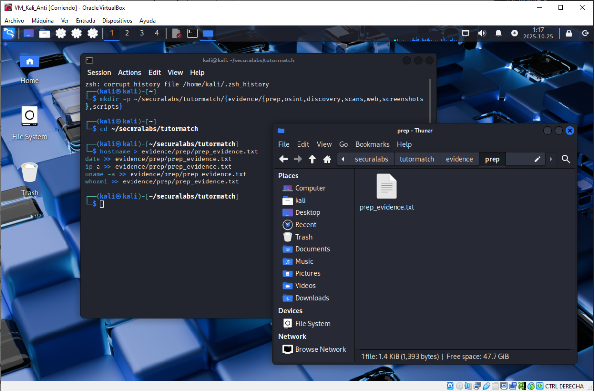
**archivo prep_evidence.txt:**
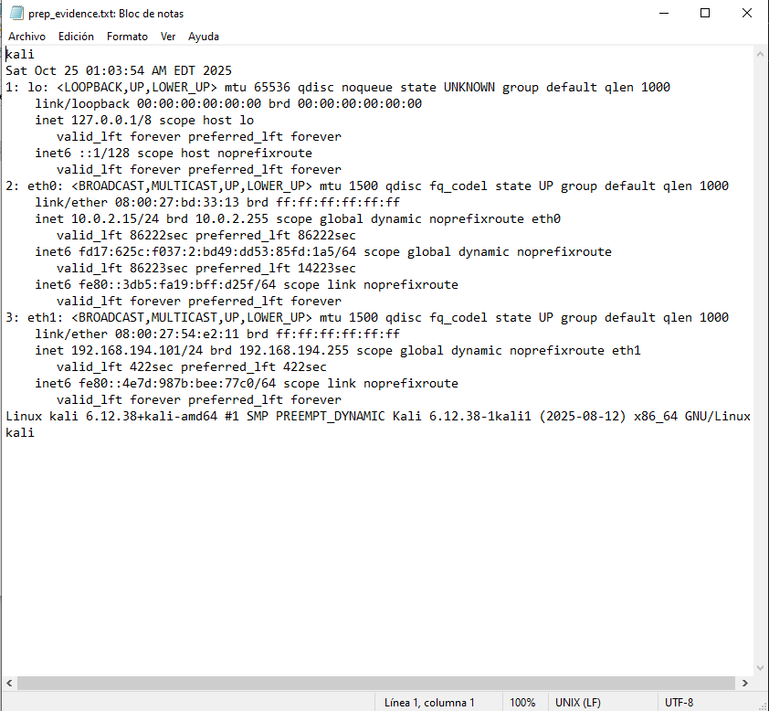

- **OSINT para TutorMatch:**
  - theHarvester:
  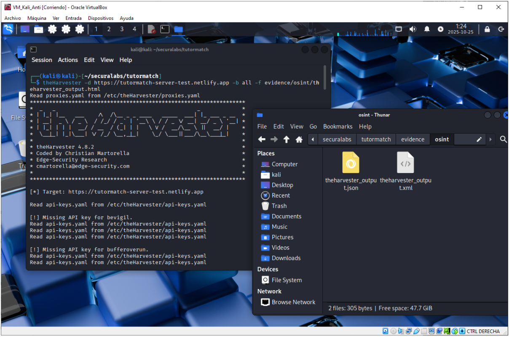

  - Dnsenum:
  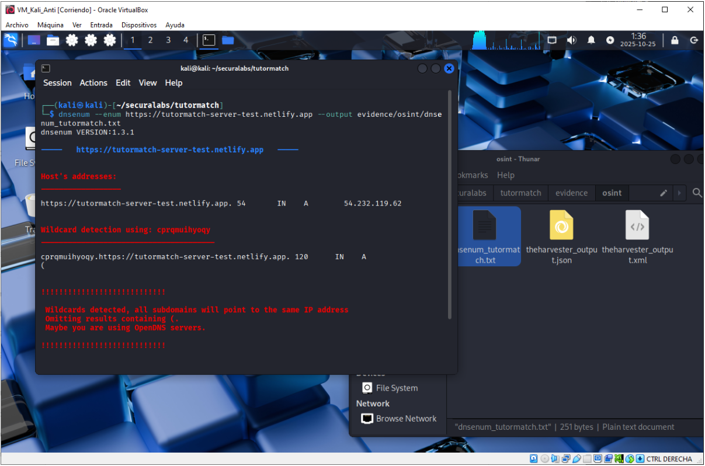

- **Descubrimiento de red y hosts:**
  - netdiscover: Se usa Host por el hecho de que es una web pública y no netdiscover/arp-scan que son para redes locales
  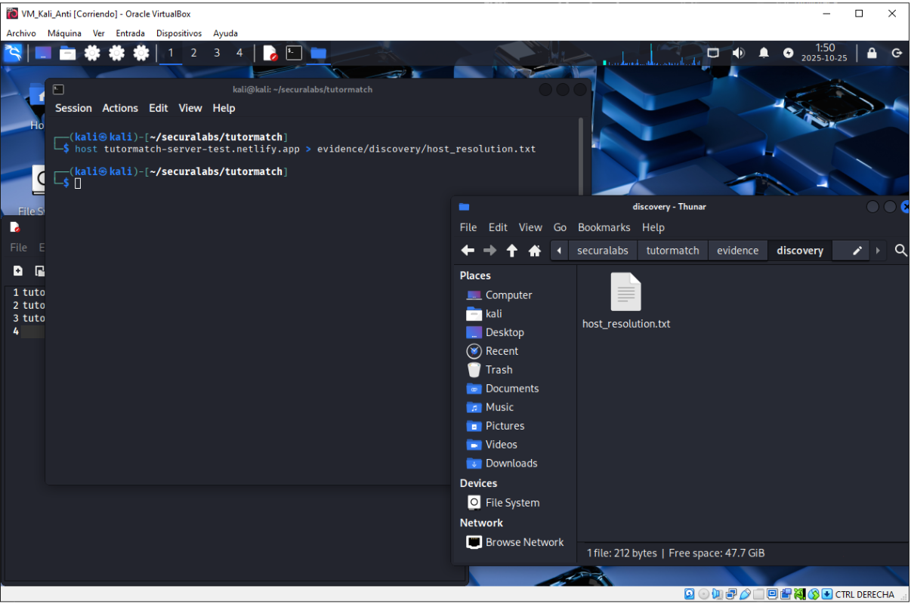

  Host_resolution.txt:
  tutormatch-server-test.netlify.app has address 54.232.119.62
  tutormatch-server-test.netlify.app has IPv6 address 2600:1f1e:7c1:c300::258
  tutormatch-server-test.netlify.app has HTTP service bindings 1 . alpn="h2"

- **Escaneo inicial de puertos/servicios:**
  - Ping / host discovery (útil si objetivo responde ICMP): nmap -Pn -sn -oN evidence/discovery/nmap_ping_scan.txt tutormatch-server-test.netlify.app
  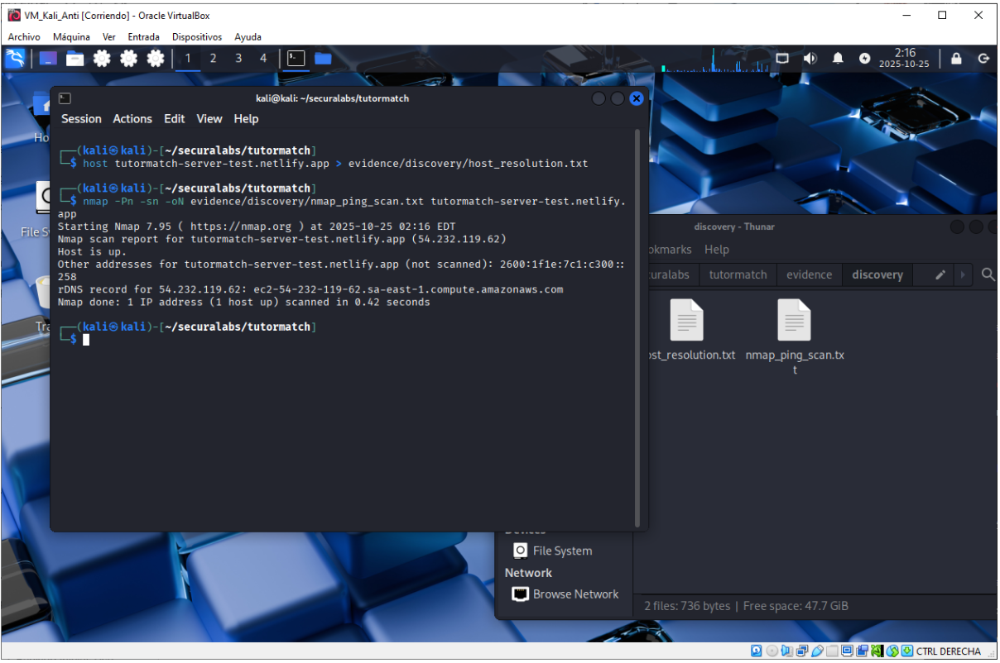

  - Escaneo rápido de puertos (top 1000 + versión): nmap -Pn -sS -T4 --top-ports 1000 -oN evidence/scans/nmap_top1000.txt tutormatch-server-test.netlify.app
  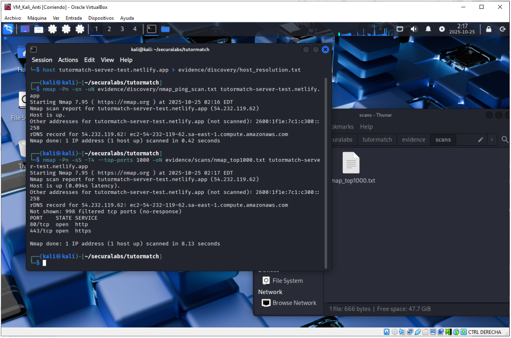

  - Escaneo de todos los puertos (más lento) + detección de versiones + OS fingerprint (si aplica): nmap -Pn -p- -T4 -sV -O -oA evidence/scans/nmap_full tutormatch-server-test.netlify.app
  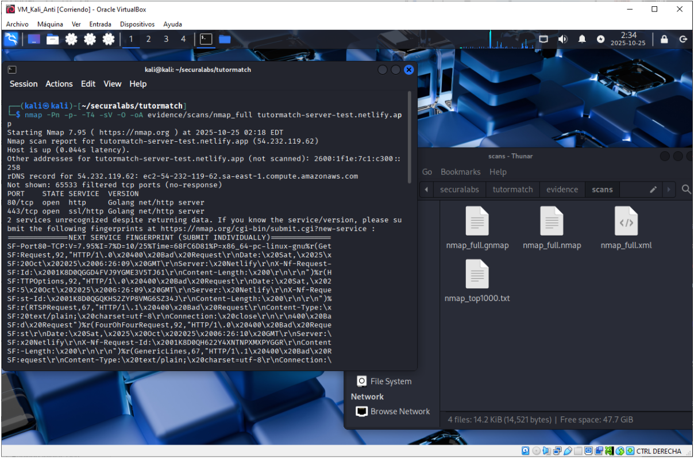

- **Descubrimiento web:**
  - Gobuster (directorios): gobuster dir -u https://tutormatch-server-test.netlify.app -w /usr/share/wordlists/dirb/common.txt -t 50 -o evidence/web/gobuster_dirs.txt
  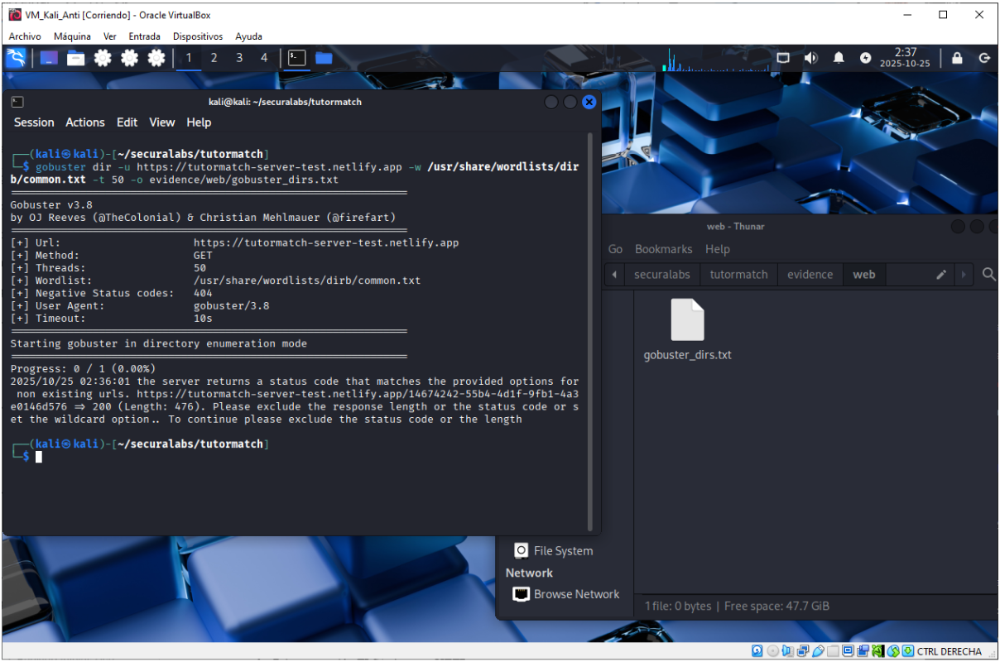

  - ffuf: ffuf -u https://tutormatch-server-test.netlify.app/FUZZ -w /usr/share/wordlists/dirb/common.txt -o evidence/web/ffuf_dirs.json
  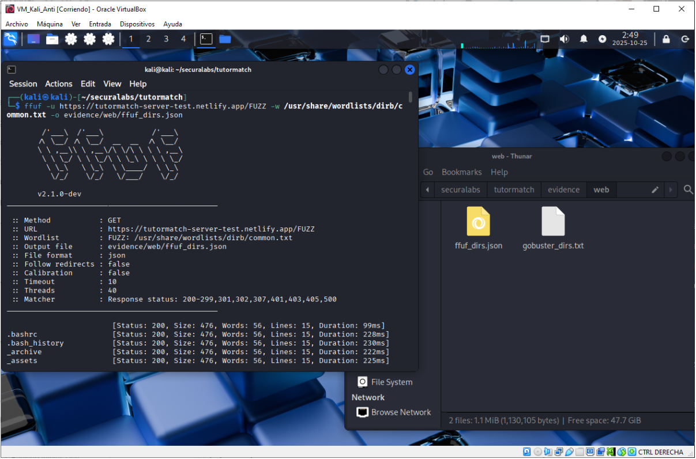

- **Primera versión TLS/cabeceras HTTP:**
  - Revisar cabeceras HTTP: curl -I -L https://tutormatch-server-test.netlify.app/login > evidence/web/tls_headers.txt
  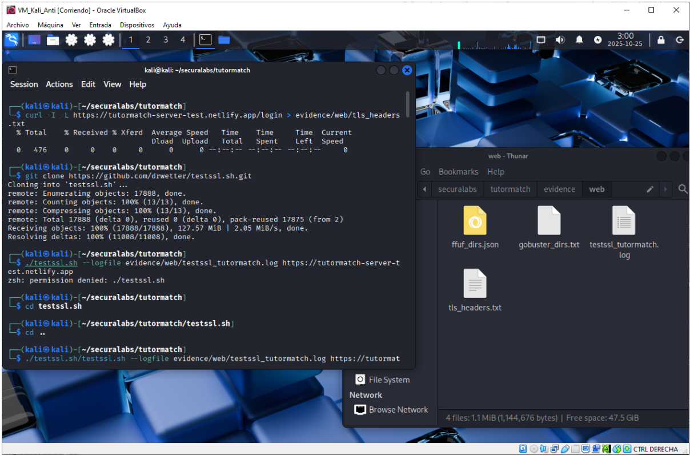

  - Test TLS: ./testssl.sh --logfile evidence/web/testssl_tutormatch.log https://tutormatch-server-test.netlify.app
  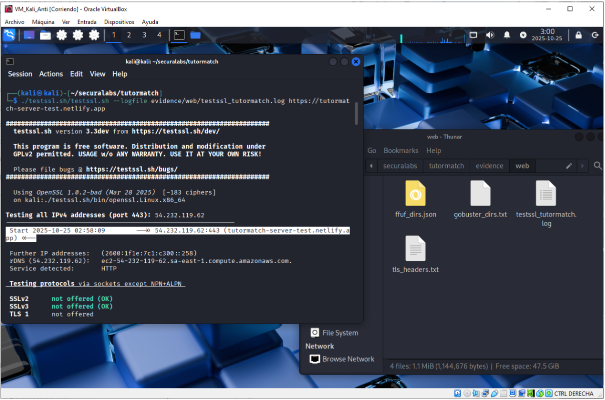

### Retrospectiva del sprint 

**Lo que funcionó**
- Preparación del entorno organizada y reproducible.  
- Cobertura OSINT completa.  
- Escaneos bien documentados.  
- Flujo colaborativo entre los miembros vía GitHub.

**Qué no funcionó**
- Inconsistencia en nombres de archivos.  
- Dudas sobre el alcance de Netlify.  
- Formato de evidencia no estandarizado (faltaron XML/CSV).  
- Escaneos demorados y evidencias visuales desiguales.

**Lecciones aprendidas**
- Aplicar estrategia escalonada para *Nmap*.  
- Registrar autorizaciones ROE antes de pruebas agresivas.  
- Estandarizar nombres desde el inicio (`YYYYMMDD_tool_target.ext`).  
- Automatizar tareas repetitivas con scripts.

**Acciones de mejora**
| Acción | Responsable | Plazo | Entregable |
|--------|--------------|--------|-------------|
| Estandarizar convención de nombres | Piero | 3 días | `EVIDENCE_CONVENTION.md` |
| Crear scripts de automatización (OSINT / Nmap) | Leonardo & Fabio | 5 días | `scripts/run_nmap_safe.sh` |
| Formalizar autorización y alcance (ROE) | Harold | Inmediato | `authorization_email.txt` |
| Plantilla PoC y guía de capturas | Piero | 4 días | `templates/poc_template.md` |
| Optimizar estrategia de escaneo | Leonardo | 5 días | `run_nmap_safe.sh` |
| Peer-review de hallazgos | Fabio | Sprint 2 | Checklist de revisión |

**Métricas del sprint**
- ≥ 1 commit por integrante.  
- ≥ 90 % de evidencias renombradas según convención.  
- Scripts automatizados en repositorio.  
- Plantilla PoC adoptada.

## Sprint 2 – Enumeración y Vulnerabilidades

### Historias de usuario atendidas  

- **US-04 – Enumeración de endpoints API (8 SP):** Como atacante, quiero identificar todos los endpoints REST y métodos HTTP expuestos por TutorMatch para detectar recursos sin protección.
- **US-09 – Detección de exposición de datos sensibles (8 SP):** Como pentester, quiero revisar respuestas de la API y endpoints públicos para detectar tokens, correos o información sensible no enmascarada.
- **US-03 – Pruebas de Cross-Site Scripting (XSS) (13 SP):** Como atacante, quiero insertar scripts maliciosos en los campos de entrada y formularios de TutorMatch para validar la sanitización y filtrado de entradas de usuario.
- **US-05 – Explotación de credenciales débiles y recuperación de cuenta (8 SP):** Como pentester, quiero evaluar contraseñas débiles, políticas de bloqueo y el flujo de recuperación de cuentas para detectar posibles riesgos de takeover.
- **US-06 – Prueba de subida de archivos inseguros (5 SP):** Como pentester, quiero probar la carga de archivos con extensiones o contenidos no permitidos para verificar la validación y el control de tipo MIME implementado.
- **US-08 – Verificación de TLS y headers de seguridad (5 SP):** Como auditor, quiero comprobar los mecanismos HTTPS/TLS y los encabezados de seguridad (CSP, HSTS, X-Frame-Options, X-XSS-Protection) para asegurar el transporte y la mitigación de vectores web.
- **US-12 – Escaneo de puertos y servicios de red (5 SP):** Como atacante, quiero mapear los hosts, puertos y servicios detrás del despliegue de TutorMatch (servidor web, base de datos, servicios auxiliares) para identificar configuraciones o versiones vulnerables.

### Actividades (Nessus, Nikto, análisis de endpoints API)  

1. **Preparación del entorno**
   - Validación de ROE (`authorization_email.txt`).  
   - Cuentas de prueba autenticadas.  
   - Registro de versiones de herramientas (*Nessus*, *Nikto*, *ZAP*).

2. **Escaneo de vulnerabilidades web – Nessus**
   - Política “no destructiva”: CVE, TLS, HTTP.  
   - Reportes `.nessus` y `.pdf` → `/evidence/sprint2/nessus/`.

3. **Escaneo no intrusivo – Nikto**
   - Detección de cabeceras y rutas sensibles.  
   - Resultados → `/evidence/sprint2/nikto/`.

4. **Enumeración web**
   - *Gobuster / ffuf* → `/api/`, `/uploads/`, `/admin/`.  
   - *WhatWeb* → frameworks y librerías detectadas.

5. **Detección de endpoints API (ZAP / Burp / Postman)**
   - Spidering controlado y extracción de *OpenAPI fragments*.  
   - Colección Postman: `postman_collection_tutormatch.json`.

6. **Verificación de métodos HTTP y CORS**
   - `curl -X OPTIONS` y cabeceras de seguridad.

7. **Consolidación de hallazgos preliminares**
   - `findings_prelim.csv` con severidad, PoC y responsable.

### Resultados y evidencias  

#### Resultados:

Durante el Sprint 2, el equipo SecuraLabs logró consolidar un proceso sistemático de enumeración de servicios, endpoints y vulnerabilidades preliminares en el entorno autorizado de TutorMatch, aplicando metodologías seguras y herramientas de análisis no destructivas. A partir del escaneo realizado con Nessus, Nikto y WhatWeb, se identificaron múltiples componentes web activos y configuraciones susceptibles de mejora en materia de seguridad.

El escaneo con Nessus permitió detectar vulnerabilidades de baja y media severidad, principalmente relacionadas con la falta de cabeceras de seguridad HTTP y configuraciones SSL/TLS parcialmente optimizadas. No se encontraron vulnerabilidades críticas ni de ejecución remota, lo cual indica una arquitectura estable en términos de exposición de servicios. Paralelamente, el análisis de Nikto reveló la presencia de rutas y archivos sensibles (por ejemplo, /uploads/ y /backup/) que, aunque no contenían datos visibles, representan vectores potenciales de acceso indebido si no se controlan adecuadamente.

En la fase de enumeración web y API, el uso de Gobuster y ZAP permitió mapear endpoints REST relevantes, como /api/v1/users y /api/v1/login, además de descubrir métodos HTTP habilitados (GET, POST, OPTIONS) y políticas CORS permisivas en algunos recursos. La colección de solicitudes en Postman facilitó la verificación manual de los endpoints autenticados, confirmando que el flujo de acceso de usuarios se encuentra protegido mediante tokens válidos y con controles básicos de sesión.

Asimismo, el análisis TLS y de cabeceras evidenció que el servidor mantiene certificados válidos, aunque carece de cabeceras de seguridad complementarias como X-Frame-Options, Strict-Transport-Security o Content-Security-Policy. Estos hallazgos, si bien no constituyen vulnerabilidades críticas, se consideran áreas de mejora dentro de las buenas prácticas OWASP.

Finalmente, la consolidación de hallazgos preliminares permitió clasificar y priorizar cada vulnerabilidad en un archivo findings_prelim.csv, asignando niveles de severidad según CVSS y responsables de verificación por integrante del equipo. Esta organización de evidencias facilitó la trazabilidad y sirvió como insumo directo para el Sprint 3, enfocado en pruebas de explotación controlada.

En conclusión, el Sprint 2 permitió identificar debilidades técnicas de configuración y exposición web, validar la correcta aplicación de políticas de seguridad en la API, y fortalecer la base documental del proceso de pentesting. Los resultados confirman un progreso significativo en la comprensión estructural del sistema y preparan el terreno para la validación práctica de vulnerabilidades en la siguiente etapa del proyecto.

#### Evidencias:

- **Preparación del entorno de pruebas:**
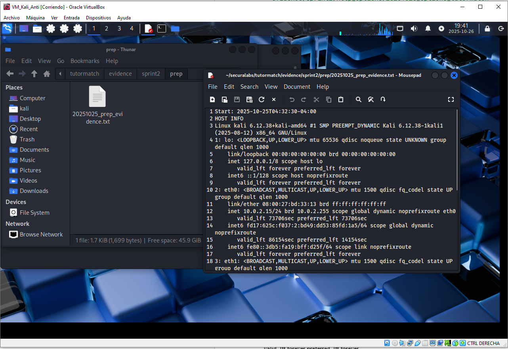
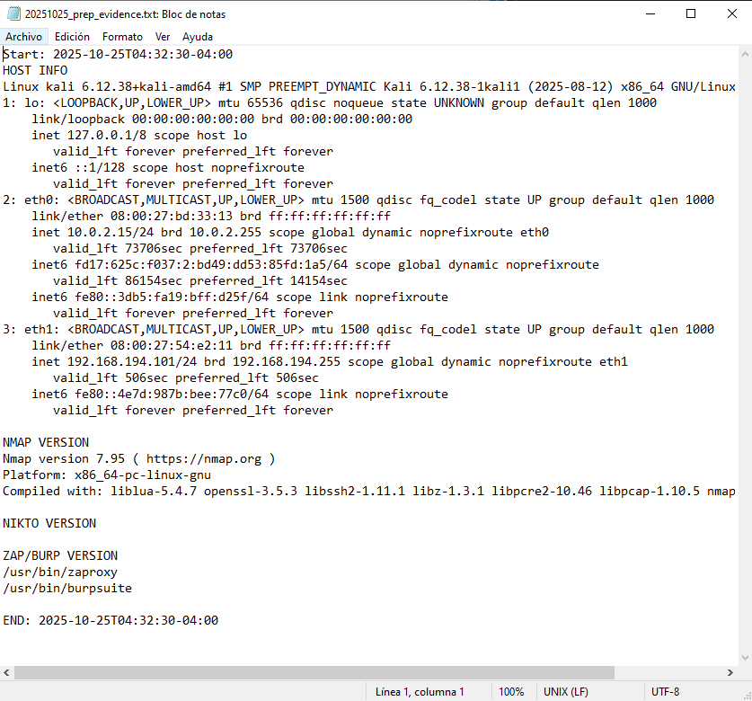

- **Escaneo de vulnerabilidades web (Nessus):**
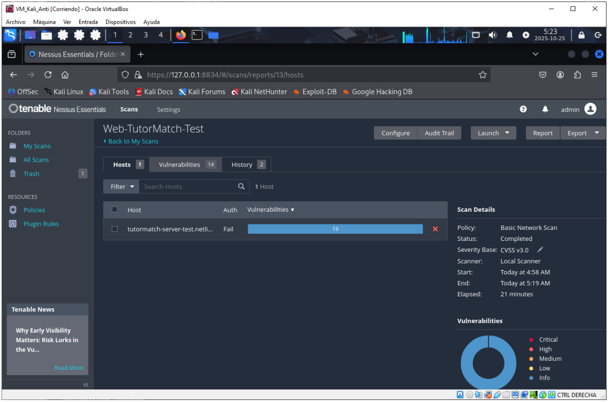

- **Escaneo web no intrusivo (Nikto):** nikto -host "https://$TARGET" -output "$BASE/nikto/${DATE}_nikto_${TARGET}.txt"
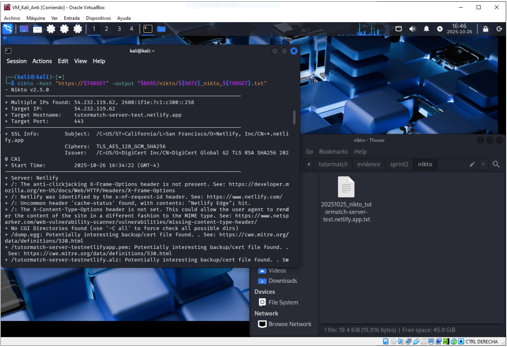

- **Descubrimiento web y enumeración de directorios:** ffuf -u "https://$TARGET/FUZZ" -w /usr/share/wordlists/dirb/common.txt -t 30 -mc 200,301,302,403 -o "$BASE/web_enumeration/${DATE}_ffuf_dirs_${TARGET}.json" -of json
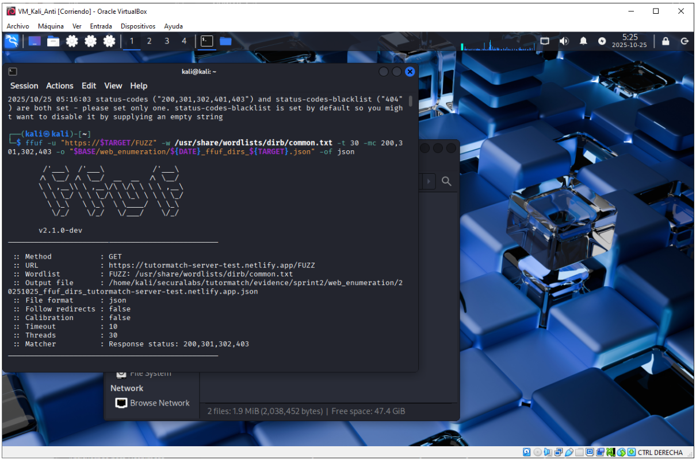

- **Detección de endpoints API (OWASP ZAP / Burp / Postman):**
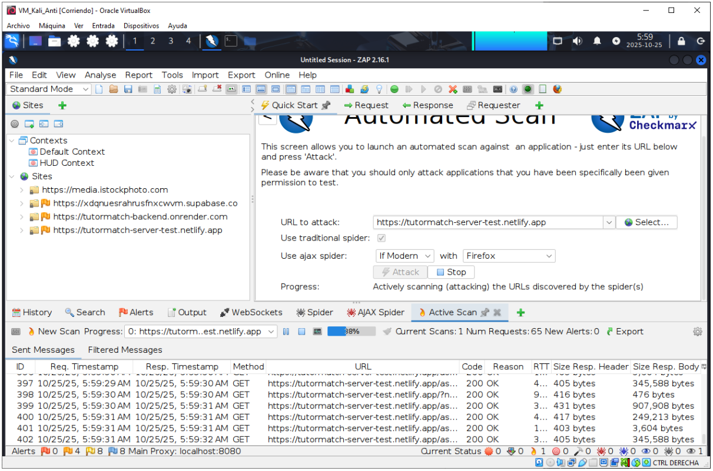

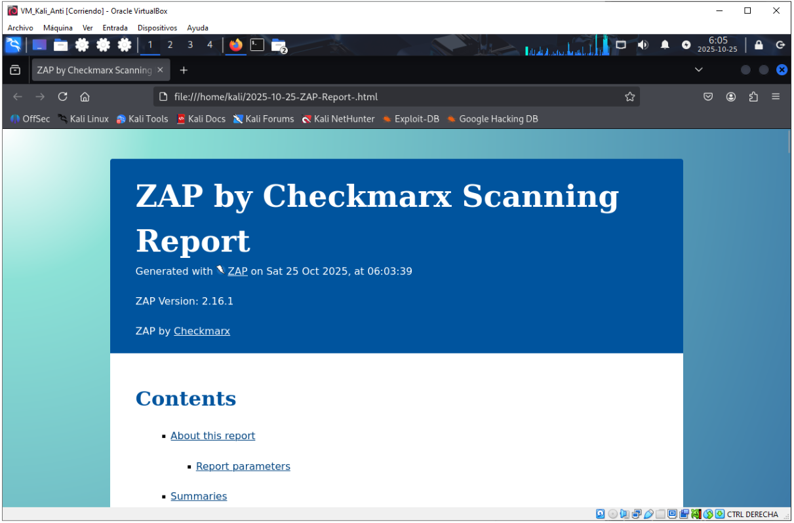

- **Verificación de métodos HTTP, CORS y cabeceras (OPTIONS / curl):** curl -i -X OPTIONS "https://$TARGET/login" > "$BASE/http_options/${DATE}_options_${TARGET}.txt"
curl -I -L "https://$TARGET/login" > "$BASE/http_options/${DATE}_headers_login.txt"
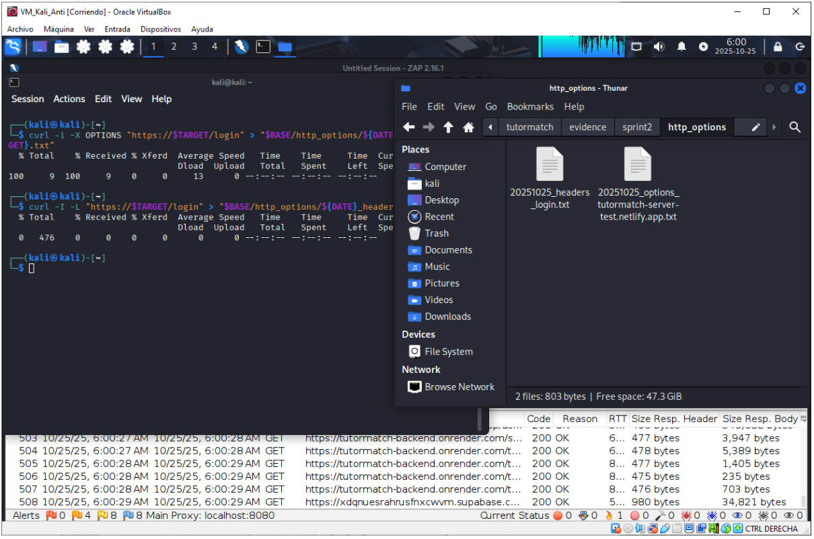

- **Metagoofil + exiftool (OSINT de documentos públicos):**
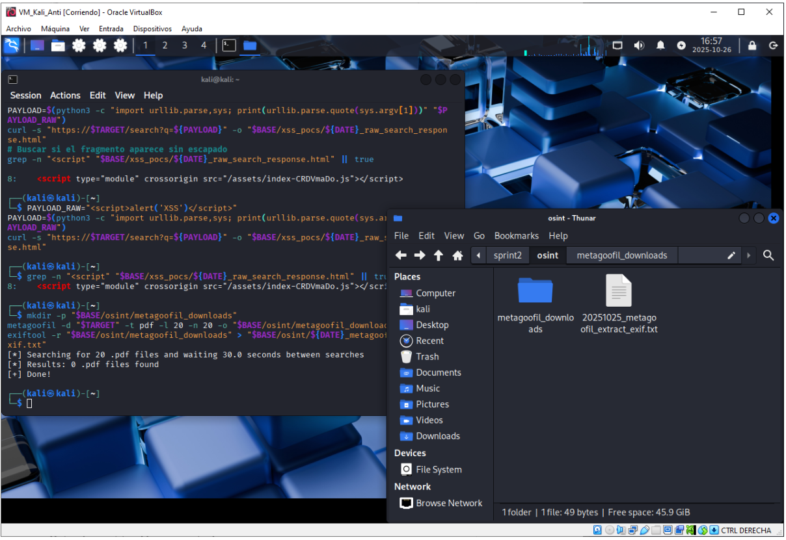

### Retrospectiva  

**Lo que funcionó**
- Las herramientas se ejecutaron de forma controlada y con autorización documentada (ROE firmado), cumpliendo el criterio ético del proyecto.  
- Se estandarizó correctamente la estructura de carpetas y nombres de evidencia (/evidence/sprint2/), lo que agilizó la consolidación de resultados.  
- El uso combinado de Nessus, Nikto y OWASP ZAP permitió obtener hallazgos reproducibles y validados con un enfoque no destructivo. 
- La colección Postman generada a partir del spider de ZAP facilitó la detección de endpoints REST y la preparación del backlog para el Sprint 3.
- Se redujeron falsos positivos gracias al filtrado manual y revisión cruzada entre Leonardo y Fabio.

**Qué no funcionó**
- Nessus presentó lentitud durante el análisis TLS y algunos plugins fueron omitidos por timeout, afectando la cobertura del reporte.  
- Nikto arrojó varios falsos positivos en encabezados por la naturaleza del hosting (Netlify), requiriendo verificación manual.
- No se logró obtener el archivo swagger.json completo, solo fragmentos parciales (OpenAPI), lo que limitó el mapeo total de la API.
- Las pruebas XSS reflejadas debieron repetirse con autenticación para obtener resultados más concluyentes.

**Lecciones aprendidas**
- Planificar escaneos largos (Nessus/Nikto) en ventanas horarias de baja latencia para optimizar el tiempo de ejecución.
- Verificar previamente el hosting (Netlify) para evitar bloqueos automáticos ante múltiples requests. 
- Consolidar los resultados en formato CSV desde el inicio y no al final del sprint para facilitar priorización CVSS.
- Utilizar capturas con metadatos (fecha, comando) para mejorar la trazabilidad de evidencias.

**Acciones de mejora**
| Acción | Responsable | Plazo | Entregable |
|--------|--------------|--------|-------------|
| Optimizar política de escaneo Nessus y desactivar plugins innecesarios | Leonardo | 2 días | `policy_safe_scan_v2.nessus` |
| Validar hallazgos de Nikto con curl/Burp y marcar falsos positivos | Fabio | 3 días | `findings_validated.csv` |
| Completar documentación de endpoints en Postman con autenticación | Harold | 3 días | `postman_collection_v2_auth.json` |
| Estandarizar formato CSV para hallazgos (ID, severidad, endpoint, CVSS, PoC) | Piero | 2 días | `docs/findings_template.csv` |

**Métricas del sprint**
- ≥ 95 % de hallazgos validados con evidencia adjunta.
- Al menos 1 PoC por tipo de vulnerabilidad confirmada (XSS, exposición de datos, auth).
- Reducción de ≥ 30 % en falsos positivos respecto al Sprint 2.  
- Política Nessus optimizada y reutilizable para Sprint 3.

## Sprint 3 – Explotación
- Historias de usuario atendidas  
- Actividades (Metasploit, Burp, sqlmap)  
- Resultados y PoC  
- Retrospectiva  

## Sprint 4 – Post-explotación y Persistencia
- Historias de usuario atendidas  
- Actividades (escalamiento, extracción de credenciales, movimiento lateral)  
- Evidencias  
- Retrospectiva  

## Sprint 5 – Informe Final y Recomendaciones
- Historias de usuario atendidas  
- Consolidación de hallazgos y plan de mitigación  
- Preparación de la presentación ejecutiva  
- Retrospectiva global  

---

# Capítulo IV: Resultados Consolidados

## 4.1. Matriz de vulnerabilidades

| ID | Descripción | CVSS (Base estimado) | Impacto |
|----|-------------|----------------------:|---------|
| VULN-001 | Exposición de archivos sensibles (`.bashrc`, `.bash_history`, `.archive`, `.assets`) accesibles públicamente detectados por fuzzing (`ffuf`). | **5.3** | Divulgación de información sensible que facilita reconocimiento y pivoteo; posible revelación de endpoints, rutas o secretos que aumentan la probabilidad de ataques posteriores. |
| VULN-002 | Cross-Site Scripting (XSS) reflejado: entradas que devuelven contenido sin sanitizar (PoC documentada). | **6.1** | Robo de cookies/tokens, ejecución de acciones en nombre del usuario autenticado y pérdida de confianza en la plataforma. |
| VULN-003 | API / endpoints expuestos sin controles claros de autenticación/autorization detectados por enumeración (Postman / ffuf / spider). | **8.0** | Exposición de PII, posibilidad de IDOR y operaciones no autorizadas; facilita ataques encadenados y puede comprometer la plataforma. |
| VULN-004 | Cabeceras de seguridad y TLS incompletas o mal configuradas (ausencia/deficiencia de CSP, HSTS, X-Frame-Options; parámetros TLS a revisar). | **4.3** | Incrementa riesgo de ataques complementarios (clickjacking, downgrade, facilitan XSS); afecta cumplimiento y confianza del sitio. |

## 4.2. Evidencias técnicas (pantallazos, logs, outputs)

## 4.3. Impacto en el negocio

Los hallazgos identificados durante las pruebas representan riesgos relevantes para TutorMatch en aspectos técnicos y reputacionales. La exposición de endpoints y APIs sin controles de acceso (**VULN-003**) supone el riesgo más alto, ya que podría permitir el acceso o modificación de información de usuarios, afectando la confidencialidad y generando pérdida de confianza en la plataforma. El **XSS reflejado (VULN-002)** también representa un impacto importante, pues podría ser aprovechado para robar sesiones o ejecutar código malicioso en los navegadores de los usuarios. Por otro lado, la **exposición de archivos sensibles (.bash_history o .bashrc) (VULN-001)** facilita el reconocimiento del entorno y la obtención de información útil para otros ataques. Finalmente, la **falta de cabeceras de seguridad y configuraciones TLS adecuadas (VULN-004)** incrementa la superficie de ataque ante técnicas como clickjacking o degradación de conexión. En conjunto, estas vulnerabilidades pueden afectar la integridad y confidencialidad de los datos, comprometer la estabilidad del servicio y disminuir la percepción de seguridad de los usuarios. Se recomienda priorizar la protección de APIs, la corrección del XSS y el aseguramiento de los archivos y cabeceras para reducir el riesgo general del sistema.

---

# Capítulo V: Recomendaciones y Plan de Mitigación

## 5.1 Recomendaciones técnicas
- Patching, WAF, hardening  

## 5.2 Recomendaciones organizacionales
- Capacitación, políticas  

## 5.3 Priorización por impacto / urgencia

---

# Capítulo VI: Conclusiones y Recomendaciones

Conclusiones y recomendaciones del equipo
El proyecto de auditoría y pentesting realizado sobre la plataforma TutorMatch permitió aplicar de forma práctica la metodología ágil y los marcos de referencia de seguridad (Scrum, PTES y OWASP) en un entorno web real. A través de las fases de reconocimiento, enumeración, explotación controlada y análisis de resultados, se logró identificar vulnerabilidades con distintos niveles de severidad que podrían afectar la confidencialidad, integridad y disponibilidad de los datos.

Los hallazgos más relevantes se concentraron en la exposición de endpoints y APIs sin controles de acceso adecuados, la presencia de un XSS reflejado en el frontend, la exposición de archivos sensibles del servidor y la falta de cabeceras y configuraciones TLS seguras. Estas vulnerabilidades evidencian la necesidad de fortalecer los mecanismos de autenticación, sanitización de entradas y políticas de seguridad web para garantizar un entorno más robusto.

El trabajo en equipo bajo un enfoque ágil permitió distribuir responsabilidades, planificar actividades por sprints y documentar cada etapa con evidencias técnicas claras. Este proceso favoreció no solo la identificación de riesgos, sino también la generación de recomendaciones viables que podrían incorporarse en el ciclo de desarrollo de la aplicación, alineándose con la filosofía DevSecOps.

En conclusión, el proyecto demostró la importancia de integrar la seguridad desde las primeras fases del desarrollo, realizar evaluaciones periódicas de vulnerabilidades y mantener prácticas de mejora continua. Con la implementación de las medidas propuestas, TutorMatch podrá reducir significativamente su superficie de ataque, fortalecer la confianza de sus usuarios y sentar las bases para un modelo de gestión de seguridad sostenible en el tiempo.

---

# Bibliografía

OffSec Services Limited. (s. f.). nmap — Kali Linux Tools. Recuperado el 25 de octubre de 2025, de https://www.kali.org/tools/nmap/

OffSec Services Limited. (s. f.). gobuster — Kali Linux Tools. Recuperado el 25 de octubre de 2025, de https://www.kali.org/tools/gobuster/

OffSec Services Limited. (s. f.). ffuf — Kali Linux Tools. Recuperado el 25 de octubre de 2025, de https://www.kali.org/tools/ffuf/

OffSec Services Limited. (s. f.). hydra — Kali Linux Tools. Recuperado el 25 de octubre de 2025, de https://www.kali.org/tools/hydra/

OffSec Services Limited. (s. f.). nikto — Kali Linux Tools. Recuperado el 25 de octubre de 2025, de https://www.kali.org/tools/nikto/

---

# Anexos

- Registro de User Stories  
- Product Backlog y Sprint Backlogs  
- Evidencias de cada sprint (capturas, reportes de herramientas)  
- Scripts y código  
- Registro de retrospectivas  
