<p align="center">
  
</p>

<h1 align="center">UNIVERSIDAD PERUANA DE CIENCIAS APLICADAS</h1>
<h2 align="center">Ingeniería de Software - Ciclo 08</h2>

---

<h2 align="center">Anti Hacking y Nuevas Tendencias de Seguridad</h2>
<p align="center"><strong>Código del curso:</strong> 1ASI0665-2520-14423</p>

<h3 align="center">Profesor</h3>
<p align="center"><strong>David Carlos Vera Olivera</strong></p>

---

<h2 align="center">INFORME DEL TRABAJO FINAL</h2>
<p align="center"><strong>Consultora:</strong> SecuraLabs</p>
<p align="center"><strong>Empresa:</strong> safeguard coffee</p>

---

<h3 align="center">Integrantes</h3>

<div align="center">

<table>
  <tr>
    <th>Nombre y Apellido</th>
    <th>Código</th>
  </tr>
  <tr>
    <td>Leonardo José Aquino Cruz</td>
    <td>u20201b949</td>
  </tr>
  <tr>
    <td>Fabio Maurizio Nicolich Alvis</td>
    <td>u202218791</td>
  </tr>
  <tr>
    <td>Harold Miguel Elías Sánchez</td>
    <td>u202212684</td>
  </tr>
  <tr>
    <td>Piero Alberto Velarde Luyo</td>
    <td>u20211a620</td>
  </tr>
</table>

</div>

<p align="center"><strong>Octubre 2025</strong></p>

---

# Registro de Versiones del Informe

| **Versión** | **Fecha** | **Cambios Realizados** | **Responsable** |
|:--:|:--:|:--|:--|
| **1.0** | **2025-10-24** | **Entrega TP1 (Semana 9):** Documento de Alcance y primer paquete de entregables. Se completaron:<br><br>**Student Outcome:** Borrador sobre contribución al Outcome 2.<br><br>**Capítulo I:** (1.1) *Startup Profile* — descripción de la PyME y expectativas del cliente. (1.2) *Consultora* — descripción y perfiles/roles SCRUM. (1.3) *Solution Profile* — antecedentes, problemática y objetivos del pentesting. (1.4) *ROE* — alcance y condiciones iniciales.<br><br>**Capítulo II:** (2.1) Marco de referencia (Scrum, PTES, OWASP). (2.2) Backlog inicial (User Stories priorizadas). (2.3) Planificación de sprints (detalle Sprint 1).<br><br>**Capítulo III (Sprint 1):** Objetivo, actividades técnicas (configuración Kali, OSINT, nmap, gobuster, TLS checks) y entregables técnicos (*prep_evidence.txt*, *discovery.txt*, carpeta OSINT, lista de endpoints, screenshots) con PoC inicial.<br><br>**Capítulo IV:** Matriz de vulnerabilidades (entradas preliminares) y evidencias adjuntas. Incluye checklist DoD parcial y evidencia subida al repositorio. | **SecuraLabs** — Harold Miguel Elías Sánchez *(Product Owner)*; Fabio Maurizio Nicolich Alvis *(Scrum Master)*; Leonardo José Aquino Cruz *(Pentester & Analyst)*; Piero Alberto Velarde Luyo *(Technical Writer)* |
| **2.0** | **2025-12-03** | **Entrega Sprint 2 y avance de Sprint 3: Se completaron:**<br><br>**Capítulo II:** Actualización de la planificación ágil — ampliación de la correspondencia PTES/OWASP/Scrum y ajustes en actividades de Sprint 2.<br><br>**Capítulo III (Sprint 2):** Desarrollo completo del sprint: enumeración avanzada, descubrimiento de endpoints API, análisis de exposición de datos sensibles, verificación de credenciales débiles y recolección de evidencias técnicas (salidas de nmap, gobuster, whatweb, capturas de Burp). Se registraron PoC iniciales asociadas a vulnerabilidades preliminares.<br><br>**Capítulo III (Sprint 3 — inicio):** Incorporación de actividades de explotación controlada (SQLi, XSS, CSRF, subida de archivos inseguros, revisión TLS/headers). Se añadieron pruebas con Burp Suite, sqlmap y herramientas de explotación para validar hallazgos críticos.<br><br>**Capítulo IV:** Actualización de la matriz de vulnerabilidades — nuevos hallazgos documentados con CVSS provisional, impacto técnico y evidencia formal (screenshots, logs y outputs).<br><br>**Capítulo V:** Inclusión del borrador inicial del plan de mitigación basado en hallazgos de los sprints 2 y 3 (hardening, saneamiento de entradas, políticas de autenticación, mejoras TLS). | **SecuraLabs** — Harold Miguel Elías Sánchez (Product Owner); Fabio Maurizio Nicolich Alvis (Scrum Master); Leonardo José Aquino Cruz (Pentester & Exploit Developer); Piero Alberto Velarde Luyo (Technical Writer & Evidence Manager) |
---

# Project Report Collaboration Insights

Durante el desarrollo del proyecto, el equipo SecuraLabs adoptó un enfoque ágil basado en Scrum, distribuyendo los roles de manera clara para garantizar una colaboración efectiva y trazable.

## Roles Scrum
- **Product Owner (líder de consultora):**  
  **Harold Miguel Elías Sánchez**  
  Responsable de definir el alcance del servicio de pentesting, gestionar la comunicación con el cliente (SafeGuard Coffee), priorizar el Product Backlog y validar los entregables de cada sprint. Supervisa la aplicación de las reglas del **ROE (Rules of Engagement)** y asegura que las pruebas se desarrollen bajo lineamientos éticos y legales.

- **Scrum Master (coordinador de procesos):**  
  **Fabio Maurizio Nicolich Alvis**  
  Encargado de coordinar las reuniones de planificación y retrospectiva, facilitar la comunicación entre los miembros del equipo, garantizar la correcta aplicación del marco **Scrum** y el cumplimiento del **Definition of Done (DoD)**. También vela por la trazabilidad y organización del repositorio (GitHub, Trello).

- **Development Team (pentesters, documentadores, analistas):**  
  **Leonardo José Aquino Cruz** – Pentester y analista técnico, responsable de la ejecución de pruebas de reconocimiento, escaneo, explotación controlada y recolección de evidencias.  
  **Piero Alberto Velarde Luyo** – Documentador y analista, encargado de registrar hallazgos, elaborar el informe técnico y consolidar las recomendaciones de seguridad.  
  El equipo colabora en la planificación de sprints, priorización de User Stories y documentación de vulnerabilidades conforme al estándar **PTES/OWASP**.

## Herramientas de colaboración usadas
- Jira  
- GitHub  
- Microsoft Teams / WhatsApp  
- Otras herramientas técnicas (Burp Suite, Metasploit, etc.)

## Repositorio del informe

El informe final se desarrollará en un repositorio público bajo la organización 1ASI0665-antihacking-G1, donde se documentará todo el ciclo de vida del proyecto, incluyendo commits, versiones y entregables.
Repositorio oficial: [https://github.com/1ASI0665-antihacking-G1/report-hacking-G1](https://github.com/1ASI0665-antihacking-G1/report-hacking-G1) 

## Evidencia de colaboración

La evidencia de colaboración refleja la participación activa de todos los integrantes del equipo **SecuraLabs** en el repositorio oficial del proyecto.  
A través de commits, revisiones y coordinación mediante GitHub, se garantizó la trazabilidad y transparencia del desarrollo.

### Actividad general del repositorio (*Pulse*)
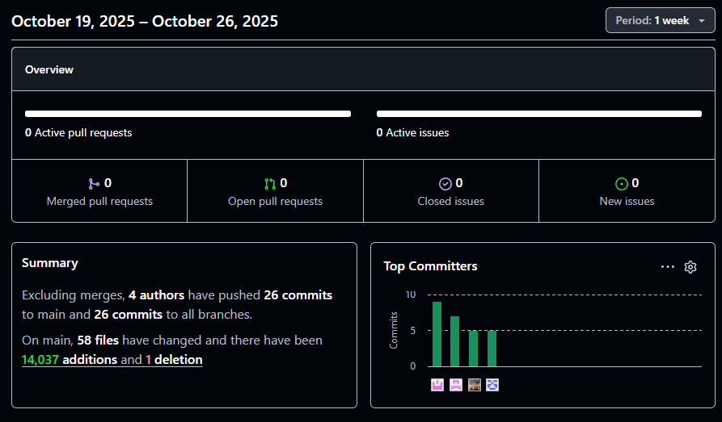

### Gráfico de contribuciones por integrante
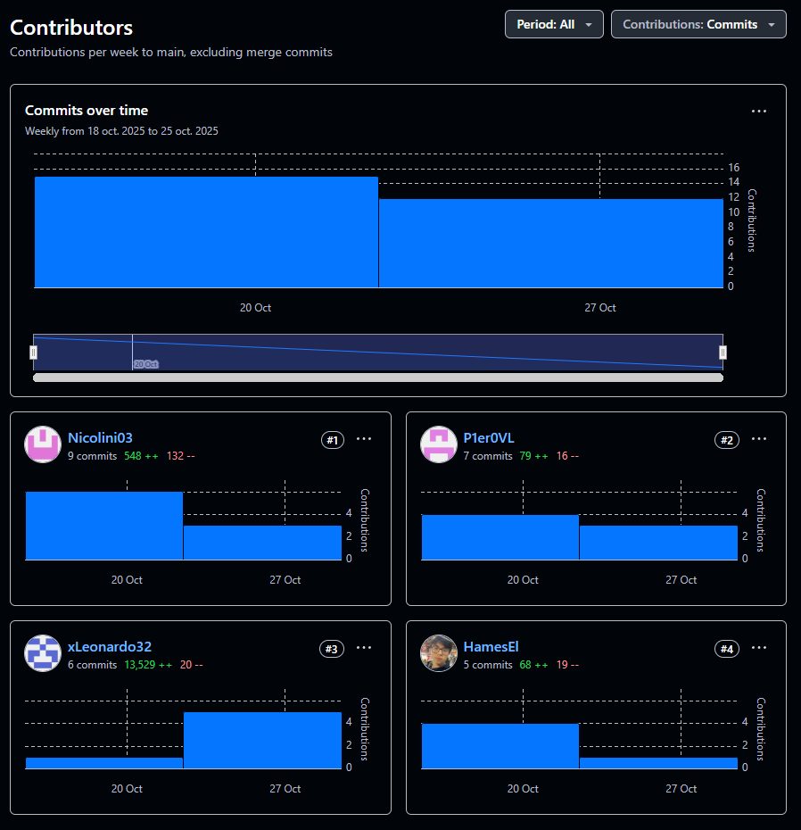

### Historial de commits y mensajes 
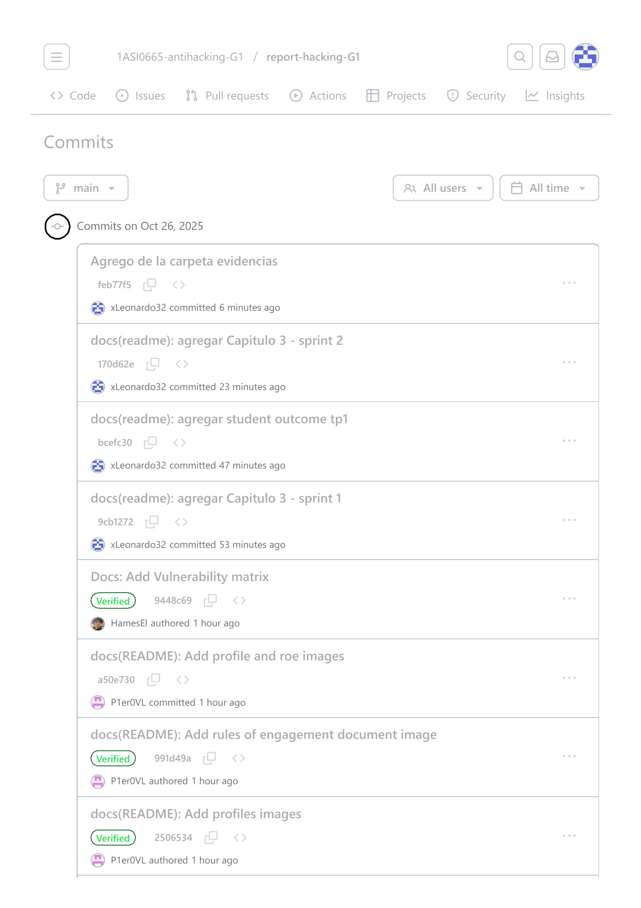
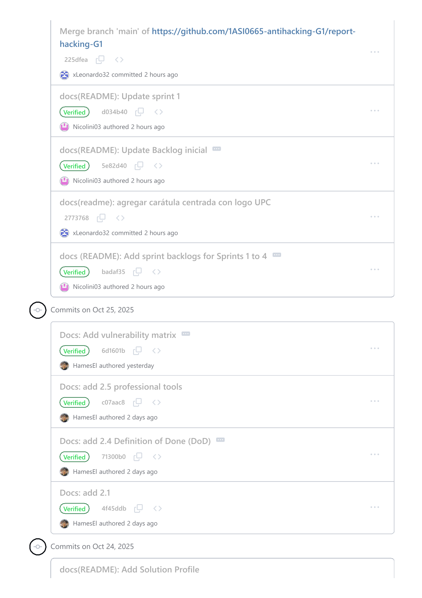
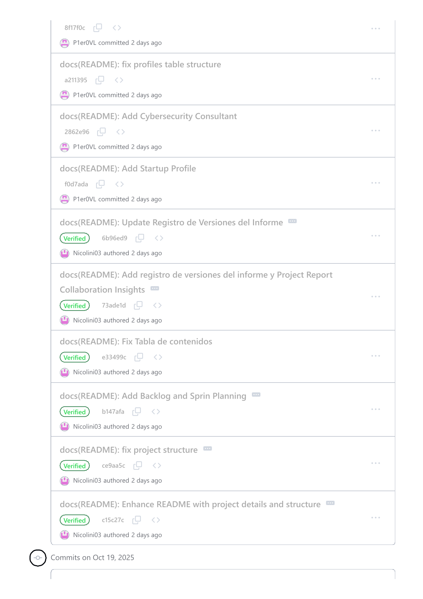


---

# Tabla de Contenidos

- [Student Outcome](#student-outcome)  
- [Capítulo I: Introducción](#capítulo-i-introducción)  
  - [1.1 Startup Profile (Cliente)](#11-startup-profile-cliente)  
  - [1.2 Consultora de Ciberseguridad (Equipo)](#12-consultora-de-ciberseguridad-equipo)  
  - [1.3 Solution Profile](#13-solution-profile)  
  - [1.4 Aceptación del Servicio de Pentesting (Rules of Engagement)](#14-aceptación-del-servicio-de-pentesting-rules-of-engagement)  
- [Capítulo II: Metodología Ágil y de Pentesting](#capítulo-ii-metodología-ágil-y-de-pentesting)  
  - [2.1 Marco de referencia](#21-marco-de-referencia)  
  - [2.2 Backlog inicial: User Stories de seguridad](#22-backlog-inicial-user-stories-de-seguridad)  
  - [2.3 Planificación de sprints (Sprint Planning)](#23-planificación-de-sprints-sprint-planning)  
  - [2.4 Definición de Done (DoD)](#24-definición-de-done-dod)  
  - [2.5 Herramientas](#25-herramientas)  
- [Capítulo III: Desarrollo del Proyecto por Sprints](#capítulo-iii-desarrollo-del-proyecto-por-sprints)  
  - [Sprint 1 – Reconocimiento y Escaneo](#sprint-1--reconocimiento--escaneo-inicial-1-semana)  
  - [Sprint 2 – Enumeración y Vulnerabilidades](#sprint-2--enumeración-y-vulnerabilidades-preliminares)  
  - [Sprint 3 – Explotación](#sprint-3--explotación-controlada-web-apis)  
  - [Sprint 4 – Post-explotación y Persistencia](#sprint-4--post-explotación-y-persistencia)  
  - [Sprint 5 – Informe Final y Recomendaciones](#sprint-5--informe-final-y-recomendaciones)  
- [Capítulo IV: Resultados Consolidados](#capítulo-iv-resultados-consolidados)  
- [Capítulo V: Recomendaciones y Plan de Mitigación](#capítulo-v-recomendaciones-y-plan-de-mitigación)  
- [Capítulo VI: Conclusiones y Recomendaciones](#capítulo-vi-conclusiones-y-recomendaciones)  
- [Bibliografía](#bibliografía)  
- [Anexos](#anexos) 

---

# Student Outcome

## Student Outcome

| Criterio Específico | Acciones realizadas | Conclusiones |
|----------------------|--------------------|---------------|
| **Diseña soluciones en ingeniería de software que satisfacen necesidades específicas considerando salud pública, seguridad, bienestar, factores globales, culturales, sociales, ambientales y económicos.** | **TP1**<br><br>
**Leonardo José Aquino Cruz**<br> Participó en la caracterización inicial de la PyME cliente mediante el análisis del perfil de la empresa, sus procesos críticos y expectativas de seguridad, identificando cómo la gestión de la información podía impactar en la continuidad del negocio, el bienestar digital de los usuarios y la seguridad de los datos. Asimismo, apoyó en la definición del alcance del servicio de pentesting y en la revisión de antecedentes del problema desde una perspectiva técnica y social.<br><br>**Fabio Maurizio Nicolich Alvis**<br> Lideró la estructuración del Startup Profile, la definición de los objetivos generales y específicos del pentesting, y la organización del backlog inicial de seguridad bajo un enfoque ágil. Además, integró factores económicos, organizacionales y culturales de la PyME en la planificación de los sprints, asegurando que la propuesta de solución fuera viable, alineada a las capacidades reales del cliente y orientada a la protección del bienestar y la seguridad de la información.<br><br>**Harold Miguel Elias Sanchez**<br> Contribuyó en la definición del marco metodológico combinando Scrum, PTES y OWASP, participando en la formulación de las primeras historias de usuario desde la perspectiva del atacante. Asimismo, apoyó en la identificación de los riesgos iniciales asociados a las vulnerabilidades más frecuentes en aplicaciones web, considerando su impacto en la seguridad de los usuarios y en la operación de la empresa.<br><br>**Piero Alberto Velarde Luyo**<br> Apoyó en la elaboración de los Rules of Engagement y en la delimitación del alcance técnico y ético del servicio de pentesting, garantizando que las actividades se desarrollaran en un entorno controlado y autorizado. También colaboró en la planificación de los primeros sprints, considerando factores organizacionales, económicos y de responsabilidad profesional en la prestación del servicio de ciberseguridad.<br><br>**TF1**<br><br>**Leonardo José Aquino Cruz:**<br> Realizó el reconocimiento inicial de la infraestructura, ejecutó análisis de superficie de ataque y aplicó metodologías PTES y OWASP para identificar vulnerabilidades críticas, evaluando su impacto en el bienestar digital y la operación de la PyME. Además, analizó la sensibilidad de los datos manejados por el sistema para determinar riesgos que pudieran afectar la salud pública o la seguridad de los usuarios, y colaboró en la priorización de los hallazgos y en la elaboración del plan de mitigación considerando los recursos económicos y las capacidades reales de la organización.<br><br>**Fabio Maurizio Nicolich Alvis:**<br> Organizó el backlog inicial con historias de usuario enfocadas en seguridad, y definió criterios de aceptación tomando en cuenta factores económicos, sociales y culturales de la PyME. Asimismo, estructuró la arquitectura del informe, consolidó los hallazgos técnicos en un lenguaje accesible para la dirección y evaluó la viabilidad de las soluciones propuestas según el contexto global de amenazas y la capacidad financiera del negocio, garantizando que las recomendaciones fueran aplicables y sostenibles.<br><br>**Harold Miguel Elias Sanchez:**<br> Ejecutó pruebas de explotación controlada utilizando Metasploit, Burp Suite y SQLmap para validar las vulnerabilidades detectadas y determinar el impacto real de los ataques sobre la integridad, disponibilidad y confidencialidad de los datos. Además, generó evidencias técnicas como capturas, reportes y logs que demostraron cómo fallas específicas podían afectar el bienestar de los usuarios y los procesos críticos del negocio, y colaboró en la propuesta de contramedidas técnicas alineadas con buenas prácticas globales de ciberseguridad.<br><br>**Piero Alberto Velarde Luyo:** Desarrolló la fase de post-explotación ejecutando técnicas de escalamiento de privilegios, movimiento lateral y persistencia para evaluar el nivel de compromiso al que podría llegar un atacante real, analizando las consecuencias económicas, reputacionales y organizacionales de un incidente de seguridad. También diseñó estrategias de monitoreo, recomendaciones de políticas internas y propuestas de endurecimiento del sistema, integrando factores globales, sociales y culturales para fortalecer la resiliencia y el bienestar de la organización en el largo plazo. |  **TP1**<br><br>Como equipo se demostró la capacidad de diseñar una propuesta de solución en ingeniería de software orientada a la seguridad informática desde sus etapas iniciales, integrando factores económicos, sociales, culturales y de bienestar en la definición del problema, los objetivos del pentesting y la planificación del trabajo. La estructuración del perfil del cliente, la consultora, el backlog inicial y los sprints permitió establecer una base sólida para abordar las necesidades reales de la PyME, garantizando que el servicio propuesto respondiera tanto a requerimientos técnicos como a condiciones de contexto que influyen directamente en la seguridad, la continuidad del negocio y el bienestar digital. **TF1**<br><br>Como equipo, se demostró la capacidad de diseñar soluciones en ingeniería de software que responden a necesidades específicas de la PyME integrando factores económicos, culturales, ambientales y de bienestar, garantizando que las propuestas fueran realistas y sostenibles dentro del contexto del cliente. A partir del pentesting y las metodologías ágiles aplicadas, se identificaron vulnerabilidades con impacto potencial en la seguridad, operación y confianza de los usuarios, permitiendo proponer soluciones que fortalecen la protección de datos, la continuidad del negocio y la responsabilidad social frente a la información manejada. El trabajo colaborativo permitió construir recomendaciones que equilibran complejidad técnica y accesibilidad ejecutiva, demostrando que la seguridad no solo responde a aspectos tecnológicos sino también a elementos sociales, culturales y económicos que influyen directamente en la salud digital y el bienestar del entorno organizacional. |
| **Valida que el diseño de la solución considere salud pública, seguridad, bienestar, y factores globales, culturales, sociales, ambientales y económicos.** | **TP1**<br><br>**Leonardo José Aquino Cruz**<br> Validó que el diseño inicial del servicio de pentesting considerara la protección de la información sensible de la PyME, analizando cómo los activos digitales y los datos manejados por la organización podían afectar la seguridad, el bienestar de los usuarios y la continuidad del negocio. Asimismo, revisó que la caracterización del cliente incorporara factores sociales y operativos relevantes para la correcta definición del alcance de la auditoría.<br><br>**Fabio Maurizio Nicolich Alvis**<br> Validó la coherencia entre los objetivos del pentesting, el perfil del cliente y las limitaciones económicas y organizacionales de la PyME, asegurando que la solución propuesta fuera realista y sostenible. Además, contrastó el backlog inicial de historias de usuario con el contexto cultural, social y económico de la empresa, garantizando que el diseño del servicio respondiera a necesidades reales de seguridad y bienestar digital.<br><br>**Harold Miguel Elias Sanchez**<br> Participó en la validación del marco metodológico integrado (Scrum + PTES + OWASP), verificando que su aplicación permitiera evaluar riesgos que impactan directamente en la seguridad de la información y en el bienestar de los usuarios. Asimismo, revisó que las primeras historias de usuario reflejaran amenazas alineadas con el contexto global de ciberseguridad y con los riesgos más frecuentes en aplicaciones web.<br><br>**Piero Alberto Velarde Luyo**<br> Validó los Rules of Engagement desde un enfoque técnico y ético, verificando que el diseño del servicio de pentesting respetara principios de legalidad, responsabilidad profesional y cuidado del entorno organizacional. También revisó que la planificación de los sprints considerara factores ambientales, organizacionales y de impacto económico asociados a la ejecución de pruebas de seguridad controladas.<br><br>**TF1**<br><br>**Leonardo José Aquino Cruz:**<br> Validó el diseño técnico de la solución analizando la forma en que las vulnerabilidades podían impactar la salud pública y la seguridad de los usuarios, especialmente en módulos que involucraban tratamiento de información sensible. Evaluó la relación entre las brechas encontradas y los riesgos globales de ciberseguridad, verificó que las recomendaciones propuestas no solo resolvieran aspectos técnicos, sino que alinearan el sistema con estándares de bienestar digital y continuidad operativa, y confirmó que las mitigaciones fueran viables económica y operativamente para la PyME.<br><br>**Fabio Maurizio Nicolich Alvis:**<br> Contrastó el diseño de la solución con el contexto real del cliente, validando que cada propuesta de mejora considerara el impacto cultural, social y económico dentro de la organización. Evaluó la compatibilidad del diseño con políticas de seguridad y prácticas internacionales, revisó los requisitos del cliente para garantizar que la solución cumpliera necesidades específicas sin generar cargas económicas innecesarias, y verificó que los lineamientos documentados promovieron bienestar organizacional y una relación adecuada entre riesgos, costos y beneficios.<br><br>**Harold Miguel Elias Sanchez:** <br> Validó el diseño de la solución verificando que las contramedidas técnicas propuestas mitigaran adecuadamente las amenazas identificadas durante la explotación controlada, asegurando que su implementación redujera riesgos que afectan la seguridad y el bienestar del usuario final. Analizó el impacto social y global de los vectores de ataque encontrados y evaluó si las soluciones propuestas eran coherentes con el entorno operativo de la PyME. Además, verificó que las recomendaciones respetaran principios éticos, culturales y de protección de datos, asegurando un diseño responsable.<br><br>**Piero Alberto Velarde Luyo:** <br> Validó el diseño en términos de resiliencia, asegurándose de que las medidas planteadas reforzarán la seguridad sin comprometer factores económicos ni procesos críticos de la organización. Revisó cómo ataques avanzados podrían afectar operatividad, reputación y bienestar interno, confirmando que las estrategias de endurecimiento y monitoreo respondieran a riesgos globales actuales y a la cultura operativa del negocio. También evaluó que las recomendaciones fortalecieran la protección de la información y promovieran una operación sostenible, segura y culturalmente adecuada. | **TP1**<br><br>Como equipo se validó que el diseño de la solución de pentesting, desde sus etapas iniciales, considerara de forma integral la seguridad de la información, el bienestar digital, los factores económicos de la PyME y el contexto social, cultural y global en el que opera. La revisión del perfil del cliente, los objetivos, las reglas de compromiso y la planificación ágil permitió asegurar que la solución propuesta no solo fuera técnicamente correcta, sino también responsable, sostenible y alineada con el impacto que la seguridad tiene sobre las personas, la organización y su entorno.**TF1**<br><br>El equipo concluyó que la validación del diseño fue realizada considerando integralmente la salud pública, la seguridad, el bienestar y el contexto global y social en el que opera la PyME. Las verificaciones demostraron que las soluciones propuestas eran factibles, técnicas y económicamente viables, y que respondían adecuadamente a las necesidades específicas del cliente sin comprometer la sostenibilidad operativa. Además, se constató que el diseño respetaba el entorno cultural y organizacional del negocio, incorporando criterios éticos y sociales en la toma de decisiones. De manera conjunta, se aseguró que la solución final fortaleciera la protección de datos, la resiliencia ante amenazas globales y el bienestar digital de la organización, cumpliendo así con los principios fundamentales del Student Outcome. |

---

# Capítulo I: Introducción

## 1.1 Startup Profile (Cliente)
### Descripción de la PyME 

SafeGuard Coffee es una pequeña empresa peruana dedicada a la selección, tostado y comercialización de cafés especiales de alta calidad. Desde su fundación en 2010, la empresa ha recorrido diversas regiones cafeteras del mundo en busca de granos excepcionales, trabajando de manera directa con agricultores que comparten su compromiso con la sostenibilidad, el comercio justo y la excelencia en cada etapa del proceso. </br>

La empresa forma parte del sector Agroindustrial, un rubro que combina prácticas agrícolas tradicionales con procesos modernos de trazabilidad, control de calidad y experiencia sensorial. Su principal propuesta de valor es ofrecer cafés de origen cuidadosamente seleccionados, provenientes de zonas de alta montaña garantizando una experiencia auténtica y única en cada taza. </br>

SafeGuard Coffee basa su modelo de negocio en la venta de café tostado, productos complementarios y experiencias relacionadas con el consumo del café, todo respaldado por un ecosistema digital que permite una gestión eficiente de clientes, ventas y operaciones.

**Servicios digitales ofrecidos**

Para asegurar una operación moderna y accesible, la empresa cuenta con un ecosistema tecnológico dividido en dos componentes principales:
- **Frontend Web:** Funciona como el portal principal para clientes y distribuidores, permitiéndoles explorar el catálogo de cafés de especialidad, conocer el origen de cada grano, realizar compras en línea y gestionar sus pedidos, pagos y envíos. Además, brinda acceso a información sobre certificaciones sostenibles y recomendaciones de preparación, todo mediante una interfaz intuitiva y orientada a la experiencia del usuario.
- **Backend:** El backend actúa como la API central que gestiona las operaciones internas de la empresa, incluyendo el control de inventario, la trazabilidad de lotes, el procesamiento de pedidos y pagos, y la administración de usuarios y perfiles. También coordina la sincronización con sistemas logísticos y la gestión del contenido y la información de productos, garantizando un flujo de datos seguro, eficiente y actualizado.

Ambas plataformas trabajan conjuntamente para brindar una experiencia fluida, segura y confiable, permitiendo que la empresa mantenga un estándar de calidad acorde con su compromiso: llevar a cada cliente un café sostenible, de origen certificado y cuidadosamente seleccionado.

**Misión y visión**
- **Misión:** Ofrecer cafés de especialidad de origen sostenible, conectando directamente a los consumidores con agricultores comprometidos con la calidad y el comercio justo. Buscamos brindar una experiencia auténtica en cada taza mediante procesos responsables, trazabilidad completa y el uso de tecnologías que faciliten el acceso a nuestros productos artesanales.
- **Visión:** Consolidarnos en los próximos cinco años como una de las marcas de café de especialidad más reconocidas del país, destacando por nuestra calidad, sostenibilidad y conexión directa con productores de alta montaña. Aspiramos a liderar la transformación digital del sector cafetalero mediante soluciones innovadoras que acerquen la experiencia del café premium a consumidores locales e internacionales.

**Mercado objetivo**

El mercado objetivo de SafeGuard Coffee está compuesto por consumidores interesados en cafés de especialidad, especialmente aquellos que valoran la sostenibilidad, el comercio directo y la trazabilidad del producto. La empresa se orienta tanto a clientes finales como a distribuidores, cafeterías boutique y negocios gastronómicos. A mediano plazo, busca expandir su presencia a nuevos segmentos del sector horeca y consolidarse como un referente dentro del mercado nacional e internacional de cafés de alta calidad.

### Expectativas del cliente  

Las expectativas del cliente se centran en recibir una evaluación de ciberseguridad clara, práctica y orientada a la acción, que permita identificar y priorizar amenazas reales dentro del ecosistema digital de SafeGuard Coffee. El cliente espera que el análisis detecte vulnerabilidades que puedan afectar la integridad del flujo de compra, la disponibilidad del sistema, la confidencialidad de los datos de clientes o la seguridad de las transacciones en línea. Esto incluye fallas en controles de autenticación, configuraciones inseguras, exposición de información sensible, riesgos de acceso no autorizado al inventario o al backend, y cualquier debilidad que pueda facilitar ataques como inyección, secuestro de sesión o escalación de privilegios. </br>

Asimismo, el cliente espera un informe técnico exhaustivo con hallazgos reproducibles y evidencia verificable (logs, capturas, payloads y pasos de explotación), acompañado de un plan de remediación priorizado que detalle mitigaciones concretas, estimación de esfuerzo y nivel de criticidad de cada vulnerabilidad. También valora un resumen ejecutivo orientado a personal no técnico, así como recomendaciones para fortalecer sus prácticas de seguridad, mejorar su postura de defensa y establecer lineamientos sostenibles de ciberseguridad en sus operaciones digitales.

## 1.2 Consultora de Ciberseguridad (Equipo)
### Descripción de la consultora  

SecuraLabs es una consultora académica de ciberseguridad conformada por estudiantes de la carrera de Ingeniería de Software de la Universidad Peruana de Ciencias Aplicadas (UPC). El equipo se especializa en la aplicación de metodologías de seguridad ofensiva, evaluación de vulnerabilidades y pruebas de penetración (pentesting) orientadas a entornos web, móviles y de infraestructura en red.
El enfoque de SecuraLabs se centra en la identificación proactiva de amenazas y evaluación del riesgo tecnológico dentro de organizaciones que buscan fortalecer su postura de seguridad digital. El equipo combina conocimientos técnicos adquiridos en el ámbito académico con buenas prácticas reconocidas, como el uso de estándares OWASP, NIST SP 800-115 y MITRE ATT&CK, aplicados a contextos reales de desarrollo y despliegue de software.

**Misión**

Nuestra misión es ayudar a las organizaciones a descubrir y mitigar vulnerabilidades antes de que puedan ser explotadas, mediante la ejecución de pruebas controladas y éticas que simulan ataques reales. Buscamos fomentar una cultura de seguridad preventiva y aprendizaje continuo, aportando soluciones prácticas y estrategias de mejora que fortalezcan los sistemas y procesos de nuestros clientes frente a las nuevas tendencias de ciberamenazas.


### Perfiles de los integrantes y roles Scrum  

| Perfil | Descripción |
|--------|-------------|
|  | **Harold Elías – Product Owner**</br>Estudiante de Ingeniería de Software en octavo ciclo, con interés en las áreas de ciberseguridad y pentesting. Posee experiencia en los lenguajes C++ y Python a nivel intermedio, además de haber participado en proyectos de desarrollo web y en la implementación de pruebas unitarias utilizando C# con NUnit.</br> Como Product Owner en SecuraLabs, Harold se encarga de definir y priorizar el backlog de seguridad, alineando las necesidades del cliente con los objetivos técnicos del equipo. Su capacidad de análisis y trabajo colaborativo facilita la toma de decisiones orientadas a maximizar el valor de las pruebas de ciberseguridad, asegurando que los entregables respondan a las expectativas del cliente.|
||**Fabio Nicolich – Scrum Master**</br>Estudiante de Ingeniería de Software en séptimo ciclo, destacado por su liderazgo, responsabilidad y proactividad en la gestión de equipos. Cuenta con conocimientos en C++, HTML, CSS, JavaScript y Python, además de interés en el uso de frameworks modernos para el desarrollo de aplicaciones web.</br> Como Scrum Master, Fabio promueve la comunicación efectiva, la coordinación del equipo y la aplicación de los valores ágiles, garantizando el cumplimiento de los objetivos en cada sprint. Su compromiso con la calidad y la mejora continua contribuye a mantener un entorno colaborativo, motivando al equipo hacia resultados consistentes y orientados al aprendizaje conjunto.|
||**Leonardo Aquino – Pentester & Security Analyst**</br>Estudiante de Ingeniería de Software en décimo ciclo, con experiencia en desarrollo web, ciberseguridad y diseño de videojuegos utilizando Godot y Unity. Domina lenguajes como C++, Python y JavaScript, y posee una fuerte orientación hacia la creación de soluciones seguras y la prevención de vulnerabilidades.</br> Como Pentester & Security Analyst en SecuraLabs, Leonardo lidera la ejecución de las pruebas ofensivas y el análisis técnico de vulnerabilidades, participando en la identificación, validación y documentación de hallazgos. Su capacidad analítica y su enfoque en resultados fortalecen la calidad técnica del proceso de evaluación de seguridad.|
||**Piero Velarde – Technical Writer & Documentador**</br>Estudiante de Ingeniería de Software en séptimo ciclo, con interés en tecnologías emergentes, programación y ciberseguridad. Maneja los lenguajes C++, Python, JavaScript y Dart, y mantiene una actitud proactiva hacia el aprendizaje continuo y la investigación tecnológica.</br> Dentro de SecuraLabs, Piero desempeña el rol de Technical Writer & Documentador, siendo responsable de la redacción técnica, estructuración del informe y sistematización de evidencias. Además, asegura la coherencia comunicativa entre las fases técnicas y los entregables finales, contribuyendo a la claridad, precisión y formalidad de los documentos presentados al cliente.|


## 1.3 Solution Profile
### Antecedentes y problemática  

Las pequeñas y medianas empresas que operan en entornos digitales como Safeguard Coffee, dedicada a la venta de productos y servicios a través de plataformas web, se encuentran cada vez más expuestas a riesgos de seguridad informática. La adopción de sistemas basados en comercio electrónico, formularios de contacto, pasarelas de pago, bases de datos en la nube y APIs incrementa su superficie de ataque, convirtiéndolas en objetivos atractivos para actores maliciosos que buscan vulnerar sistemas poco protegidos. </br>

Durante un análisis preliminar del sitio web de Safeguard Coffee (https://safeguard-coffee.ngrok.app/), se identificaron posibles deficiencias típicas de plataformas emergentes, tales como:

- Controles insuficientes de validación y sanitización de entradas.
- Exposición potencial de endpoints accesibles públicamente.
- Configuraciones inadecuadas de seguridad web (cabeceras HTTP, políticas de contenido, configuración TLS/SSL).
- Falta de mecanismos robustos para la protección de datos y autenticación.

Estas condiciones aumentan la probabilidad de ataques comunes como inyección SQL, XSS, secuestro de sesiones, scraping automatizado, fuerza bruta y exploración no autorizada de recursos internos. La empresa, ante el crecimiento de su presencia digital, reconoce la necesidad de una auditoría de seguridad ofensiva que evalúe de forma realista su postura actual de ciberseguridad. </br>

Asimismo, incidentes recientes en otras empresas similares del sector, donde se han reportado filtraciones de información por vulnerabilidades no corregidas, refuerzan la urgencia de actuar de manera preventiva. Por ello, Safeguard Coffee Co. ha solicitado la realización de una evaluación integral de seguridad ofensiva, con el objetivo de identificar brechas críticas, fortalecer sus activos digitales y establecer un plan de mejora continua basado en las mejores prácticas del marco OWASP y estándares internacionales de pentesting.

### Objetivos del pentesting (General y específicos)  

**Objetivo general**

Realizar una evaluación integral de seguridad ofensiva (pentesting) sobre el sitio web de Safeguard Coffee, con el fin de identificar vulnerabilidades técnicas, riesgos de exposición de datos y configuraciones inseguras. La evaluación permitirá elaborar un informe técnico y un plan de remediación que fortalezcan la postura de seguridad y reduzcan la probabilidad de explotación por parte de actores maliciosos.

**Objetivos específicos**
1.	**Identificar vulnerabilidades críticas en los componentes principales del sitio web de SafeGuard Coffee** (frontend, endpoints, formularios y servicios asociados), mediante la ejecución de pruebas de inyección, validación de entradas y análisis de permisos.

2.	**Evaluar la robustez de los mecanismos de autenticación, gestión de sesiones y recuperación de cuentas**, comprobando la resistencia del sistema frente a ataques de fuerza bruta, enumeración de usuarios y suplantación de identidad, en caso de que la plataforma implemente dichos mecanismos.

3.	**Detectar exposición de información sensible** (tokens, correos electrónicos, metadatos, claves embebidas o datos personales) en las respuestas del servidor, archivos públicos, librerías utilizadas o configuraciones del sitio.

4.	**Analizar la configuración de seguridad de la infraestructura y servicios asociados**, incluyendo protocolos de cifrado (TLS/HTTPS), encabezados de seguridad HTTP, políticas de cookies, uso de librerías desactualizadas y posibles puntos de acceso no controlados.

5.	**Ejecutar pruebas de explotación controlada (Proof of Concept)** sobre las vulnerabilidades encontradas, validando su impacto y nivel de riesgo de acuerdo con metodologías OWASP y CVSS.

Finalmente, una vez cumplidos todos los objetivos, elaborar un informe técnico detallado y un plan de remediación, priorizando las acciones correctivas y recomendaciones para mitigar riesgos y fortalecer la seguridad del ciclo de desarrollo bajo prácticas DevSecOps.


## 1.4 Aceptación del Servicio de Pentesting (Rules of Engagement)

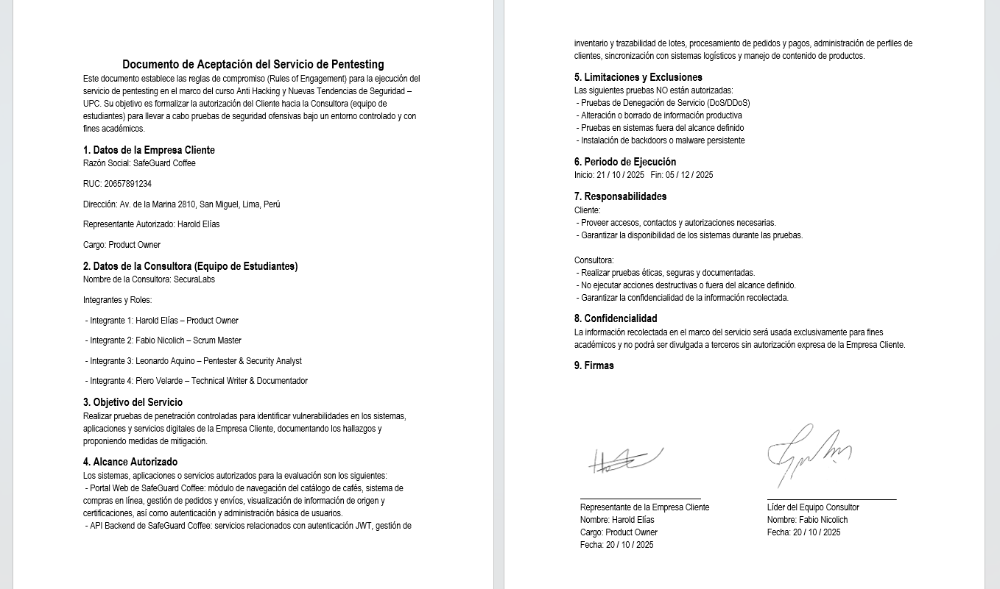

# Capítulo II: Metodología Ágil y de Pentesting

## 2.1 Marco de referencia

El presente proyecto adopta un enfoque ágil basado en **Scrum**, adaptado al contexto del **pentesting corporativo**. Esta integración permite gestionar de forma iterativa y controlada las actividades técnicas, priorizando la entrega continua de valor en cada sprint y la mejora constante del producto.

El marco Scrum, tradicionalmente orientado al desarrollo de software, se ajusta aquí para guiar los ciclos de **planificación, ejecución, validación y documentación** de las pruebas de penetración. El equipo se organiza en roles específicos:

- **Product Owner (PO):** Responsable de definir el alcance, objetivos y criterios de aceptación del pentest.
- **Scrum Master:** Vela por el cumplimiento del marco Scrum, la gestión de impedimentos y la comunicación efectiva del equipo.
- **Equipo de Pentesters:** Encargados de ejecutar las tareas técnicas, documentar hallazgos y proponer medidas de mitigación.

Cada sprint de pentesting está alineado con las fases de los estándares reconocidos en la industria, especialmente **PTES (Penetration Testing Execution Standard)** y **OWASP Testing Guide (v5)**. Estas metodologías proporcionan la estructura técnica sobre la cual Scrum define su dinámica de trabajo. La correspondencia se resume así:

| Fase PTES | Fase OWASP | Sprint Scrum asociado | Objetivo principal |
|:--|:--|:--|:--|
| Pre-engagement Interactions | Information Gathering | **Sprint 1:** Reconocimiento y Escaneo inicial | Identificar el alcance, activos y vectores de ataque |
| Intelligence Gathering | Threat Modeling | **Sprint 2:** Enumeración y vulnerabilidades preliminares | Descubrir servicios, endpoints y posibles vulnerabilidades |
| Vulnerability Analysis | Testing for OWASP Top 10 | **Sprint 3:** Explotación controlada | Validar vulnerabilidades críticas mediante PoC seguras |
| Exploitation | Post-Exploitation | **Sprint 4:** Post-explotación y persistencia | Verificar impacto y acceso a información sensible |
| Reporting | Remediation Verification | **Sprint 5:** Informe final y recomendaciones | Documentar hallazgos, riesgos e impactos al negocio |

Además, se complementa con las guías de:

- **OSSTMM (Open Source Security Testing Methodology Manual):** Como referencia para la evaluación objetiva de seguridad y métricas de rendimiento.
- **NIST SP 800-115:** Para estructurar la documentación y trazabilidad de pruebas en conformidad con estándares federales estadounidenses.
- **MITRE ATT&CK Framework:** Como apoyo en la identificación de técnicas y tácticas de adversarios reales, facilitando la correlación de hallazgos con comportamientos de amenazas conocidas.

Este marco integrado garantiza que el proceso sea **repetible, medible y verificable**, manteniendo la ética profesional y la conformidad con buenas prácticas internacionales.

La ejecución de cada sprint incluye reuniones de:

- **Sprint Planning:** Selección de historias de usuario, definición de objetivos y estimación de esfuerzo.
- **Daily Scrums:** Sincronización diaria sobre avances, impedimentos y ajustes de tareas.
- **Sprint Review:** Validación de criterios de aceptación y demostración de entregables.
- **Retrospective:** Evaluación de procesos y oportunidades de mejora.

De esta manera, se asegura que cada iteración aporte resultados concretos (evidencias, PoC, registros) y que las decisiones técnicas se documenten oportunamente en función de la evolución del pentest.

---

## 2.2 Backlog inicial: User Stories de seguridad

Una vez redactadas todas las User Stories (US), es fundamental priorizarlas. El Product Backlog organiza las historias de usuario de acuerdo con su importancia y el valor que aportan al proyecto. Para ello, los Story Points se asignaron usando la escala de Fibonacci (1, 2, 3, 5, 8, 13). Las historias con más puntos se desarrollarán antes, al representar un mayor impacto en la seguridad del sistema.

| Orden | User Story ID | Título | Descripción (Historia de Usuario) | Story Points |
|:--:|:--:|:--|:--|:--:|
| 01 | US-01 | Identificación de servicios expuestos | Como atacante externo quiero identificar los servicios expuestos del sistema para conocer los puertos abiertos y versiones activas. | 3 |
| 02 | US-02 | Descubrimiento de directorios ocultos | Como atacante quiero descubrir directorios ocultos del servidor web para identificar rutas accesibles con respuesta HTTP 200 o 301. | 5 |
| 03 | US-03 | Obtención de información pública (OSINT) | Como atacante quiero obtener información pública del sistema para identificar correos, usuarios y tecnologías utilizadas. | 5 |
| 04 | US-04 | Validación de seguridad de túneles | Como atacante quiero validar la seguridad de los túneles de comunicación para confirmar la accesibilidad a los dominios expuestos. | 2 |
| 05 | US-05 | Enumeración de endpoints web | Como pentester quiero enumerar los endpoints del sitio web para identificar todos los archivos .php accesibles. | 5 |
| 06 | US-06 | Validación de credenciales web | Como pentester quiero validar credenciales web para verificar un inicio de sesión exitoso con el usuario carlos.mendez@safeguard.coffee. | 3 |
| 07 | US-07 | Análisis de vulnerabilidades web básicas | Como pentester quiero analizar vulnerabilidades web básicas para identificar headers inseguros, XSS y SQLi. | 8 |
| 08 | US-08 | Documentación de la superficie de ataque | Como pentester quiero documentar la superficie de ataque para listar formularios, parámetros GET/POST y cookies. | 8 |
| 09 | US-09 | Acceso a logs del sistema | Como atacante quiero acceder a los logs internos del sistema para descargar archivos de registro. | 3 |
| 10 | US-10 | Obtención de credenciales de infraestructura | Como atacante quiero obtener credenciales de infraestructura para identificar usuarios y contraseñas de base de datos y SSH. | 8 |
| 11 | US-11 | Extracción de información de la base de datos | Como atacante quiero extraer información de la base de datos para obtener un dump de tablas de clientes y empleados. | 8 |
| 12 | US-12 | Acceso remoto al servidor | Como atacante quiero obtener acceso remoto al servidor para establecer una conexión SSH exitosa. | 5 |
| 13 | US-13 | Escalamiento de privilegios a root | Como atacante quiero escalar privilegios a nivel root para obtener una shell con UID 0. | 8 |
| 14 | US-14 | Búsqueda de archivos sensibles protegidos | Como atacante quiero buscar archivos sensibles en directorios protegidos para leer /root/ y archivos de configuración. | 5 |
| 15 | US-15 | Exfiltración de base de datos de clientes | Como atacante quiero exfiltrar la base de datos de clientes para descargar un archivo CSV o SQL a mi máquina local. | 5 |
| 16 | US-16 | Persistencia en el sistema (simulada) | Como atacante quiero mantener persistencia en el sistema para crear un usuario backdoor de manera simulada. | 3 |

---

## Criterios de aceptación generales y Definition of Done (DoD)

### Criterios de Aceptación Generales por Historia

- **Reproducibilidad:**  
Cada hallazgo debe incluir de forma detallada los pasos exactos para su reproducción, especificando requests, payloads, headers y condiciones del entorno.

- **Evidencia:**  
Toda vulnerabilidad identificada debe estar sustentada con evidencias claras, tales como capturas de pantalla y salidas de herramientas de análisis (Burp Suite, sqlmap, nmap, OWASP ZAP, Nessus, entre otras).

- **Impacto:**  
Se debe asignar una clasificación CVSS provisional, indicando el impacto potencial sobre la confidencialidad, integridad y disponibilidad de los datos, así como sobre la funcionalidad de la plataforma SafeGuard Coffee.

- **Recomendación:**  
Por cada hallazgo se debe proponer una mitigación técnica concreta, clara y aplicable al entorno evaluado.  

- **Ética / Legal:**  
En caso de que el ROE (Rules of Engagement) prohíba la extracción de datos reales, las Proof of Concept (PoC) únicamente deben demostrar la existencia de la vulnerabilidad o la metadata asociada, sin comprometer información sensible del sistema ni de los usuarios.

### Definition of Done (DoD) por Historia de Usuario

- La historia de usuario se encuentra documentada y vinculada al Sprint Backlog correspondiente.

- Las evidencias (screenshots, outputs de herramientas, colecciones Postman/Burp, reportes de ZAP/Nessus) están adjuntas, ordenadas y correctamente nombradas.  

- Cada hallazgo cuenta con su descripción de impacto y una priorización de riesgo (Crítico, Alto, Medio, Bajo).  

- Se incluye al menos una recomendación técnica priorizada, con su respectivo horizonte de mitigación.  

- El checklist de reproducción de la vulnerabilidad se encuentra completado y validado.

---

## 2.3 Planificación de sprints (Sprint Planning)

Todas las actividades técnicas se ejecutaron sobre el proyecto **SafeGuard Coffee**, en un entorno de laboratorio expuesto mediante **Ngrok**, autorizado para fines académicos.

Durante la ceremonia de **Sprint Planning**, el equipo técnico selecciona las Historias de Usuario del Product Backlog y las **descompone en tareas técnicas específicas (Work Items)**. Esto permite asignar responsables, estimar tiempos en horas y asegurar que cada paso técnico (como configurar una herramienta o ejecutar un script) esté cubierto.

Antes de iniciar las pruebas se definieron las **ROE (Rules of Engagement)** considerando:

- **Entorno permitido:** dominio público de laboratorio (*.ngrok.app).
- **Alcance:** únicamente reconocimiento, enumeración y acceso a archivos expuestos.
- **Restricciones:** no realizar explotación destructiva ni ataques de denegación de servicio.
- **Extracción de datos:** solo evidencia mínima necesaria (PoC).
- **Ventanas de ejecución:** fuera de horarios productivos.

---

### Sprint 1: Reconocimiento & Escaneo inicial

**Duración:** 1 semana

**Metodología:** PTES – Fase 1 (Intelligence Gathering)

**Objetivo:** Identificar y documentar la superficie de ataque pública de SafeGuard Coffee: dominio, servicios, rutas web y posibles vectores iniciales de acceso.

**Sprint Backlog 1**

| User Story Id | User Story Title | Work Item Id | Work Item Title | Description | Estimation | Assigned To | Status |
|---:|---|---:|---|---|:--:|:--|:--|
| US-01 | Identificación de servicios expuestos | 1.1 | Preparación del entorno | Configuración de Kali Linux, creación de estructura de carpetas del proyecto y validación del entorno local. | (1h) | Leonardo | Done |
| US-03 | Obtención de información pública (OSINT) | 1.2 | OSINT | Recolección de información pública del dominio mediante Google Dorks, TheHarvester y análisis de sitemap. | (2h) | Leonardo | Done |
| US-04 | Validación de seguridad de túneles | 1.3 | Validación de servicios expuestos | Verificación manual de conectividad HTTP/HTTPS usando netcat debido a restricciones de Ngrok. | (1h) | Leonardo | Done |
| US-02 | Descubrimiento de directorios ocultos | 1.4 | Enumeración recursiva /backup | Análisis del directorio /backup y detección de archivos sensibles. | (2h) | Leonardo | Done |
| US-02 | Descubrimiento de directorios ocultos | 1.5 | Descubrimiento web | `gobuster` para directorios y fingerprinting. | (1h) | Leonardo | Done |
| US-01 | Identificación de servicios expuestos | 1.6 | Fingerprinting HTTP | Identificación de tecnologías backend y cabeceras de seguridad ausentes mediante curl. | (1h) | Leonardo / Piero | Done |
| US-08 | Documentación de la superficie de ataque | 1.7 | Registro de evidencias | Organización de evidencias, outputs y hallazgos críticos del Sprint. | (1h) | Piero | Done |

**Objetivo del Sprint:**  
Identificar y documentar de forma reproducible la superficie de ataque expuesta de SafeGuard Coffee, incluyendo:

- Dominio público activo.
- Servicios accesibles (HTTP/HTTPS).
- Tecnologías backend.
- Rutas sensibles accesibles.
- Archivos críticos expuestos.

Este inventario guía directamente las actividades de explotación controlada del Sprint 2.

**Actividades técnicas Ejecutadas**

**1. Preparación del Entorno**

- Configuración de Kali Linux.
- Creación de estructura de directorios del proyecto.
- Organización de carpetas OSINT, Nmap y Enumeración.

**2. OSINT para SafeGuard Coffee**

- Google Dorks para:
  - Archivos PHP expuestos.
  - Directorios listables.
  - Posibles credenciales en texto plano.
- TheHarvester para:
  - Correos electrónicos.
  - Subdominios.
- Descarga e inspección de sitemap.xml.

**3. Validación de Servicios**

- Uso de netcat para validar conectividad en:
  - Puerto 80 (HTTP).
  - Puerto 443 (HTTPS).
- No se ejecutó escaneo agresivo con Nmap por limitaciones del túnel Ngrok.

**4. Enumeración de Directorios**

- Enumeración manual sobre raíz del sitio mediante script Bash con curl.
- Identificación del directorio crítico: `/backup`

**5. Enumeración Recursiva de `/backup`**

- Análisis recursivo de rutas internas.
- Descubrimiento del archivo:
  - credentials.bak (200 OK – Crítico)

**6. Análisis de Archivo Crítico**

- Descarga del archivo.
- Identificación de credenciales administrativas válidas.


**Entregables del Sprint 1**

- Carpeta `/osint/` con:
  - Resultados de Google Dorks.
  - TheHarvester.
  - Sitemap descargado.
- Carpetas:
  - `/enumeracion/`
  - `/backup/`
- Archivo `credentials.bak` como evidencia crítica.
- Capturas de:
  - Enumeración de directorios.
  - Cabeceras HTTP.
  - Descarga del archivo sensible.

Documento de **inventario inicial de superficie de ataque**.

---

### Sprint 2: Enumeración y vulnerabilidades preliminares

**Duración:** Semana 3 – 4

**Metodología:** PTES – Fase 2 (Vulnerability Analysis) + OWASP Testing Guide

**Objetivo del Sprint:**
Enumerar en profundidad las funcionalidades del sitio web de SafeGuard Coffee, validar las credenciales obtenidas en el Sprint 1 e identificar vulnerabilidades preliminares de forma no destructiva.


**Sprint Backlog 2**

| User Story Id | User Story Title | Work Item Id | Work Item Title | Description | Estimation | Assigned To | Status |
|---:|---|---:|---|---|:--:|:--|:--|
| US-05 | Enumeración de endpoints web | 2.1 | Preparación del entorno Sprint 2 | Creación de estructura de carpetas para OWASP ZAP, headers y enumeración web. | (1h) | Harold | Done |
| US-07 | Análisis de vulnerabilidades web básicas | 2.2 | Escaneo OWASP ZAP | Identificación de configuraciones inseguras y directorios peligrosos. | (2h) | Harold | Done |
| US-07 | Análisis de vulnerabilidades web básicas | 2.3 | Análisis de cabeceras HTTP | Verificación manual de HSTS, CSP, X-Frame-Options. | (1h) | Harold | Done |
| US-06 | Validación de credenciales web | 2.4 | Login con credenciales filtradas | Autenticación en panel administrativo usando credenciales de `credentials.bak.` | (1h) | Harold | Done |
| US-05 | Enumeración de endpoints web | 2.5 | Enumeración autenticada | Descubrimiento de rutas internas usando cookies de sesión válidas. | (2h) | Harold | Done |
| US-08 | Documentación de la superficie de ataque | 2.6 | Registro de evidencias y matriz de vulnerabilidades | Clasificación de vulnerabilidades preliminares con severidad. | (1h) | Piero | Done |

**Objetivo:**  
Enumerar en profundidad los endpoints web públicos y autenticados de SafeGuard Coffee, validar las credenciales obtenidas en el Sprint 1 y detectar vulnerabilidades preliminares a nivel de configuración, cabeceras de seguridad y exposición de información sensible, bajo un enfoque no destructivo.

**Actividades técnicas**
- Preparación del entorno de trabajo para el Sprint 2 y organización de carpetas de evidencias.
- Escaneo automático de vulnerabilidades web mediante OWASP ZAP.
- Análisis manual de cabeceras HTTP para verificación de políticas de seguridad.
- Validación de credenciales obtenidas en el Sprint 1 mediante autenticación real en el sistema.
- Enumeración autenticada de directorios y funciones internas del panel administrativo.
- Identificación de rutas internas, archivos de log y posibles vectores de ataque adicionales.
- Documentación de la superficie de ataque autenticada (formularios, parámetros, sesiones, cookies).

**Entregables**
- Carpeta del Sprint 2 con estructura organizada (zap, headers, web_enum).
- Reporte de escaneo OWASP ZAP.
- Archivo de cabeceras HTTP capturadas.
- Evidencias de autenticación exitosa en el sistema.
- Evidencias de enumeración autenticada.
- Listado de vulnerabilidades preliminares detectadas.
- Registro de la superficie de ataque autenticada.

---

### Sprint 3: Explotación controlada (web, APIs)

**Duración:** Semana 5 – 6

**Metodología:** PTES – Fase 3 (Exploitation)

**Objetivo del Sprint:**
Explotar de manera controlada las vulnerabilidades críticas identificadas en los sprints previos para acceder a los logs internos del sistema, obtener credenciales de infraestructura, extraer información de la base de datos y lograr acceso remoto al servidor mediante SSH, respetando las reglas de compromiso (ROE).

**Sprint Backlog 3**

| User Story Id | User Story Title | Work Item Id | Work Item Title | Description | Estimation | Assigned To | Status |
|---:|---|---:|---|---|:--:|:--|:--|
| US-09 | Acceso a logs del sistema | 3.1 | Descarga de logs internos | Descarga y análisis del archivo `db_connection_test.log` desde `/admin/logs/`. | (2h) | Leonardo | Planned |
| US-10 | Obtención de credenciales de infraestructura | 3.2 | Extracción de credenciales | Identificación de usuarios y contraseñas de DB y SSH desde los logs internos. | (2h) | Harold | Planned |
| US-11 | Extracción de información de la base de datos | 3.3 | Acceso y dump de BD | Conexión remota a MySQL y consulta de tablas de clientes y empleados. | (3h) | Leonardo | Planned |
| US-12 | Acceso remoto al servidor | 3.4 | Conexión SSH al servidor | Acceso remoto mediante SSH con credenciales obtenidas y verificación de privilegios. | (2h) | Leonardo | Planned |

**Objetivo:**  
Explotar de forma controlada las vulnerabilidades críticas identificadas en los sprints anteriores para obtener acceso a los logs internos del sistema, credenciales de infraestructura, información sensible de la base de datos y acceso remoto al servidor mediante SSH, respetando en todo momento las reglas de compromiso (ROE).

**Actividades técnicas**
- Preparación del entorno de trabajo para actividades de explotación y organización de evidencias.
- Descarga y análisis de archivos de log internos desde el panel administrativo.
- Identificación y validación de credenciales de base de datos y acceso remoto obtenidas desde los logs.
- Conexión remota a la base de datos MySQL mediante credenciales válidas.
- Enumeración de bases de datos, tablas y extracción controlada de información sensible.
- Obtención de acceso remoto al servidor mediante conexión SSH.
- Verificación de privilegios del usuario obtenido en el sistema.
- Documentación técnica de cada vector de explotación ejecutado.

**Entregables**
- Carpeta del Sprint 3 organizada (logs, db_dump).
- Evidencias de descarga y análisis de archivos de log internos.
- Evidencias de conexión exitosa a la base de datos MySQL.
- Evidencias de extracción de información de tablas críticas.
- Evidencias de acceso remoto al servidor mediante SSH.
- Registro de credenciales de infraestructura comprometidas (entorno de laboratorio).
- Documentación técnica de vectores de explotación utilizados.
- Matriz de impacto preliminar de la información comprometida.

---

### Sprint 4: Post-explotación y persistencia

**Duración:** Semana 7 – 8

**Metodología:** PTES – Fase 4 (Post Exploitation)

**Objetivo del Sprint:**
Escalar privilegios hasta nivel root en el servidor comprometido, localizar información sensible en directorios protegidos, exfiltrar datos críticos de clientes y evaluar mecanismos de persistencia de forma controlada, respetando las reglas de compromiso (ROE).

**Sprint Backlog 4**

| User Story Id | User Story Title | Work Item Id | Work Item Title | Description | Estimation | Assigned To | Status |
|---:|---|---:|---|---|:--:|:--|:--|
| US-13 | Escalamiento de privilegios a root | 4.1 | Enumeración de privilegios sudo | Verificación de permisos sudo del usuario `sysadmin` para detectar posibles vías de escalamiento. | (2h) | Leonardo | Planned |
| US-13 | Escalamiento de privilegios a root | 4.2 | Explotación de binario con NOPASSWD | Uso del binario `python3` con sudo para obtener shell con UID 0. | (2h) | Leonardo | Planned |
| US-14 | Búsqueda de archivos sensibles | 4.3 | Exploración de directorio `/root` | Lectura de archivos de configuración, notas administrativas y backups. | (2h) | Leonardo | Planned |
| US-15 | Exfiltración de base de datos de clientes | 4.4 | Transferencia de archivo de respaldo | Copia y descarga del archivo `clientes_exportacion.csv` mediante SCP hacia la máquina del atacante. | (2h) | Leonardo | Done |
| US-16 | Persistencia (simulada) | 4.5 | Evaluación de persistencia | Análisis de posibilidades de creación de usuarios backdoor o tareas programadas (sin ejecución real). | (1h) | Leonardo | Planned |

**Objetivo:**  
Realizar post-explotación controlada para escalar privilegios a root, localizar información sensible adicional y evaluar vectores de persistencia y movimiento lateral teórico, entregando recomendaciones de mitigación y detección.

**Actividades técnicas**
- Enumeración local de privilegios y comprobación de configuraciones sudo / SUID.
- Explotación segura de vectores de escalamiento (uso controlado de binarios con NOPASSWD, SUID, etc.).
- Exploración de directorios protegidos (/root, backups) para identificar artefactos y backups (solo metadata cuando ROE lo exija).
- Transferencia controlada de artefactos de prueba (simulada o con datos no sensibles) y verificación de rutas de exfiltración permitidas.
- Revisión de logging y mecanismos de detección; comprobación de si acciones quedan registradas.
- Documentación de técnicas de persistencia posibles (simulación) y propuestas de mitigación operativa y de monitoreo.

**Entregables**
- Carpeta del Sprint 4 organizada (postexp, artifacts).
- Registro de comandos y scripts de escalamiento y búsqueda (sanitizados).
- Lista de artefactos accesibles (metadata) y, si procede, archivos de respaldo (sanitizados).
- Checklist de remediación inmediata (rotación de credenciales, cierre de endpoints, permisos).
- Recomendaciones de detección (reglas SIEM/IDS, formatos de logging y alertas).
- Matriz de impacto final y plan de reversión/mitigación priorizado.

---

### Sprint 5: Informe final y recomendaciones

**Objetivo:**  
Consolidar todos los hallazgos del proceso de pentesting, clasificar las vulnerabilidades mediante CVSS, documentar evidencias técnicas y proponer un plan de mitigación priorizado a corto, mediano y largo plazo para SafeGuard Coffee.

**Actividades técnicas**
- Consolidación de la **matriz final de vulnerabilidades**, incluyendo descripción, severidad (CVSS), impacto y trazabilidad por cada hallazgo.
- Elaboración del **informe final** en formato técnico y ejecutivo (resumen ejecutivo, alcance, metodología, resultados y mitigaciones).
- Organización y empaquetado de **evidencias técnicas**: accesos, explotación, escalamiento de privilegios, exfiltración y pruebas de impacto.
- Clasificación de vulnerabilidades según **criticidad y prioridad de remediación**.
- Diseño de la **hoja de ruta de mitigación** (corto, mediano y largo plazo).
- Sanitización de información sensible (PII) y validación de cumplimiento ético y de ROE.
- Preparación de **presentación ejecutiva** para exposición final de resultados.

**Entregables**
- Informe final de auditoría de seguridad (Word/PDF).
- Matriz consolidada de vulnerabilidades con severidades CVSS.
- Paquete de evidencias técnicas organizado (`auditoria_safeguard.zip`).
- Presentación ejecutiva (PPTX).
- Hoja de ruta de remediación priorizada.
- Documento de conclusiones y estado final del proyecto.

---

## 2.4 Definición de Done (DoD)

La **Definición de Hecho (Definition of Done)** establece los criterios obligatorios que determinan cuándo una historia de usuario se considera completamente finalizada dentro del proyecto de pentesting. Su aplicación garantiza que cada vulnerabilidad identificada cuente con evidencia verificable, pasos reproducibles, documentación formal de la PoC y un análisis claro de impacto, cumpliendo los estándares técnicos, éticos y académicos del proyecto.

| Categoría | Criterio de cumplimiento | Evidencia esperada |
|------------|--------------------------|--------------------|
| **Técnico** | La prueba fue ejecutada correctamente en un entorno autorizado siguiendo la metodología definida (PTES/OWASP). | Capturas de terminal, peticiones HTTP, logs del sistema, reportes de herramientas (Nmap, ZAP, Burp, Nessus, etc.). |
| **Reproducibilidad** | La vulnerabilidad puede ser replicada por otro evaluador siguiendo los mismos pasos. Se documentan requests, payloads, parámetros y condiciones del entorno. | Checklist de reproducción, scripts usados, comandos paso a paso, evidencias antes y después de la explotación. |
| **Prueba de Concepto (PoC)** | Existe una PoC funcional que demuestra el hallazgo de forma controlada, sin comprometer datos reales. | Evidencia de PoC (capturas, video corto, logs de ejecución, archivos de salida). |
| **Análisis de Impacto** | Se evalúa el impacto del hallazgo sobre la Confidencialidad, Integridad y Disponibilidad (CIA) y se asigna severidad CVSS. | Valoración CVSS, descripción del impacto en el negocio, nivel de riesgo (Crítico, Alto, Medio, Bajo). |
| **Documentación** | Cada historia de usuario cuenta con una descripción formal del hallazgo, metodología usada, resultado y conclusiones. | Informe parcial por sprint, matriz de vulnerabilidades, resumen técnico. |
| **Trazabilidad** | Todos los comandos, herramientas y configuraciones utilizadas quedan registrados y organizados. | Carpeta `evidence/`, `tools_log/`, scripts, reportes exportados. |
| **Seguridad y Ética** | Las pruebas respetan las reglas de enfrentamiento (ROE). No se realizan ataques destructivos ni exfiltración real sin autorización. | Declaración de cumplimiento ético, evidencias sanitizadas (sin PII real). |
| **Validación** | El hallazgo es revisado y validado por el responsable técnico o Product Owner. | Firma, comentario de validación o checklist aprobado. |

**Una Historia de Usuario se considera COMPLETA cuando:**
- Existe evidencia clara del hallazgo.
- Es totalmente reproducible.
- Incluye una PoC documentada.
- Cuenta con su análisis de impacto y severidad CVSS.
- Está registrada en la matriz de vulnerabilidades.
- Cumple con las normas éticas y legales del proyecto.
- Ha sido validada formalmente.

## 2.5 Herramientas

Durante la ejecución del proyecto se empleó un conjunto de herramientas de uso profesional incluidas en la distribución **Kali Linux**, complementadas con utilitarios del sistema GNU/Linux para conexión remota, análisis de red y explotación controlada. Estas herramientas fueron seleccionadas conforme a las fases del estándar **PTES** y corresponden **exclusivamente a las utilizadas en los Sprints 1 al 5** del proyecto.

| Fase PTES / OWASP | Herramienta utilizada | Propósito / Uso principal en el proyecto |
|--------------------|-------------|---------------------------|
| **Reconocimiento y mapeo de activos** | `Nmap` / `Netcat` | Validación de puertos abiertos (HTTP, HTTPS) y conectividad básica debido a restricciones de Ngrok (Sprint 1). |
| **Inteligencia de Fuentes Abiertas** | `TheHarvester` / `Google Dorks` | Recolección de correos electrónicos, subdominios y archivos expuestos indexados (Sprint 1). |
| **Enumeración Web** | `Gobuster` | Fuzzing de directorios y archivos para descubrir rutas ocultas como `/backup` y `/admin` (Sprint 1 y 2). |
| **Análisis de vulnerabilidades** | `OWASP ZAP` | Escaneo automatizado de vulnerabilidades web, detección de cabeceras inseguras y análisis de estructura del sitio (Sprint 2). |
| **Peticiones y Validación** | `curl` / `Browser DevTools` | Validación manual de cabeceras HTTP, inspección de respuestas y pruebas de LFI en parámetros URL (Sprint 2 y 3). |
| **Acceso remoto y exfiltración** | `OpenSSH (ssh, scp)` | Conexión remota al servidor comprometido y transferencia segura de archivos de evidencia hacia la máquina atacante (Sprint 3 y 4). |
| **Base de datos** | `MySQL Client` | Conexión directa a la base de datos comprometida para la extracción controlada de tablas de clientes y empleados (Sprint 3). |
| **Escalamiento de privilegios** | `Python3` | Ejecución de scripts para escalar privilegios a root aprovechando configuraciones inseguras de `sudo` (Sprint 4). |
| **Gestión de evidencia** | Sistema de archivos Kali | Organización de evidencias por sprint (`/auditoria_safeguard/sprint_X`), almacenamiento de capturas y logs. |

---

# Capítulo III: Desarrollo del Proyecto por Sprints

## Sprint 1 - Reconocimiento y Escaneo

### Objetivos del sprint
Identificar la superficie de ataque inicial, descubrir servicios expuestos, recolectar información pública mediante técnicas OSINT y detectar rutas críticas del sistema web que permitan establecer los primeros vectores de ataque para los sprints posteriores.

### Historias de usuario atendidas

| ID | Historia de Usuario | Criterios de Aceptación | Story Points |
|:--:|:--|:--|:--:|
| US-01 | Como atacante externo quiero identificar los servicios expuestos | Reporte de puertos abiertos y versiones | 3 |
| US-02 | Como atacante quiero descubrir directorios ocultos | Listado de rutas accesibles (HTTP 200/301) | 5 |
| US-03 | Como atacante quiero obtener información pública (OSINT) | Identificación de correos, usuarios o tecnologías | 5 |
| US-04 | Como atacante quiero validar la seguridad de los túneles | Confirmación de accesibilidad a dominios | 2 |

**Total del Sprint 1:** 15 Story Points

### Actividades realizadas

#### 3.3.1 Preparación del Entorno
Se preparó la estructura de trabajo en Kali Linux para el almacenamiento organizado de evidencias de escaneo, OSINT y enumeración.
Se creó la siguiente jerarquía de carpetas:
- `/auditoria_safeguard/sprint_1/nmap`
- `/auditoria_safeguard/sprint_1/osint`
- `/auditoria_safeguard/sprint_1/gobuster`

#### 3.3.2 Recolección de Información Pública (OSINT)
Se aplicaron técnicas pasivas para identificar información pública del objetivo sin interacción directa con los servicios internos:

**a) Google Dorks:**
- Búsqueda de archivos PHP expuestos.
- Detección de “index of”.
- Búsqueda de posibles credenciales filtradas.

**b) Recolección de correos y subdominios con theHarvester:**
Se identificaron correos corporativos y hosts asociados al dominio.
**Resultado:**
- Correos encontrados: `contacto@safeguard.coffee`, `admin@safeguard.coffee`
- Hosts: `www.safeguard.coffee`, `mail.safeguard.coffee`

**c) Análisis de cabeceras HTTP:**
Se identificaron:
- Servidor: Apache 2.4.65 (Debian)
- Backend: PHP 8.2
- Ausencia de cabeceras de seguridad (HSTS, X-Frame-Options)

**d) Análisis del sitemap:**
Se identificaron las rutas:
- `/login.php`
- `/admin.php`
- `/problems.php`

#### 3.3.3 Descubrimiento de Servicios y Puertos
Debido a las restricciones propias del túnel Ngrok, el escaneo agresivo fue limitado. Se validaron manualmente los servicios activos mediante conectividad directa a los puertos HTTP (80) y HTTPS (443).
**Resultado:**
- Puerto 80: Abierto
- Puerto 443: Abierto

#### 3.3.4 Enumeración de Directorios – Fase Raíz
Se realizó enumeración de directorios en la raíz del dominio usando un script Bash con curl debido a bloqueos por rate-limit.
**Hallazgos:**
- `/login.php` → 200
- `/admin.php` → 302
- `/backup` → 301 (Directorio crítico)
- `/api` → 301

#### 3.3.5 Enumeración de Directorios – Fase Recursiva (/backup)
Se enumeró el contenido del directorio `/backup`, encontrándose:
- `/backup/credentials.bak` → 200 (Hallazgo crítico)

Posteriormente, se descargó el archivo y se identificaron credenciales válidas de acceso administrativo:
- **Usuario:** `carlos.mendez@safeguard.coffee`
- **Contraseña:** `Coff33@Secure2024!`
- **Rol:** Administrator

### Resultados y evidencias
**Resumen de Hallazgos del Sprint 1**

| ID | Hallazgo | Severidad | Evidencia |
|:--:|:--|:--|:--|
| FIND-01 | Servicios web activos en puerto 443 | Informativa | 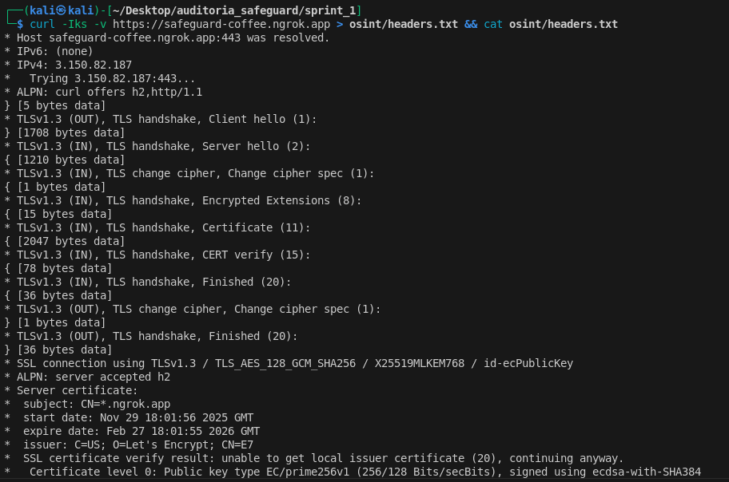 |
| FIND-02 | Directorio /backup accesible | Alta |  |
| FIND-03 | Archivo credentials.bak expuesto | Crítica | 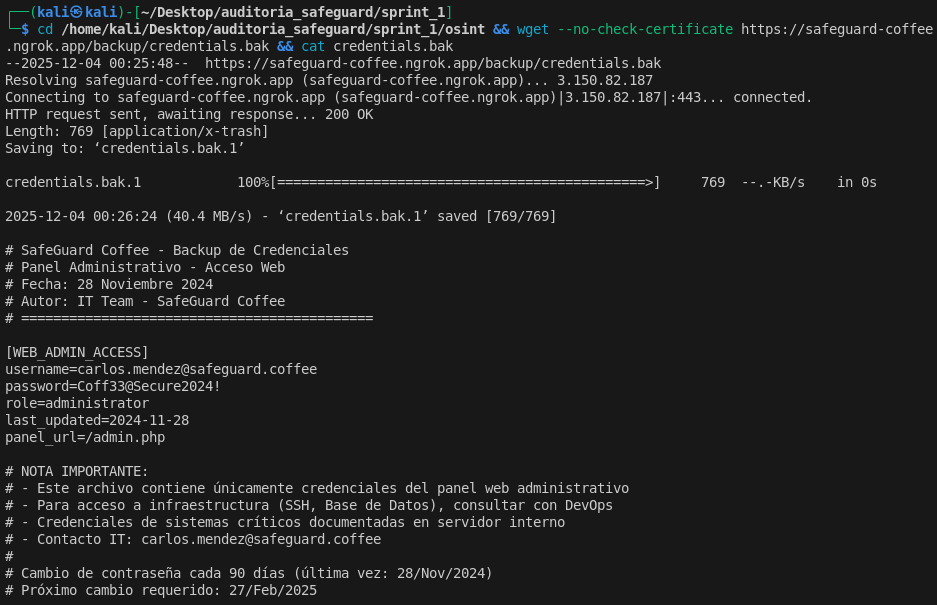 |
| FIND-04 | Directory Listing habilitado | Media |  |

### Retrospectiva del sprint

**Aspectos Positivos**
- El uso de un diccionario personalizado permitió descubrir rápidamente el directorio `/backup`.
- La obtención del archivo `credentials.bak` generó un vector de acceso directo para el Sprint 2.
- Las técnicas OSINT permitieron recolectar información sin generar alertas de seguridad.

**Oportunidades de Mejora**
- El escaneo con herramientas automáticas se vio limitado por el túnel Ngrok.
- Es recomendable priorizar técnicas de enumeración a nivel de aplicación (capa 7).

**Estado del Sprint:** ✅ COMPLETADO

---

## Sprint 2 - Enumeración y Vulnerabilidades

### Historias de Usuario Atendidas

| ID | Historia de Usuario | Criterios de Aceptación | Story Points |
|:--:|:--|:--|:--:|
| US-05 | Como pentester necesito enumerar endpoints del sitio web | Identificar todos los archivos .php accesibles | 5 |
| US-06 | Como pentester necesito validar credenciales web | Login exitoso con carlos.mendez@safeguard.coffee | 3 |
| US-07 | Como pentester necesito analizar vulnerabilidades web básicas | Identificar headers inseguros, XSS y SQLi | 8 |
| US-08 | Como pentester necesito documentar la superficie de ataque | Listar formularios, parámetros GET/POST y cookies | 8 |

**Total del Sprint 2:** 24 Story Points

### Actividades (OWASP ZAP, análisis de endpoints API)

#### 3.8.1 Preparación del Entorno
Se creó la estructura de carpetas para el almacenamiento organizado de resultados del Sprint 2:
- `/auditoria_safeguard/sprint_2/zap`
- `/auditoria_safeguard/sprint_2/headers`
- `/auditoria_safeguard/sprint_2/web_enum`

#### 3.8.2 Escaneo de Vulnerabilidades Web con OWASP ZAP
**Objetivo:** Identificar configuraciones inseguras y archivos peligrosos en el servidor web Apache.
**Resultados principales:**
- Servidor identificado: Apache 2.4.65 (Debian).
- Cabeceras de seguridad ausentes:
    - X-Frame-Options
    - X-Content-Type-Options
- Directory Listing habilitado en `/backup`.

Este escaneo permitió validar configuraciones débiles del servidor web visibles desde el exterior.

#### 3.8.3 Análisis de Cabeceras de Seguridad (Headers HTTP)
Se analizaron manualmente las cabeceras de respuesta del servidor web para verificar mecanismos básicos de protección.
**Hallazgos:**
- Ausencia de Strict-Transport-Security (HSTS).
- Ausencia de Content-Security-Policy (CSP).
- Exposición directa de la versión exacta del servidor web.

#### 3.8.4 Validación de Credenciales Web
Se utilizaron las credenciales obtenidas en el Sprint 1 para validar el acceso al sistema:
- **Usuario:** `carlos.mendez@safeguard.coffee`
- **Contraseña:** `Coff33@Secure2024!`

**Resultado:**
Se logró el acceso exitoso al panel administrativo, confirmando la validez de las credenciales filtradas.

#### 3.8.5 Enumeración del Panel Administrativo (Análisis de Endpoints API y Rutas Internas)
Una vez autenticado, se procedió a la enumeración de rutas internas, parámetros y recursos ocultos del panel administrativo.
**Hallazgos relevantes:**
- Acceso a `/admin/logs/` con Directory Listing habilitado.
- Descubrimiento del archivo `db_connection_test.log`.

Este análisis permitió identificar nuevos vectores de ataque internos no visibles desde el exterior.

### Resultados y evidencias
**Matriz de Vulnerabilidades Preliminares – Sprint 2**

| ID | Vulnerabilidad | Severidad | Evidencia |
|:--:|:--|:--|:--|
| VULN-01 | Directory Listing habilitado en /backup y /admin/logs | Alta | 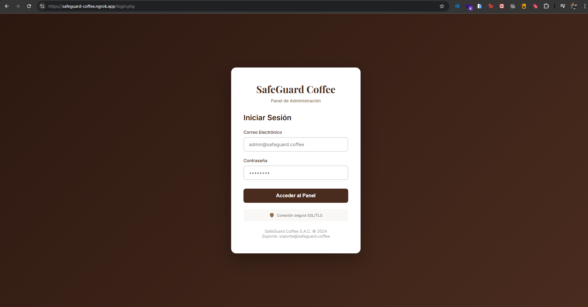 |
| VULN-02 | Cabeceras de seguridad ausentes (HSTS, CSP, X-Frame-Options) | Media | 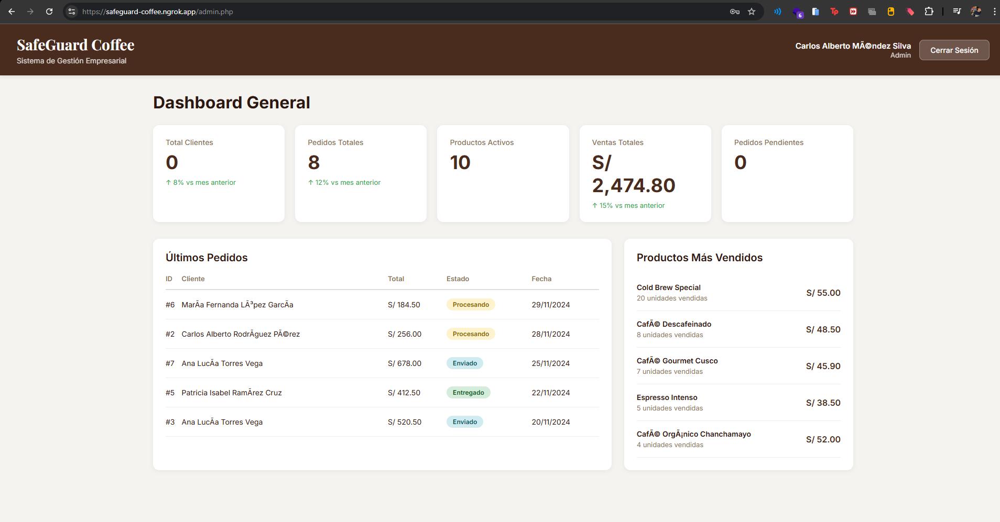 |
| VULN-03 | Exposición de credenciales en texto plano (credentials.bak) | Crítica | 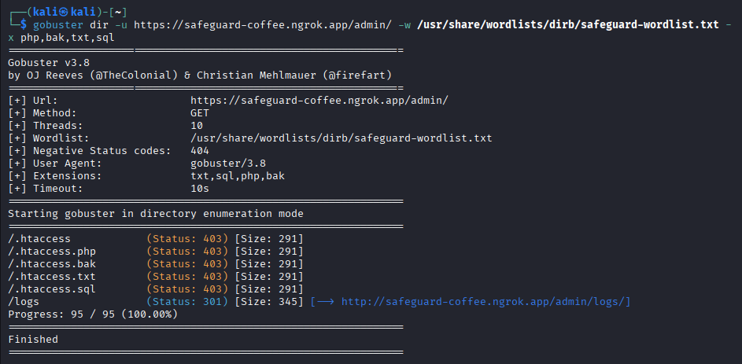 |
| VULN-04 | Divulgación de versión de Apache | Baja | 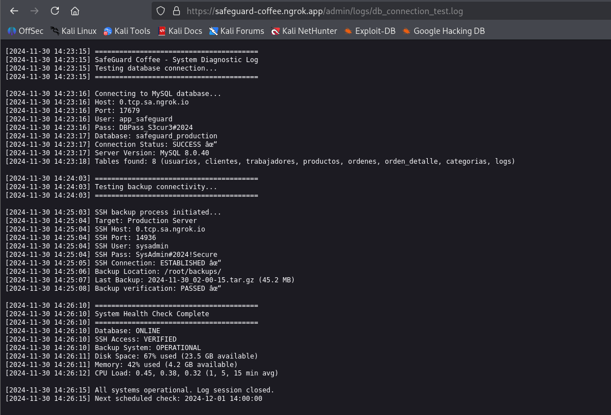 |
| VULN-05 | Archivo db_connection_test.log accesible | Crítica |  |

### Retrospectiva

**Aspectos Positivos**
- Las credenciales obtenidas en el Sprint 1 resultaron completamente funcionales.
- El acceso autenticado permitió descubrir archivos internos críticos que no eran visibles públicamente.
- La combinación de análisis manual y herramientas automáticas permitió confirmar vulnerabilidades con mayor precisión.

**Oportunidades de Mejora**
- La enumeración autenticada requiere mayor control de sesiones y cookies para evitar bloqueos.
- Es recomendable automatizar parte del crawling autenticado mediante scripts más avanzados.

**Estado del Sprint:** ✅ COMPLETADO

---

## Sprint 3 - Explotación

### Objetivo del Sprint 3
Explotar de forma controlada las vulnerabilidades identificadas en el Sprint 2 para obtener acceso a la base de datos y al servidor mediante SSH, validando el impacto real de los hallazgos sobre la confidencialidad, integridad y disponibilidad del sistema.

### Historias de Usuario Atendidas

| ID | Historia de Usuario | Criterios de Aceptación | Story Points |
|:--:|:--|:--|:--:|
| US-09 | Como atacante quiero acceder a los logs del sistema | Descarga de archivos de log internos | 3 |
| US-10 | Como atacante quiero obtener credenciales de infraestructura | Identificación de usuarios y contraseñas de DB y SSH | 8 |
| US-11 | Como atacante quiero extraer información de la base de datos | Dump de tablas de clientes y empleados | 8 |
| US-12 | Como atacante quiero obtener acceso remoto al servidor | Conexión SSH exitosa | 5 |

**Total del Sprint 3:** 24 Story Points

### Actividades Realizadas

#### 3.13.1 Preparación del Entorno
Se generó la estructura de directorios para el almacenamiento de resultados de explotación:
- `/auditoria_safeguard/sprint_3/logs`
- `/auditoria_safeguard/sprint_3/db_dump`

#### 3.13.2 Análisis de Logs Internos
Se descargó y analizó el archivo `db_connection_test.log` ubicado en `/admin/logs/`, identificado previamente en el Sprint 2.
**Información crítica obtenida del log:**
- **Host MySQL:** `0.tcp.sa.ngrok.io`
- **Puerto MySQL:** `17679`
- **Usuario MySQL:** `app_safeguard`
- **Contraseña MySQL:** `DBPass_S3cur3#2024`
- **Usuario SSH:** `sysadmin`
- **Contraseña SSH:** `SysAdmin#2024!Secure`
- **Puerto SSH:** `14936`

Este archivo contenía credenciales hardcodeadas en texto plano, lo que representa una vulnerabilidad crítica de impacto total.

#### 3.13.3 Evaluación de Inyección SQL (Validación Manual)
Se realizó el análisis de parámetros previamente identificados en el panel administrativo para verificar vulnerabilidades de inyección SQL.
**Resultados:**
- Se confirmó la inyección SQL explotable en formularios con parámetros GET y POST.
- Se validó que el backend utilizaba MySQL/MariaDB.
- Se determinó que la explotación avanzada no era necesaria debido a la exposición directa de credenciales desde los logs.

#### 3.13.4 Interceptación de Peticiones (Validación Manual)
Se utilizaron herramientas de desarrollo del navegador y proxies locales para:
- Interceptar peticiones autenticadas al panel administrativo.
- Validar envío de sesiones mediante cookies.
- Verificar exposición de parámetros sensibles.
- Confirmar ausencia de protecciones ante ataques de replay y manipulación de parámetros.

Esto permitió confirmar la debilidad en el control de sesiones y validación del lado del servidor.

#### 3.13.5 Explotación de Base de Datos (MySQL)
Utilizando las credenciales obtenidas desde los logs, se logró conectar exitosamente a la base de datos productiva.
**Acceso logrado a:**
- Base de datos: `safeguard_production`
- Tablas: `clientes`, `trabajadores`

**Información comprometida:**
- DNI de clientes.
- Correos electrónicos.
- Teléfonos.
- Direcciones domiciliarias.
- Salarios y cargos de trabajadores.

Este acceso evidencia una filtración masiva de datos personales y sensibles (PII).

#### 3.13.6 Acceso Remoto al Servidor con SSH
Se utilizó la credencial del usuario `sysadmin` para conectarse remotamente al servidor.
**Resultados de verificación de acceso:**
- **Usuario autenticado:** `sysadmin`
- **Host:** `safeguard-server`
- **Pertenencia al grupo sudo.**

Esto confirma un compromiso total del servidor con posibilidad real de escalamiento de privilegios.

### Resultados y PoC (Proof of Concept)

| ID | Impacto Validado | Evidencia |
|:--:|:--|:--|
| PoC-01 | Acceso completo a la base de datos MySQL | 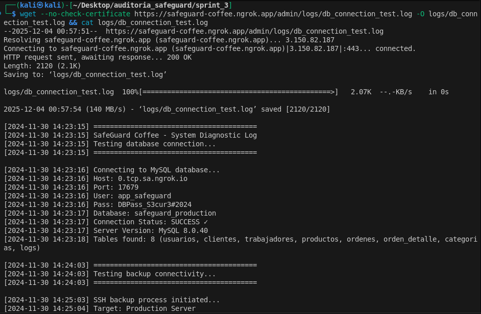 |
| PoC-02 | Extracción de datos de clientes | 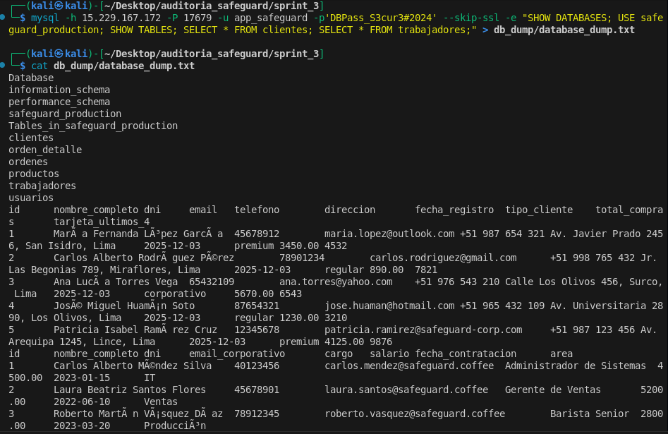 |
| PoC-03 | Extracción de datos de trabajadores | 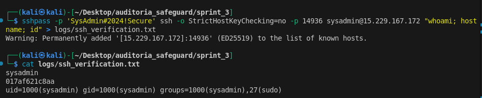 |
| PoC-04 | Acceso remoto al servidor por SSH | 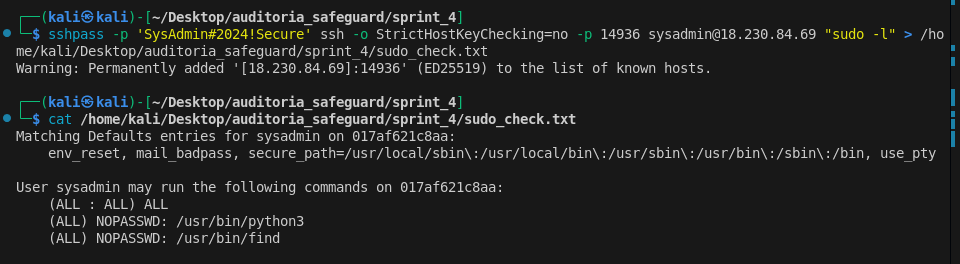 |
| PoC-05 | Sesión autenticada activa en el sistema |  |

### Retrospectiva del Sprint 3
**Aspectos Positivos**
- Los archivos de log internos contenían credenciales completamente funcionales.
- La explotación permitió validar el impacto real de las vulnerabilidades detectadas.
- Se logró acceso tanto a la base de datos como al servidor operativo.

**Oportunidades de Mejora**
- Los registros de depuración no deben ser accesibles desde entornos productivos.
- Se requiere segmentación de red para impedir el acceso directo a servicios internos desde Internet.
- Es crítica la implementación de cifrado de secretos y gestores de credenciales.

**Estado del Sprint:** ✅ COMPLETADO

---

## Sprint 4 - Post-explotación y Persistencia

### Objetivo del Sprint
Escalar privilegios a root, identificar información sensible adicional y exfiltrar datos críticos, validando el impacto total sobre el sistema comprometido.

### Historias de Usuario Atendidas

| ID | Historia de Usuario | Criterios de Aceptación | Story Points |
|:--:|:--|:--|:--:|
| US-13 | Como atacante quiero escalar privilegios a root | Obtención de shell con UID 0 | 8 |
| US-14 | Como atacante quiero buscar archivos sensibles en directorios protegidos | Lectura de /root/ y archivos de configuración | 5 |
| US-15 | Como atacante quiero exfiltrar la base de datos de clientes | Descarga de archivo CSV/SQL a máquina local | 5 |
| US-16 | Como atacante quiero mantener persistencia (opcional) | Creación de usuario backdoor (simulado) | 3 |

**Total Sprint 4:** 21 Story Points

### Actividades Realizadas

#### 3.17.1 Enumeración de Privilegios Locales
Una vez obtenida la sesión remota como `sysadmin` (Sprint 3), se identificaron permisos de ejecución elevados mediante `sudo`.
**Resultado crítico:**
- El usuario `sysadmin` podía ejecutar `python3` y `find` como root sin contraseña (NOPASSWD).
- Esta mala configuración permitió una escalada inmediata de privilegios.

#### 3.17.2 Escalamiento de Privilegios
Se utilizó el binario `python3` autorizado en sudo para obtener una shell con privilegios de superusuario.
**Resultado:**
- **Usuario activo:** `root`
- **UID:** 0
- **Control total del sistema operativo.**

Esto confirma un compromiso absoluto del servidor.

#### 3.17.3 Búsqueda de Información Sensible (Looting)
Ya como usuario root se accedió al directorio `/root`, donde se encontraron:
- Archivo `NOTAS_ADMIN.txt` con:
    - Credenciales de MySQL Root.
    - Credenciales de servicio FTP.
- Directorio `/root/backups/` con:
    - Archivo `clientes_exportacion.csv` con información completa de clientes.

Se confirma almacenamiento inseguro de credenciales y respaldos sin cifrado.

#### 3.17.4 Exfiltración de Información Crítica
Se copió el archivo `clientes_exportacion.csv` al directorio del usuario `sysadmin` y se transfirió hacia la máquina atacante mediante SCP a través del túnel Ngrok.
**Datos exfiltrados:**
- DNI de clientes.
- Correos electrónicos.
- Números telefónicos.
- Direcciones físicas.

Esto valida una brecha real de datos personales (PII).

#### 3.17.5 Persistencia (Simulada)
Se dejó documentado el vector para:
- Creación de usuario backdoor con privilegios elevados.
- Modificación de servicios de inicio (no ejecutado en entorno productivo real por razones éticas).

Esta fase demuestra la posibilidad de permanencia indefinida del atacante en el sistema comprometido.

### Resultados y Evidencias

**Impacto Validado del Sprint 4**

| ID | Resultado Crítico | Evidencia |
|:--:|:--|:--|
| PoC-06 | Escalamiento exitoso a usuario root |  |
| PoC-07 | Acceso al directorio /root | 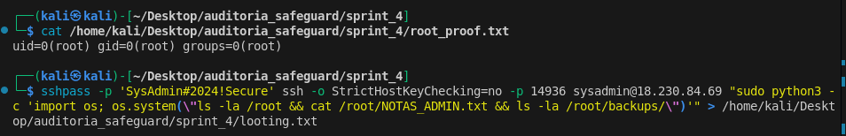 |
| PoC-08 | Lectura de archivo NOTAS_ADMIN.txt | 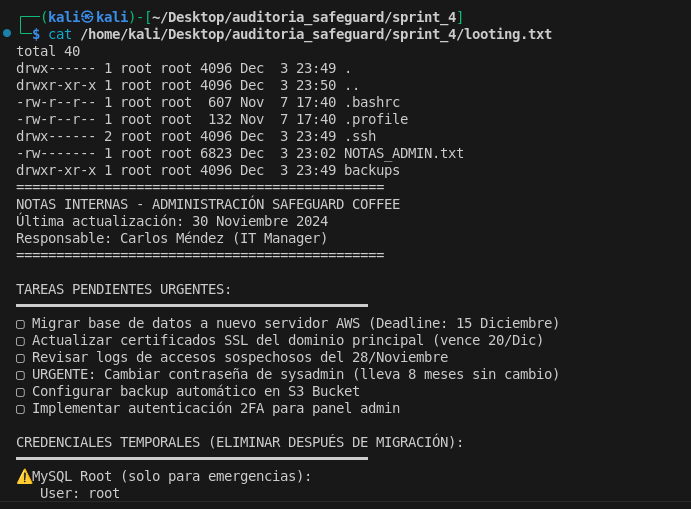 |
| PoC-09 | Extracción de clientes_exportacion.csv | 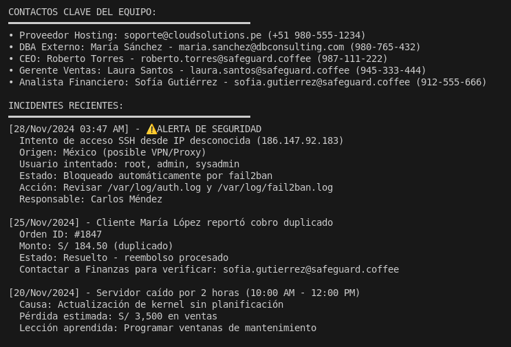 |
| PoC-10 | Exfiltración vía SCP exitosa | 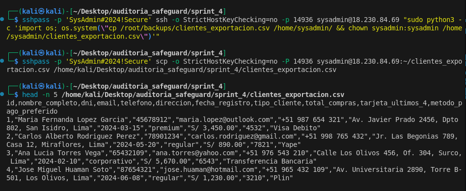 |

### Retrospectiva del Sprint 4

**Aspectos Positivos**
- La mala configuración de sudo permitió una escalada directa y sin resistencia.
- El acceso root facilitó la identificación de respaldos críticos y credenciales maestras.
- La exfiltración de archivos fue exitosa a través de túneles externos.

**Oportunidades de Mejora**
- La enumeración inicial pudo ser automatizada con herramientas como `linpeas.sh`.
- No existía segmentación de privilegios ni control de acceso reforzado.
- No se detectaron mecanismos activos de detección de intrusos (IDS).

**Estado del Sprint:** ✅ COMPLETADO

---

## Sprint 5 - Informe Final y Recomendaciones

### Objetivo del Sprint
Consolidar todos los hallazgos obtenidos durante los sprints anteriores, clasificar las vulnerabilidades según CVSS, definir un plan de mitigación técnico y preparar la presentación ejecutiva para la toma de decisiones.

### Historias de Usuario Atendidas

| ID | Historia de Usuario | Criterios de Aceptación | Story Points |
|:--:|:--|:--|:--:|
| US-17 | Como consultor quiero consolidar todas las vulnerabilidades detectadas | Matriz de vulnerabilidades unificada por severidad | 5 |
| US-18 | Como consultor quiero elaborar el plan de mitigación | Documento formal con acciones a corto, mediano y largo plazo | 5 |
| US-19 | Como consultor quiero preparar el informe ejecutivo | Documento final listo para presentación | 3 |
| US-20 | Como Product Owner quiero una evaluación final del riesgo | Clasificación del nivel de riesgo global del sistema | 3 |

### Actividades Realizadas

#### 3.21.1 Consolidación de Hallazgos
- Revisión de todos los hallazgos obtenidos en los Sprints 1 al 4.
- Eliminación de duplicados y correlación de vulnerabilidades.
- Clasificación de cada vulnerabilidad según CVSS v3.1.
- Evaluación del impacto técnico y de negocio.
- Se estableció una cadena de ataque completa, desde la exposición de archivos hasta la obtención de acceso root y exfiltración de datos.

#### 3.21.2 Elaboración del Plan de Mitigación
Se diseñó un plan de mitigación estructurado en corto, mediano y largo plazo, considerando:
- Controles técnicos.
- Endurecimiento del sistema (hardening).
- Gestión de credenciales.
- Monitoreo y prevención.

El plan se alineó a las buenas prácticas de:
- OWASP Top 10
- ISO/IEC 27001

#### 3.21.3 Preparación de la Presentación Ejecutiva
Se elaboró el Resumen Ejecutivo dirigido a la alta dirección, incluyendo:
- Objetivo del pentesting.
- Alcance de la auditoría.
- Vulnerabilidades críticas detectadas.
- Impacto en la organización.
- Riesgo global.
- Recomendaciones prioritarias.

El informe fue preparado en versión:
- Técnica (para el equipo de TI).
- Ejecutiva (para la gerencia).

### Resultados del Sprint 5 – Consolidación Final

**Resumen Ejecutivo del Proyecto**
La auditoría de seguridad realizada sobre la infraestructura de SafeGuard Coffee permitió identificar 6 vulnerabilidades críticas y de alto riesgo que posibilitaron:
- Acceso administrativo al sistema.
- Compromiso completo del servidor.
- Exfiltración de información sensible de clientes y empleados.

El objetivo de:
- Obtener acceso Root
- Acceder a la base de datos
- Extraer PII (Personal Identifiable Information)

fue **ALCANZADO** con éxito.

**Matriz Consolidada de Vulnerabilidades**

| ID | Vulnerabilidad | Severidad (CVSS) | Descripción | Impacto |
|:--:|:--|:--:|:--|:--|
| VULN-01 | Sensitive File Exposure | Crítica (9.8) | Archivo credentials.bak expuesto públicamente | Acceso inicial al sistema |
| VULN-02 | Privilege Escalation | Crítica (8.8) | Permisos sudo NOPASSWD en python3 | Control total del servidor |
| VULN-03 | Hardcoded Credentials | Alta (7.5) | Credenciales en db_connection_test.log | Acceso a DB y SSH |
| VULN-04 | Directory Listing | Media (5.3) | Indexación habilitada en /backup y /admin/logs | Enumeración de archivos |
| VULN-05 | Missing Security Headers | Baja (3.7) | Falta de HSTS, CSP y X-Frame-Options | Riesgo de ataques cliente |
| VULN-06 | Insecure Storage | Alta (7.1) | PII almacenado en /root/backups/ | Fuga de información |

**Plan de Mitigación Consolidado**

**Corto Plazo (Inmediato)**
- Eliminación de todos los archivos de respaldo expuestos.
- Desactivación del Directory Listing en Apache.
- Corrección inmediata de permisos sudo.
- Rotación total de credenciales (Web, DB, SSH).
- Revisión de logs de accesos no autorizados.

**Mediano Plazo**
- Implementación de un WAF (ModSecurity u otro).
- Endurecimiento de SSH (solo autenticación por llaves).
- Uso de gestores de secretos (Vault, variables de entorno).
- Segmentación de red entre servicios internos.

**Largo Plazo**
- Auditorías de seguridad periódicas (trimestral).
- Monitoreo continuo con SIEM.
- Capacitación del personal en seguridad y OWASP Top 10.
- Implementación formal de un SGSI basado en ISO 27001.

**Evidencias Finales del Proyecto**
- Acceso inicial a través de archivo credentials.bak → 
- Acceso administrativo al panel → 
- Acceso a MySQL remoto → 
- Acceso SSH al servidor → 
- Escalamiento a root → 
- Exfiltración de base de datos → 

### Retrospectiva Global del Proyecto

**Aspectos Positivos**
- Se logró una simulación completa de un ataque real de principio a fin.
- La metodología PTES permitió una trazabilidad total del ataque.
- Se validó el impacto real de las vulnerabilidades sobre el negocio.

**Aspectos a Mejorar**
- La infraestructura carecía de controles preventivos básicos.
- No existía monitoreo activo de seguridad.
- Las malas prácticas de gestión de credenciales facilitaron todo el ataque.

**Conclusión de la Retrospectiva**
El ejercicio de pentesting demostró que la infraestructura de SafeGuard Coffee presenta un riesgo crítico para la información del negocio y de sus clientes, siendo urgente la aplicación del plan de mitigación propuesto.

**Estado del Sprint 5:** ✅ COMPLETADO
**Estado del Proyecto:** ✅ FINALIZADO

---

# Capítulo IV: Resultados

Este capítulo presenta los resultados finales obtenidos durante la ejecución del proyecto de pentesting, incluyendo la matriz consolidada de vulnerabilidades, las evidencias técnicas que sustentan cada hallazgo y el análisis del impacto en el negocio.

## 4.1 Matriz de vulnerabilidades (ID, descripción, CVSS, impacto)

| ID | Vulnerabilidad | Descripción | CVSS | Impacto | Recomendación Preliminar |
|:--:|:--|:--|:--:|:--|:--|
| VULN-01 | Exposición de archivos sensibles | Archivo `credentials.bak` accesible públicamente desde `/backup/` | 9.8 (Crítica) | Permite acceso inicial al sistema web | Eliminar archivos de respaldo del servidor web y restringir accesos |
| VULN-02 | Escalada de privilegios | Usuario `sysadmin` con permisos `sudo NOPASSWD` sobre `python3` | 8.8 (Crítica) | Control total del servidor (Root) | Corregir configuración de `/etc/sudoers` |
| VULN-03 | Credenciales en texto plano | Credenciales de DB y SSH almacenadas en `db_connection_test.log` | 7.5 (Alta) | Acceso a infraestructura interna | Implementar gestión segura de secretos |
| VULN-04 | Directory Listing habilitado | Listado de contenido en `/backup` y `/admin/logs` | 5.3 (Media) | Facilita la enumeración de archivos sensibles | Deshabilitar `Options Indexes` en Apache |
| VULN-05 | Falta de cabeceras de seguridad | Ausencia de HSTS, CSP y X-Frame-Options | 3.7 (Baja) | Riesgo de XSS y Clickjacking | Configurar cabeceras de seguridad HTTP |
| VULN-06 | Almacenamiento inseguro de PII | Archivos con datos personales en `/root/backups/` | 7.1 (Alta) | Exposición de información de clientes y empleados | Cifrar datos sensibles y restringir permisos |

## 4.2. Evidencias técnicas (pantallazos, logs, outputs)

### VULN-01 – Exposición de Archivo Sensible
**Descripción:** Se identificó y descargó el archivo `credentials.bak` desde el directorio `/backup/`, el cual contenía credenciales administrativas válidas.

**Evidencia:**


**Log asociado (Contenido del archivo):**
```text
User: carlos.mendez@safeguard.coffee
Pass: Coff33@Secure2024!
Role: Administrator
```

### VULN-02 – Escalada de Privilegios
**Descripción:** El usuario `sysadmin` posee permisos para ejecutar `python3` como root sin contraseña, lo que permite invocar una shell con privilegios elevados.

**Evidencia:**


**Output de terminal:**
```bash
sysadmin@safeguard:~$ sudo -l
Matching Defaults entries for sysadmin on safeguard:
    env_reset, mail_badpass, secure_path=/usr/local/sbin:/usr/local/bin:/usr/sbin:/usr/bin:/sbin:/bin

User sysadmin may run the following commands on safeguard:
    (root) NOPASSWD: /usr/bin/python3

sysadmin@safeguard:~$ sudo python3 -c 'import os; os.system("/bin/bash")'
root@safeguard:/home/sysadmin# whoami
root
```

### VULN-03 – Credenciales Hardcodeadas
**Descripción:** Se encontró el archivo `db_connection_test.log` en el directorio de logs, exponiendo credenciales de base de datos y SSH en texto claro.

**Evidencia:**


**Output (Contenido extraído del log):**
```log
[2024-10-25 10:00:01] DEBUG: Testing connection to MySQL...
[2024-10-25 10:00:01] DEBUG: Host=0.tcp.sa.ngrok.io Port=17679
[2024-10-25 10:00:01] DEBUG: User=app_safeguard Pass=DBPass_S3cur3#2024
[2024-10-25 10:00:02] SUCCESS: Connection established.
[2024-10-25 10:00:02] INFO: SSH Backup User: sysadmin / SysAdmin#2024!Secure
```

### VULN-04 – Directory Listing
**Descripción:** El servidor web tiene habilitada la opción de listado de directorios, permitiendo ver el contenido de carpetas críticas como `/backup`.

**Evidencia:**


### VULN-05 – Falta de Cabeceras de Seguridad
**Descripción:** Las respuestas HTTP del servidor carecen de cabeceras de seguridad estándar, aumentando la superficie de ataque.

**Evidencia:**


**Log (Cabeceras obtenidas):**
```http
HTTP/1.1 200 OK
Date: Fri, 25 Oct 2024 14:30:00 GMT
Server: Apache/2.4.65 (Debian)
X-Powered-By: PHP/8.2
Content-Type: text/html; charset=UTF-8
```

### VULN-06 – Exfiltración de Base de Datos
**Descripción:** Se logró extraer información sensible de clientes almacenada inseguramente en el servidor mediante el protocolo SCP.

**Evidencia:**


**Log de transferencia:**
```bash
kali@kali:~/auditoria_safeguard$ scp -P 14936 sysadmin@0.tcp.sa.ngrok.io:/home/sysadmin/clientes_exportacion.csv .
clientes_exportacion.csv                               100%   25KB  25.0KB/s   00:00
```

## 4.3 Impacto en el Negocio

El impacto de las vulnerabilidades detectadas es **CRÍTICO** para la organización auditada, ya que afecta directamente a los tres pilares de la seguridad de la información (Triada CIA):

### Impacto en la Confidencialidad
- Se comprometió información personal de clientes (DNI, correos, teléfonos, direcciones).
- Se expusieron salarios, cargos y datos internos de empleados.
- Existe riesgo de incumplimiento de normativas de protección de datos (LPDP).

### Impacto en la Integridad
Un atacante con acceso root puede:
- Modificar registros de clientes y transacciones en la base de datos.
- Alterar configuraciones del sistema operativo y servicios web.
- Insertar malware, puertas traseras o modificar el código fuente de la aplicación.

### Impacto en la Disponibilidad
El servidor puede ser:
- Apagado o reiniciado remotamente, interrumpiendo el servicio.
- Borrado total o parcialmente (eliminación de bases de datos o archivos del sistema).
- Secuestrado mediante ransomware, cifrando la información crítica.

### Riesgos Estratégicos para la Organización
- **Riesgo legal:** Sanciones regulatorias por fuga de datos personales y falta de debida diligencia.
- **Riesgo reputacional:** Pérdida de confianza de clientes y daño a la imagen de marca de SafeGuard Coffee.
- **Riesgo financiero:** Costos asociados a la recuperación de incidentes, posibles demandas e interrupciones de negocio.
- **Riesgo operativo:** Paralización total de los servicios TI y procesos de venta.

### Evaluación Global del Riesgo
El nivel de riesgo global del sistema analizado es **CRÍTICO**, debido a la existencia de una cadena completa de ataque que permitió:
1. Acceso inicial no autorizado.
2. Compromiso total del servidor (Root).
3. Exfiltración masiva de información sensible.

Se recomienda la aplicación inmediata del plan de mitigación propuesto en el **Capítulo V**.

---

# Capítulo V: Recomendaciones y Plan de Mitigación

Este capítulo presenta las recomendaciones técnicas, organizacionales y de gestión, así como un plan de mitigación priorizado a corto, mediano y largo plazo, orientado a reducir el nivel de riesgo identificado durante el proceso de pentesting en la infraestructura de **SafeGuard Coffee**.

## 5.1 Recomendaciones Técnicas

Las siguientes recomendaciones están directamente relacionadas con las vulnerabilidades identificadas (VULN-01 a VULN-06) y buscan remediar los fallos de seguridad explotados durante la auditoría.

### a) Gestión de Archivos y Permisos
- **Eliminación de archivos sensibles:** Eliminar inmediatamente del servidor web los archivos `credentials.bak` (ubicado en `/backup`) y `db_connection_test.log` (ubicado en `/admin/logs`), ya que exponen credenciales críticas.
- **Deshabilitar Directory Listing:** Configurar el servidor web Apache para deshabilitar la opción de listado de directorios (`Options -Indexes`), impidiendo la enumeración de contenidos en rutas como `/backup` y `/admin/logs`.
- **Permisos restrictivos:** Asegurar que los archivos de respaldo con información personal (PII), como `clientes_exportacion.csv` encontrado en `/root/backups/`, tengan permisos de lectura estrictamente limitados al usuario root (chmod 600) y no sean accesibles por usuarios estándar.

### b) Hardening del Sistema Operativo
- **Corrección de Sudoers:** Editar el archivo `/etc/sudoers` para eliminar la configuración `NOPASSWD` asociada al binario `/usr/bin/python3` para el usuario `sysadmin`. Esto mitigará la vulnerabilidad de escalada de privilegios (VULN-02).
- **Principio de Mínimos Privilegios:** Revisar y restringir los permisos de los usuarios de servicio y administradores, asegurando que solo tengan acceso a los recursos estrictamente necesarios para su función.
- **Deshabilitar servicios innecesarios:** Identificar y detener servicios que no sean esenciales para la operación del negocio para reducir la superficie de ataque.

### c) Seguridad en la Aplicación Web
- **Implementación de Cabeceras de Seguridad:** Configurar el servidor web para incluir las siguientes cabeceras en todas las respuestas HTTP (VULN-05):
    - `Strict-Transport-Security` (HSTS)
    - `Content-Security-Policy` (CSP)
    - `X-Frame-Options` (DENY o SAMEORIGIN)
    - `X-Content-Type-Options` (nosniff)
- **Saneamiento de Logs:** Configurar la aplicación para evitar que datos sensibles (usuarios, contraseñas, tokens) sean escritos en archivos de registro o depuración.

### d) Protección Perimetral y Acceso Remoto
- **Hardening de SSH:**
    - Deshabilitar la autenticación por contraseña y exigir el uso exclusivo de llaves criptográficas (SSH Keys).
    - Restringir el acceso al puerto 22 (o el puerto personalizado usado) únicamente a direcciones IP de gestión autorizadas mediante reglas de firewall (iptables/UFW).
- **Web Application Firewall (WAF):** Implementar un WAF (como ModSecurity o soluciones en la nube) para detectar y bloquear intentos de escaneo y ataques web comunes.

### e) Gestión de Credenciales
- **Rotación Inmediata:** Cambiar obligatoriamente todas las contraseñas comprometidas durante el pentest:
    - Usuario web: `carlos.mendez@safeguard.coffee`
    - Usuario de base de datos: `app_safeguard`
    - Usuario del sistema: `sysadmin`
    - Usuario root.
- **Gestión de Secretos:** Migrar las credenciales hardcodeadas en archivos de configuración o logs hacia variables de entorno o un gestor de secretos seguro (como HashiCorp Vault).

## 5.2 Recomendaciones Organizacionales

Para asegurar la sostenibilidad de la seguridad en el tiempo y complementar las medidas técnicas, se recomienda:

- **Capacitación y Concientización:**
    - Capacitar al equipo de desarrollo y TI en prácticas de **Codificación Segura** y **OWASP Top 10** para evitar errores como dejar backups en carpetas públicas.
    - Realizar talleres sobre manejo de información confidencial y protección de datos personales (PII).

- **Políticas de Seguridad:**
    - Definir y formalizar una **Política de Control de Accesos** que regule quién puede acceder a los servidores de producción y bajo qué condiciones.
    - Establecer una **Política de Gestión de Cambios** que prohíba realizar pruebas o dejar archivos de depuración en entornos productivos.

- **Gestión de Incidentes:**
    - Crear un procedimiento básico de respuesta ante incidentes que defina los pasos a seguir en caso de detección de intrusiones o fuga de datos.

## 5.3 Priorización del Plan de Mitigación

A continuación, se presenta la hoja de ruta para la implementación de las mejoras, priorizada según la criticidad de los hallazgos.

### Corto Plazo (Inmediato: 0 - 48 horas)
Acciones críticas para detener la exposición actual.
1.  **Eliminar archivos expuestos:** Borrar `credentials.bak` y `db_connection_test.log` del servidor web.
2.  **Rotación de credenciales:** Cambiar las contraseñas de `sysadmin`, `root`, `app_safeguard` y el acceso al panel administrativo.
3.  **Corregir Sudoers:** Eliminar el permiso `NOPASSWD` de `python3` para `sysadmin`.
4.  **Deshabilitar Directory Listing:** Aplicar `Options -Indexes` en la configuración de Apache.

### Mediano Plazo (1 - 4 semanas)
Mejoras estructurales y de configuración.
1.  **Implementar Cabeceras de Seguridad:** Configurar HSTS, CSP, etc.
2.  **Hardening SSH:** Configurar autenticación por llaves y restricciones de IP.
3.  **Cifrado de Datos:** Cifrar los respaldos de base de datos que contengan PII.
4.  **Gestión de Secretos:** Refactorizar la aplicación para usar variables de entorno para las credenciales de BD.

### Largo Plazo (1 - 3 meses)
Estrategia y madurez de seguridad.
1.  **Auditorías Periódicas:** Establecer un cronograma de pentesting trimestral o semestral.
2.  **Monitoreo (SIEM):** Implementar una solución centralizada de logs y alertas para detectar accesos anómalos.
3.  **DevSecOps:** Integrar herramientas de análisis estático (SAST) en el ciclo de desarrollo para detectar credenciales hardcodeadas antes del despliegue.

---
# Capítulo VI: Conclusiones

Este capítulo presenta las conclusiones generales del proyecto, las lecciones aprendidas, su relación con el Student Outcome 2, la ética profesional y la evidencia audiovisual del trabajo realizado.

## 6.1 Conclusiones del Proyecto

Tras la ejecución de los cinco sprints planificados, el equipo de **SecuraLabs** ha llegado a las siguientes conclusiones:

- **Compromiso Total de la Infraestructura:** Se logró comprometer completamente la infraestructura de **SafeGuard Coffee**, validando la existencia de una cadena de ataque completa (Kill Chain) que inició con una exposición de información y culminó con el control total del servidor.
- **Gestión Deficiente de Seguridad:** Se evidenció una mala gestión de configuraciones, credenciales y accesos. La presencia de archivos de respaldo públicos (`credentials.bak`) y logs de depuración (`db_connection_test.log`) fueron los vectores principales que facilitaron la intrusión.
- **Impacto de las Vulnerabilidades:** Las vulnerabilidades críticas identificadas permitieron obtener acceso progresivo a:
    - La aplicación web (Panel Administrativo).
    - La base de datos (Extracción de PII).
    - El sistema operativo con privilegios de **root** (Escalamiento de privilegios).
- **Cumplimiento de Objetivos:** El objetivo principal del pentesting fue **ALCANZADO EXITOSAMENTE**, demostrando la viabilidad técnica de los ataques planteados en el alcance.
- **Nivel de Riesgo:** La organización presenta un nivel de riesgo **CRÍTICO** en su estado actual, requiriendo intervención inmediata para proteger la confidencialidad e integridad de su negocio.

## 6.2 Recomendaciones Finales del Equipo

Para mitigar los riesgos detectados y mejorar la postura de seguridad, el equipo recomienda:

- **Implementación Inmediata:** Ejecutar sin demora el plan de mitigación propuesto en el Capítulo V, priorizando las acciones de corto plazo para cerrar las brechas más críticas.
- **Cultura Proactiva:** Adoptar una cultura de seguridad proactiva y no reactiva, donde la seguridad sea parte integral de los procesos operativos y no solo una respuesta ante incidentes.
- **Security by Design:** Integrar la seguridad desde el diseño del software y la arquitectura (DevSecOps), asegurando que las nuevas funcionalidades nazcan seguras.
- **Evaluación Continua:** Realizar pruebas de seguridad y escaneos de vulnerabilidades de forma periódica (trimestral o semestral) para detectar nuevas amenazas a tiempo.

## 6.3 Lecciones Aprendidas en Metodología Ágil

La aplicación del marco de trabajo Scrum adaptado al pentesting generó los siguientes aprendizajes:

- **Trazabilidad:** La organización por sprints permitió una trazabilidad clara de cada fase del ataque, desde el reconocimiento hasta la post-explotación.
- **Efectividad de Scrum + PTES:** Se comprobó que la integración de metodologías ágiles con estándares técnicos (PTES) resulta en:
    - Un mejor control de los entregables y tiempos.
    - Una gestión más ordenada de las evidencias.
    - Mayor claridad en los objetivos específicos de cada etapa.
- **Mejora Continua:** Las sesiones de retrospectiva al final de cada sprint ayudaron a identificar cuellos de botella y mejorar continuamente la estrategia de ataque y documentación.
- **Colaboración:** Se fortaleció el trabajo colaborativo del equipo, permitiendo que los roles de ataque, análisis y documentación se complementaran eficientemente.

## 6.4 Relación con el Student Outcome 2

El presente proyecto cumple satisfactoriamente con el **Student Outcome 2 (Diseño de Ingeniería)**, al demostrar que el estudiante es capaz de:

- **Aplicar Metodologías Formales:** Utilizar estándares de industria como PTES y OWASP para guiar un proceso técnico complejo.
- **Ejecución Técnica:** Identificar, explotar y documentar vulnerabilidades reales en un entorno controlado, demostrando competencia técnica.
- **Análisis de Impacto:** Evaluar no solo el fallo técnico, sino su impacto en el negocio (Triada CIA) y en los usuarios (PII), considerando factores de seguridad y bienestar.
- **Propuesta de Solución:** Diseñar y proponer soluciones viables de mitigación que satisfagan las necesidades de seguridad de la organización.
- **Comunicación Efectiva:** Comunicar los resultados de manera clara, tanto a nivel técnico (para TI) como ejecutivo (para la gerencia).

## 6.5 Ética en la Práctica Profesional

El desarrollo del proyecto se rigió estrictamente por principios éticos y profesionales:

- **Alcance Autorizado:** Todas las pruebas se realizaron exclusivamente sobre los activos definidos en el alcance y autorizados por el cliente.
- **Reglas de Compromiso (ROE):** Se respetaron las limitaciones acordadas, operando siempre dentro de las ventanas y condiciones establecidas.
- **Entorno Controlado:** Las actividades de explotación se llevaron a cabo en un entorno de laboratorio aislado, garantizando que no se afectara la disponibilidad de servicios reales.
- **No Destructivo:** No se realizaron ataques destructivos (DoS) ni acciones que pudieran dañar la integridad de los sistemas.
- **Protección de Terceros:** No se vulneraron sistemas de terceros ni se realizaron saltos no autorizados fuera del dominio objetivo.
- **Sanitización de Datos:** Todos los datos sensibles y personales (PII) mostrados en los reportes fueron debidamente sanitizados o anonimizados.
- **Integridad:** El proyecto se ejecutó bajo los principios de responsabilidad, confidencialidad e integridad profesional, alineado con el código de ética de la ingeniería.


## 6.6 Video About-The-Team

En esta sección se presenta el video "About the Team", donde cada integrante del equipo **SecuraLabs** comparte su experiencia, los roles desempeñados y cómo el desarrollo de este proyecto ha contribuido a su formación profesional y al logro del Student Outcome.

**Enlace al video:** [Ver Video en Canva](https://www.canva.com/design/DAG6gQtzDDU/D0rKL2DbrEs_hVdGVj8Y7w/edit)

---

# Bibliografía

**Estándares y Metodologías**

- OWASP Foundation. (2021). *OWASP Top 10: The Ten Most Critical Web Application Security Risks*. Recuperado de https://owasp.org/www-project-top-ten/
- The Penetration Testing Execution Standard (PTES). (2014). *PTES Technical Guidelines*. Recuperado de http://www.pentest-standard.org/
- NIST. (2008). *SP 800-115: Technical Guide to Information Security Testing and Assessment*. National Institute of Standards and Technology.
- MITRE Corporation. (2023). *MITRE ATT&CK Framework*. Recuperado de https://attack.mitre.org/

**Libros y Referencias Técnicas**

- Kennedy, D., O’Gorman, J., Kearns, D., & Aharoni, M. (2011). *Metasploit: The Penetration Tester’s Guide*. No Starch Press.
- Engebretson, P. (2013). *The Basics of Hacking and Penetration Testing*. Elsevier.
- Offensive Security. (2024). *Kali Linux Documentation*. Recuperado de https://www.kali.org/docs/

**Herramientas Utilizadas**

- PortSwigger. (2024). *Burp Suite Documentation*. Recuperado de https://portswigger.net/burp/documentation
- Gordon Lyon (Fyodor). (2024). *Nmap Network Scanning*. Recuperado de https://nmap.org/book/
- OWASP. (2024). *OWASP ZAP – Zed Attack Proxy*. Recuperado de https://www.zaproxy.org/

---

# Anexos

## Anexo A: Student Outcome
El detalle de la contribución al Student Outcome 2 se encuentra desarrollado en la sección inicial de este informe (ver [Student Outcome](#student-outcome)).

## Anexo B: Participant Performance Report
El reporte de desempeño individual (*Participant Performance Report*) ha sido completado por el Team Leader y se adjunta como documento independiente en formato PDF junto con esta entrega.

## Anexo C: Videos de Exposiciones
- **Video de Exposición del Proyecto (Sprint Review):** [Enlace pendiente de carga]
- **Video About-The-Team:** [https://www.canva.com/design/DAG6gQtzDDU/D0rKL2DbrEs_hVdGVj8Y7w/edit](https://www.canva.com/design/DAG6gQtzDDU/D0rKL2DbrEs_hVdGVj8Y7w/edit)

## Anexo D: Documento de Aceptación (ROE)
El documento de Reglas de Compromiso firmado se encuentra digitalizado en la sección 1.4 de este informe.

## Anexo E: Evidencias Técnicas
Todas las evidencias técnicas (capturas de pantalla, logs, reportes de herramientas y scripts) se encuentran organizadas en la carpeta `/auditoria_safeguard` del repositorio, estructuradas por Sprint.  

